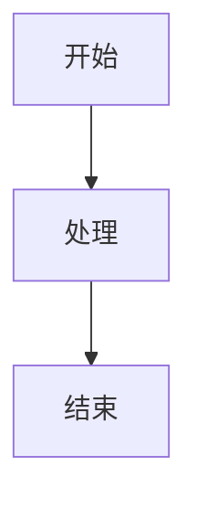

# Mermaid本地化部署说明

## 问题背景

浏览器追踪防护（Tracking Prevention）阻止了外部CDN加载Mermaid库：
- ❌ jsdelivr.net 被阻止
- ❌ unpkg.com 被阻止  
- ❌ cdnjs.cloudflare.com 被阻止

导致错误：
```
Tracking Prevention blocked access to storage for https://unpkg.com/mermaid@10.6.1/dist/mermaid.min.js
📊 总共渲染 0 个图表
```

## 解决方案

### ✅ 已实施：本地文件部署

**文件位置：** `assets/js/mermaid.min.js`  
**文件大小：** 2.9 MB  
**版本：** Mermaid 10.6.1

**优势：**
1. ✓ 完全离线可用，不依赖网络
2. ✓ 不受浏览器追踪防护影响
3. ✓ 加载速度更快（无网络延迟）
4. ✓ 稳定性最高

## 使用方法

### 在HTML中引用

```html
<!-- Mermaid图表库（本地文件，完全离线可用） -->
<script src="./assets/js/mermaid.min.js"></script>
```

### 初始化配置

```javascript
// 检查Mermaid是否可用
if (typeof mermaid !== 'undefined') {
    window.mermaidAvailable = true;
    
    // 初始化Mermaid
    mermaid.initialize({
        startOnLoad: false,
        theme: 'base',
        themeVariables: {
            primaryColor: '#e0f2fe',
            primaryTextColor: '#0c4a6e',
            // ... 其他配置
        }
    });
} else {
    window.mermaidAvailable = false;
    console.warn('Mermaid未加载');
}
```

### 渲染图表

```javascript
async function renderMermaidDiagrams() {
    if (!window.mermaidAvailable) {
        console.log('Mermaid不可用，跳过图表渲染');
        return;
    }
    
    const mermaidElements = document.querySelectorAll('.mermaid');
    
    for (let i = 0; i < mermaidElements.length; i++) {
        const element = mermaidElements[i];
        const graphDefinition = element.textContent.trim();
        const id = element.id;
        
        try {
            element.innerHTML = '';
            const { svg } = await mermaid.render('mermaid-svg-' + i, graphDefinition);
            element.innerHTML = svg;
        } catch (err) {
            console.error('Mermaid渲染错误:', err);
        }
    }
}
```

## 文件结构

```
d:\学习\健身\
├── 知识库文档.html          # 主页面
├── knowledge_data.js        # 知识库数据
└── assets/
    └── js/
        └── mermaid.min.js   # Mermaid库（本地）
```

## 更新Mermaid版本

如需更新Mermaid版本：

1. 下载新版本：
```bash
curl -o assets/js/mermaid.min.js https://unpkg.com/mermaid@最新版本/dist/mermaid.min.js
```

2. 或使用PowerShell：
```powershell
Invoke-WebRequest -Uri "https://unpkg.com/mermaid@最新版本/dist/mermaid.min.js" -OutFile "assets/js/mermaid.min.js"
```

3. 刷新页面即可

## 故障排除

### 问题1：图表仍然不显示

**检查步骤：**
1. 打开浏览器控制台（F12）
2. 查看是否有错误信息
3. 确认 `window.mermaidAvailable` 为 `true`

**解决方法：**
```javascript
console.log('Mermaid状态:', window.mermaidAvailable);
console.log('Mermaid对象:', typeof mermaid);
```

### 问题2：文件路径错误

**症状：** 控制台显示404错误

**解决：** 确保路径正确
```html
<!-- 如果HTML在根目录 -->
<script src="./assets/js/mermaid.min.js"></script>

<!-- 如果HTML在子目录 -->
<script src="../assets/js/mermaid.min.js"></script>
```

### 问题3：图表语法错误

**症状：** 渲染失败，显示错误提示

**解决：** 检查Mermaid语法


常见错误：
- 缺少箭头 `-->`
- 节点ID包含特殊字符
- 语法格式不正确

## 性能优化建议

1. **按需加载**：只在需要图表的页面加载Mermaid
2. **缓存策略**：浏览器会自动缓存本地JS文件
3. **压缩版本**：已使用minified版本（2.9MB）
4. **懒渲染**：图表在可见时才渲染

## 技术细节

- **库名称：** Mermaid.js
- **版本：** 10.6.1
- **许可证：** MIT
- **官方网站：** https://mermaid.js.org/
- **功能：** 使用文本生成流程图、时序图、甘特图等

## 兼容性

- ✅ Chrome/Edge（Chromium内核）
- ✅ Firefox
- ✅ Safari
- ✅ 移动浏览器
- ✅ 离线环境

---

**最后更新：** 2026年6月5日  
**维护者：** AI Assistant
