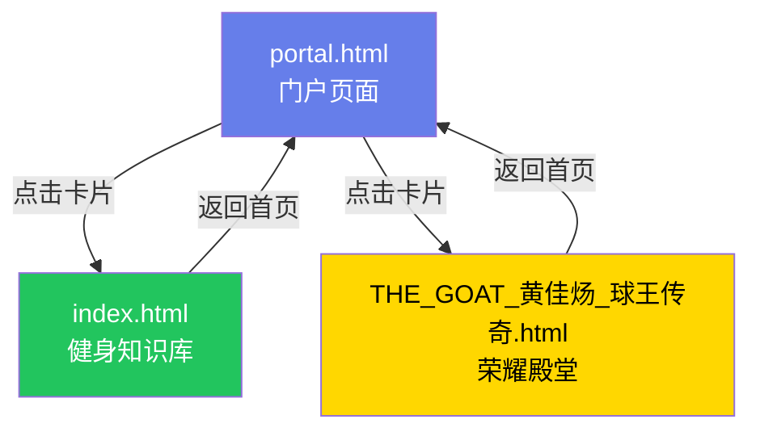

# 📄 页面结构说明

本文档说明项目中不同页面的用途和访问方式。

---

## 🎯 页面概览

本项目包含**3个独立的HTML页面**,每个页面服务于不同的目的:

### 1️⃣ 门户页面 (portal.html)

**用途**: 项目导航入口,统一展示所有个人项目

**访问地址**:
- 本地: `http://localhost:5173/portal.html`
- GitHub Pages: `https://yangzn666.github.io/sport/portal.html`

**内容**:
- 🏋️ 健身与跑步科学知识库 - 点击进入React应用
- ⚽ 球王黄佳炀荣耀殿堂 - 点击进入成就展示页

**特点**:
- 精美的渐变背景
- 卡片式布局
- 响应式设计
- 粒子动画效果

---

### 2️⃣ 健身知识库 (index.html + React应用)

**用途**: 完整的健身科学知识管理系统

**访问地址**:
- 本地开发: `http://localhost:5173/`
- GitHub Pages: `https://yangzn666.github.io/sport/`

**技术栈**:
- React 19
- Vite 8
- Tailwind CSS 4
- React Router DOM 7
- Mermaid.js (图表)

**功能模块**:
- 📊 首页仪表盘 - 统计卡片、智能搜索
- 📚 知识库浏览 - 分类查看文章
- 📖 文章详情 - Markdown渲染、目录导航
- 🔍 智能搜索 - 全文检索
- 📈 数据分析 - 体脂秤数据可视化
- 💡 智能分析 - 个性化建议

**知识库内容**:
- 运动生理学基础
- 力量训练科学
- 有氧训练与耐力科学
- 营养与恢复科学
- 周期化训练高级理论
- 心理训练与认知表现
- 2024-2026前沿研究汇总

---

### 3️⃣ 黄佳炀荣耀殿堂 (THE_GOAT_黄佳炀_球王传奇.html)

**用途**: 个人足球成就展示页面

**访问地址**:
- 本地: `http://localhost:5173/THE_GOAT_黄佳炀_球王传奇.html`
- GitHub Pages: `https://yangzn666.github.io/sport/THE_GOAT_黄佳炀_球王传奇.html`

**内容**:
- 👑 THE GOAT称号
- 🏆 65+项个人荣誉
- ⚽ 梅开二度球王风采
- 🚴‍♂️ 浙西天路征服者
- ✨ C罗风格特效展示

**特点**:
- 奢华的金色主题
- 动态粒子效果
- 戏剧性交互
- 王者般震撼氛围

---

## 🔄 页面跳转关系



---

## 🛠️ 开发指南

### 本地运行

```bash
# 启动开发服务器
npm run dev

# 访问不同页面:
# 1. 门户页面: http://localhost:5173/portal.html
# 2. 健身知识库: http://localhost:5173/
# 3. 荣耀殿堂: http://localhost:5173/THE_GOAT_黄佳炀_球王传奇.html
```

### 构建生产版本

```bash
npm run build

# 输出到 dist/ 目录
# 所有HTML文件会被复制到dist根目录
```

### 部署到GitHub Pages

已配置GitHub Actions自动部署:
- 每次push到main分支自动触发
- 约2-3分钟完成部署
- 访问: https://yangzn666.github.io/sport/

---

## 📝 修改建议

### 如需添加新项目

1. 在 `portal.html` 中添加新的项目卡片
2. 创建对应的项目页面
3. 更新本说明文档

### 如需修改现有页面

**门户页面**:
- 编辑 `portal.html`
- 修改CSS样式或JavaScript逻辑

**健身知识库**:
- 编辑 `src/` 目录下的React组件
- 修改 `public/data/knowledge/` 中的Markdown文章

**荣耀殿堂**:
- 编辑 `THE_GOAT_黄佳炀_球王传奇.html`
- 修改HTML内容和CSS样式

---

## 🎨 设计原则

### 分离关注点

- **门户页面**: 简洁明了,快速导航
- **健身知识库**: 专业严谨,内容丰富
- **荣耀殿堂**: 奢华震撼,视觉冲击

### 独立维护

每个页面都是独立的HTML文件,可以单独修改和部署,互不影响。

### 统一风格

虽然内容不同,但整体设计风格保持一致:
- 现代化的UI设计
- 响应式布局
- 流畅的动画效果
- 优秀的用户体验

---

## 📞 需要帮助?

如有问题,请:

1. 查看 [README.md](README.md)
2. 查看 [QUICKSTART.md](QUICKSTART.md)
3. 提交 [GitHub Issue](https://github.com/Yangzn666/sport/issues)

---

**最后更新**: 2026年5月31日
