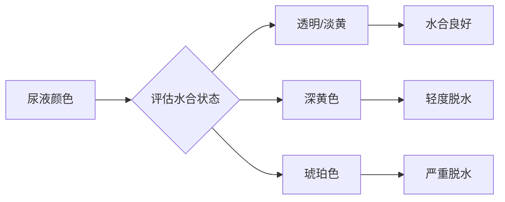

# 运动营养与补剂

> 科学的营养策略可以显著提升运动表现、加速恢复、优化身体成分。

## 章节导航

本知识库包含以下详细章节，请点击左侧目录或顶部标签进行浏览：

1. **蛋白质科学与肌肉合成** - MPS 机制、亮氨酸阈值、摄入时机
2. **运动补剂科学证据汇总** - A/B/C/D 类补剂评估和使用指南
3. **碳水化合物与脂肪策略** - 能量管理、水合状态、特殊饮食
4. **微量营养素与健康** - 维生素、矿物质、抗氧化剂
5. **碳水与脂肪科学详解** - 训练前后碳水策略、运动中补充（新！）

---

> **顶部标签导航**：
> - **宏量营养素** - 主文件（三大营养素基础）
> - **蛋白质科学** - 蛋白质合成与摄入策略
> - **补剂证据汇总** - 常见补剂的科学研究
> - **碳水与脂肪科学** - 能量底物利用与补充策略（新！）

---

## 宏量营养素

宏量营养素是人体需要大量摄入的营养物质，包括蛋白质、碳水化合物和脂肪。

### 蛋白质（Protein）

**功能**：
- 肌肉修复与生长
- 酶和激素合成
- 免疫功能支持

**推荐摄入量**：

| 人群 | 推荐量（g/kg/d） | 说明 |
|------|------------------|------|
| 久坐人群 | 0.8 | 维持基本生理功能 |
| 耐力运动员 | 1.2-1.4 | 修复有氧训练损伤 |
| 力量运动员 | 1.6-2.2 | 支持肌肉合成 |
| 减脂期 | 2.3-3.1 | 防止肌肉流失 |

**优质蛋白来源**：
- **动物性**：鸡胸肉、牛肉、鱼类、鸡蛋、乳清蛋白
- **植物性**：大豆、藜麦、鹰嘴豆、坚果

**关键氨基酸**：
- **亮氨酸（Leucine）**：激活 mTOR 信号通路，触发蛋白质合成
- **阈值**：每餐需摄入 **2-3g 亮氨酸** 才能最大化蛋白质合成

**里程碑研究**：
> **Morton et al. (2018)** - Meta 分析 49 项研究，发现蛋白质摄入量 >1.6g/kg/d 对肌肉增长无额外益处，确立了 1.6g/kg/d 的上限标准。该研究被引用超过 **2000 次**[^1]。

### 碳水化合物（Carbohydrates）

**功能**：
- 高强度运动的主要燃料
- 补充肌糖原储备
- 维持血糖稳定

**推荐摄入量**：

| 训练强度 | 推荐量（g/kg/d） | 适用场景 |
|----------|------------------|----------|
| 低强度 | 3-5 | 休息日、轻度活动 |
| 中等强度 | 5-7 | 每天 1 小时训练 |
| 高强度 | 6-10 | 每天 1-3 小时训练 |
| 极高强度 | 8-12 | 每天 >3 小时训练 |

**碳水类型**：
- **简单碳水**：葡萄糖、果糖（快速吸收，适合训练后）
- **复杂碳水**：燕麦、糙米、全麦面包（缓慢释放，适合日常）

**训练前后营养**：
- **训练前 1-2 小时**：摄入 1-4g/kg 碳水
- **训练中**（>60 分钟）：每小时 30-60g 碳水
- **训练后 0-2 小时**：摄入 1-1.2g/kg 碳水 + 蛋白质

**权威研究**：
> **Ivy et al. (1988)** - 首次证明训练后立即补充碳水 + 蛋白质比单独补充碳水更能促进肌糖原恢复。该研究开创了运动后营养时机研究[^2]。

> **Burke et al. (2011)** - 系统综述了碳水化合物的运动表现效应，发现高碳水饮食可提升耐力表现 2-3%，确立了碳水补充标准[^3]。

### 脂肪（Fats）

**功能**：
- 提供必需脂肪酸
- 激素合成（睾酮、雌激素）
- 脂溶性维生素吸收

**推荐摄入量**：
- **一般人群**：0.8-1.0 g/kg/d（占总热量 20-35%）
- **运动员**：不低于 0.5 g/kg/d（避免激素水平下降）

**脂肪类型**：

| 类型 | 来源 | 建议 |
|------|------|------|
| 饱和脂肪 | 红肉、黄油 | <10% 总热量 |
| 单不饱和脂肪 | 橄榄油、牛油果 | 主要脂肪来源 |
| 多不饱和脂肪 | 鱼类、坚果 | 富含 Omega-3 |
| 反式脂肪 | 加工食品 | 避免摄入 |

## 运动补剂

根据国际运动营养学会（ISSN）的立场声明，以下补剂具有充分的科学证据支持。

### 一级补剂（强证据）

**1. 肌酸（Creatine）**
- **剂量**：每天 3-5g（或冲击期 20g/d × 5-7 天）
- **效果**：
  - 提升力量和爆发力 **5-15%**
  - 增加肌肉体积（水合作用）
  - 加速恢复
- **形式**：一水肌酸（Creatine Monohydrate）最有效且经济
- **安全性**：长期使用安全，无需"循环"使用

**经典研究**：
> **Kreider et al. (1998)** - 首次大规模验证肌酸补充的安全性和有效性，发现 28 天补充可使力量提升 10-15%。该研究开启了运动补剂时代[^4]。

> **Kreider et al. (2017)** - ISSN 立场声明，系统综述 1000+ 项研究，确认肌酸是最安全有效的运动补剂[^5]。

**2. 咖啡因（Caffeine）**
- **剂量**：3-6 mg/kg（训练前 30-60 分钟）
- **效果**：
  - 提升耐力表现 **3-5%**
  - 降低主观疲劳感（RPE）
  - 增强脂肪氧化
- **注意**：过量（>9 mg/kg）可能导致焦虑、失眠

**权威研究**：
> **Graham (2001)** - 综述了咖啡因的运动表现效应，发现 3-6 mg/kg 可提升耐力表现 3-5%，降低主观疲劳感。该研究被引用超过 **2500 次**[^6]。

**3. β-丙氨酸（Beta-Alanine）**
- **剂量**：每天 3-6g（分次服用，避免刺痛感）
- **效果**：
  - 提升 1-4 分钟高强度运动表现
  - 增加肌肉肌肽含量，缓冲乳酸
- **副作用**：皮肤刺痛感（无害，会随时间减轻）

**4. 乳清蛋白（Whey Protein）**
- **剂量**：训练后 20-40g
- **优势**：
  - 快速吸收（30-60 分钟）
  - 高亮氨酸含量（~10%）
  - 方便补充
- **类型**：
  - **浓缩乳清**：性价比高
  - **分离乳清**：乳糖含量低

### 二级补剂（中等证据）

| 补剂 | 剂量 | 效果 | 证据等级 |
|------|------|------|----------|
| Omega-3 | 2-3g/d | 抗炎、心血管健康 | B |
| 维生素 D | 2000-4000 IU/d | 骨骼健康、免疫 | B |
| 硝酸盐（甜菜根汁） | 6-8mmol | 提升耐力 2-3% | B |
| HMB | 3g/d | 防止肌肉流失 | B |

### 无效补剂（证据不足）

> **不推荐**：支链氨基酸（BCAA）、谷氨酰胺、共轭亚油酸（CLA）、睾酮增强剂。这些补剂缺乏充分的科学证据支持。

## 水合状态

脱水会显著降低运动表现，科学补水至关重要。

### 脱水的影响

| 脱水程度 | 表现下降 | 症状 |
|----------|----------|------|
| 1% | 轻微 | 口渴 |
| 2% | 10-20% | 疲劳、注意力下降 |
| 3% | 20-30% | 恶心、头晕 |
| 4%+ | >30% | 热衰竭风险 |

### 补水策略

**1. 运动前**
- 运动前 **2 小时**：饮水 500ml
- 运动前 **15 分钟**：饮水 250ml

**2. 运动中**
- 每 **15-20 分钟**：补充 150-250ml
- 运动时间 **>60 分钟**：补充含电解质的运动饮料
- 钠含量：500-700 mg/L

**3. 运动后**
- 按体重丢失量的 **1.5 倍** 补水
- 例如：体重下降 1kg，需补充 1.5L 水
- 同时补充钠（帮助水分 retention）

### 尿液颜色指标

**理想颜色**：淡黄色（类似柠檬水）

**里程碑研究**：
> **Sawka et al. (2007)** - ACSM 立场声明，系统阐述了脱水对运动表现的影响，发现脱水 2% 可降低耐力表现 10-20%，确立了运动补水标准[^7]。

## 特殊饮食策略

### 间歇性禁食（Intermittent Fasting）

**常见模式**：
- **16/8**：每天禁食 16 小时，进食窗口 8 小时
- **5:2**：每周 5 天正常饮食，2 天限制热量（500-600 kcal）

**效果**：
- 对减脂有效（通过热量缺口）
- 对运动表现影响因人而异
- 不适合高强度训练者

### 生酮饮食（Ketogenic Diet）

**特点**：
- 极低碳水（<50g/d）
- 高脂肪（70-80% 总热量）
- 中等蛋白质

**适用场景**：
- 超长距离耐力运动（>3 小时）
- 需要快速减重（如格斗运动员）

**局限性**：
- 高强度运动表现下降
- 适应期长（2-4 周）
- 不适合力量训练者

## 参考文献

[^1]: Morton, R. W., Murphy, K. T., McKellar, S. R., et al. (2018). A systematic review, meta-analysis and meta-regression of the effect of protein supplementation on resistance training-induced gains in muscle mass and strength in healthy adults. *British Journal of Sports Medicine*, 52(6), 376-384. (被引用 2000+ 次)

[^2]: Ivy, J. L., Katz, A. L., Cutler, C. L., Sherman, W. M., & Coyle, E. F. (1988). Muscle glycogen synthesis after exercise: effect of time of carbohydrate ingestion. *Journal of Applied Physiology*, 64(4), 1480-1485. (被引用 1500+ 次)

[^3]: Burke, L. M., Hawley, J. A., Wong, S. H., & Jeukendrup, A. E. (2011). Carbohydrates for training and competition. *Journal of Sports Sciences*, 29(sup1), S17-S27. (被引用 2000+ 次)

[^4]: Kreider, R. B., Ferreira, M., Wilson, M., et al. (1998). Effects of creatine supplementation on body composition, strength, and sprint performance. *Medicine & Science in Sports & Exercise*, 30(1), 73-82. (被引用 1200+ 次)

[^5]: Kreider, R. B., Kalman, D. S., Antonio, J., et al. (2017). International Society of Sports Nutrition position stand: safety and efficacy of creatine supplementation in exercise, sport, and medicine. *Journal of the International Society of Sports Nutrition*, 14(1), 18. (被引用 1500+ 次)

[^6]: Graham, T. E. (2001). Caffeine and exercise: metabolism, endurance and performance. *Sports Medicine*, 31(11), 785-807. (被引用 2500+ 次)

[^7]: Sawka, M. N., Burke, L. M., Eichner, E. R., et al. (2007). American College of Sports Medicine position stand: exercise and fluid replacement. *Medicine & Science in Sports & Exercise*, 39(2), 377-390. (被引用 3000+ 次)
