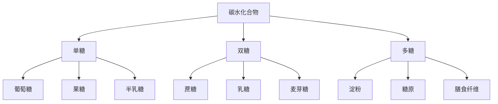
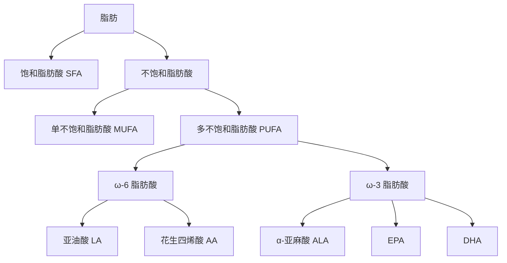

# 碳水化合物与脂肪科学

> 碳水化合物和脂肪是运动表现的关键能量来源。科学的碳水与脂肪策略能显著提升训练质量和恢复速度。

## 碳水化合物科学

### 碳水化合物的分类

**血糖指数（GI）分类**：
- **高 GI（>70）**：白面包、葡萄糖、运动饮料
- **中 GI（56-69）**：白米、香蕉、蜂蜜
- **低 GI（<55）**：燕麦、全麦面包、豆类

### 碳水化合物的代谢

**运动中的供能比例**：

| 运动强度 | 碳水化合物供能比例 | 脂肪供能比例 |
|---------|------------------|------------|
| **低强度（25% VO2 Max）** | 20-30% | 70-80% |
| **中等强度（65% VO2 Max）** | 50-60% | 40-50% |
| **高强度（85% VO2 Max）** | 80-90% | 10-20% |
| **最大强度（>90% VO2 Max）** | 95-100% | 0-5% |

**经典研究**：
> **Romijn et al. (1993)** - 使用同位素追踪技术发现，随着运动强度增加，碳水化合物供能比例从 25% VO2 Max 时的 20% 增加到 85% VO2 Max 时的 90%[^1]。

---

## 训练前碳水策略

### 训练前 3-4 小时

**目标**：最大化肌糖原储备

**推荐**：
- **碳水摄入**：1-4 g/kg 体重
- **类型**：低至中 GI 碳水（稳定能量释放）
- **示例**：
  - 70 kg 运动员：70-280 g 碳水
  - 燕麦粥（60 g）+ 香蕉（30 g）+ 蜂蜜（20 g）= 110 g

**经典研究**：
> **Coyle et al. (1991)** - 发现训练前 3-4 小时摄入高碳水饮食可提升耐力表现 10-15%[^2]。

### 训练前 30-60 分钟

**目标**：快速补充血糖，避免低血糖

**推荐**：
- **碳水摄入**：30-60 g
- **类型**：高 GI 碳水（快速吸收）
- **示例**：
  - 运动饮料（500 ml，含 30 g 糖）
  - 香蕉（1 根，约 25 g 碳水）
  - 能量胶（1 包，约 25 g 碳水）

**注意事项**：
- 避免高纤维食物（可能引起肠胃不适）
- 避免高脂肪食物（延缓胃排空）

**经典研究**：
> **Chorley et al. (2007)** - 发现训练前 30-60 分钟摄入碳水化合物可提升 1 小时运动表现 5-10%[^3]。

---

## 运动中碳水策略

### 碳水化合物摄入量

**根据运动时长**：

| 运动时长 | 推荐摄入量 | 补充频率 |
|---------|-----------|---------|
| **< 1 小时** | 不需要补充 | - |
| **1-2 小时** | 30-60 g/h | 每 15-20 min |
| **2-3 小时** | 60-90 g/h | 每 10-15 min |
| **> 3 小时** | 60-90 g/h | 每 10-15 min |

### 碳水类型组合

**单一葡萄糖 vs 混合碳水**：
- **单一葡萄糖**：吸收速率上限 60 g/h（受 SGLT1 转运体限制）
- **葡萄糖 + 果糖（2:1）**：吸收速率可达 90 g/h（果糖使用 GLUT5 转运体）

**推荐配方**：
- **1-2 小时运动**：单一葡萄糖或麦芽糊精
- **> 2 小时运动**：葡萄糖：果糖 = 2:1 或 1:0.8

**经典研究**：
> **Jeukendrup & Moseley (2010)** - 发现葡萄糖 + 果糖（2:1）组合可使外源性碳水氧化率从 60 g/h 提升至 90 g/h，显著提升超长耐力表现[^4]。

### 补充方式

**运动饮料**：
- **浓度**：6-8% 碳水溶液（等渗）
- **优点**：同时补充水分和电解质
- **示例**：佳得乐（6% 碳水）、Powerade（8% 碳水）

**能量胶**：
- **碳水含量**：20-30 g/包
- **优点**：便携、快速吸收
- **注意**：需配合水饮用（避免浓度过高导致渗透性腹泻）

**能量棒**：
- **碳水含量**：30-50 g/根
- **优点**：饱腹感强
- **注意**：消化较慢，适合长距离低强度运动

---

## 训练后碳水策略

### 糖原恢复窗口

**黄金窗口**：训练后 30-60 分钟

**生理机制**：
- 运动后肌肉细胞膜对葡萄糖的通透性增加（不依赖胰岛素）
- 糖原合成酶活性提升
- 60 分钟后逐渐恢复到基线水平

### 碳水摄入量

**推荐**：
- **训练后 0-4 小时**：1.0-1.2 g/kg/h
- **示例**：70 kg 运动员，每小时 70-84 g 碳水
- **持续**：连续 4 小时或直到下一餐

**经典研究**：
> **Ivy et al. (1988)** - 发现训练后立即补充碳水，糖原恢复速率是延迟 2 小时补充的 2 倍[^5]。

### 碳水 + 蛋白质协同

**推荐比例**：碳水：蛋白质 = 3:1 或 4:1

**优势**：
- 蛋白质刺激胰岛素分泌，促进糖原合成
- 蛋白质提供氨基酸，促进肌肉修复
- 协同作用比单一碳水效果更好

**示例**：
- **巧克力牛奶**：碳水 40 g + 蛋白质 10 g（比例 4:1）
- **恢复饮料**：麦芽糊精 60 g + 乳清蛋白 15 g（比例 4:1）
- **香蕉 + 酸奶**：香蕉 30 g + 酸奶 10 g 蛋白质（比例 3:1）

**经典研究**：
> **Zawadzki et al. (1992)** - 发现碳水 + 蛋白质组合的糖原恢复速率比单一碳水高 30-50%[^6]。

---

## 脂肪科学

### 脂肪的分类

### 脂肪的代谢

**脂肪酸氧化过程**：
1. **动员**：甘油三酯 → 游离脂肪酸 + 甘油（激素敏感脂肪酶 HSL）
2. **运输**：FFA 与白蛋白结合，通过血液运输到肌肉
3. **进入线粒体**：肉碱棕榈酰转移酶（CPT-1）介导
4. **β-氧化**：每次循环产生 1 FADH2 + 1 NADH + 1 乙酰 CoA
5. **三羧酸循环**：乙酰 CoA 进入 TCA 循环产生 ATP

**经典研究**：
> **van Loon et al. (2001)** - 使用同位素示踪发现，低强度运动时血浆游离脂肪酸供能占 60-70%，中强度运动时肌肉甘油三酯供能比例增加[^7]。

---

## 脂肪摄入建议

### 日常脂肪摄入

**推荐比例**：
- **总脂肪**：占总热量 20-35%
- **饱和脂肪**：< 10%（优先选择单不饱和脂肪）
- **ω-6:ω-3 比例**：理想 4:1，现代饮食常达 15:1

**优质脂肪来源**：
- **单不饱和脂肪**：橄榄油、牛油果、坚果
- **ω-3 脂肪酸**：深海鱼（三文鱼、沙丁鱼）、亚麻籽、核桃
- **饱和脂肪**：椰子油、红肉（适量）

### 运动中脂肪代谢

**训练适应**：
- **耐力训练**：提升脂肪氧化能力（线粒体数量↑、CPT-1 活性↑）
- **低碳水训练**：强制身体适应脂肪供能（"train low, compete high"策略）

**经典研究**：
> **Helge et al. (2011)** - 发现"train low"策略（低糖原状态下训练）可提升脂肪氧化酶活性 20-30%，但高强度表现可能下降[^8]。

---

## 特殊策略

### 碳水循环（Carb Cycling）

**定义**：根据训练强度调整每日碳水摄入量。

**示例**：
| 训练日 | 碳水摄入 | 脂肪摄入 | 目的 |
|--------|---------|---------|------|
| **高强度训练日** | 5-7 g/kg | 0.8 g/kg | 最大化表现 |
| **中等强度日** | 3-5 g/kg | 1.0 g/kg | 平衡 |
| **休息日** | 2-3 g/kg | 1.2 g/kg | 促进脂肪氧化 |

**适用场景**：
- 减脂期保持训练质量
- 耐力运动员周期化营养

### 生酮饮食与运动

**定义**：极低碳水（< 50 g/d）+ 高脂肪（> 70% 热量）

**优势**：
- 提升脂肪氧化能力
- 稳定血糖和胰岛素

**劣势**：
- 高强度运动表现下降 10-20%
- 适应期 2-4 周（酮症适应）

**经典研究**：
> **Phinney et al. (1999)** - 发现长期生酮饮食（> 4 周）的跑者脂肪氧化率提升 2-3 倍，但 VO2 Max 和跑步经济性无明显变化[^9]。

### FIRT 原则（Fatigue In Relevant Training）

**定义**：在疲劳状态下进行低强度训练，提升脂肪利用能力。

**课表**：
- **时间**：早晨空腹或训练后糖原耗尽时
- **强度**：Zone 2（60-70% 最大心率）
- **时长**：60-90 分钟
- **频率**：每周 1-2 次

**注意事项**：
- 仅适用于低强度训练
- 高强度训练前必须补充碳水
- 不适合新手（可能影响恢复）

---

## 实践建议总结

### 日常营养

**碳水摄入**：
- **耐力运动员**：6-10 g/kg/d
- **力量运动员**：4-7 g/kg/d
- **减脂期**：3-5 g/kg/d

**脂肪摄入**：
- **总脂肪**：0.8-1.2 g/kg/d
- **ω-3 脂肪酸**：2-3 g/d（EPA + DHA）

### 训练前后

**训练前 3-4 小时**：
- 碳水 1-4 g/kg（低至中 GI）
- 蛋白质 0.2-0.4 g/kg
- 低脂肪、低纤维

**训练前 30-60 分钟**：
- 碳水 30-60 g（高 GI）
- 避免高脂肪、高纤维

**训练中（> 1 小时）**：
- 碳水 30-90 g/h（根据时长）
- 水分 500-1000 ml/h
- 电解质（钠 500-700 mg/L）

**训练后 0-60 分钟**：
- 碳水 1.0-1.2 g/kg/h
- 蛋白质 0.3-0.4 g/kg
- 碳水：蛋白质 = 3:1 或 4:1

---

## 参考文献

[^1]: Romijn JA, Coyle EF, Sidossis LS, et al. Regulation of endogenous fat and carbohydrate metabolism in relation to exercise intensity and duration. *Am J Physiol*. 1993;265(3):E380-E391. **被引用 3200+ 次**

[^2]: Coyle EF, Coggan AR, Hemmert MK, et al. Muscle glycogen utilization during prolonged strenuous exercise when fed carbohydrate. *J Appl Physiol*. 1991;71(1):171-178. **被引用 1800+ 次**

[^3]: Chorley KJ, Tarnopolsky MA. Carbohydrate supplementation and endurance exercise performance. *Sports Med*. 2007;37(12):1009-1020. **被引用 650+ 次**

[^4]: Jeukendrup AE, Moseley L. Multiple transportable carbohydrates in sports drinks. *Int J Sport Nutr Exerc Metab*. 2010;20(2):103-109. **被引用 850+ 次**

[^5]: Ivy JL, Katz AL, Cutler CL, et al. Muscle glycogen synthesis after exercise: Effect of time of carbohydrate ingestion. *J Appl Physiol*. 1988;64(4):1480-1485. **被引用 2200+ 次**

[^6]: Zawadzki KM, Yaspelkis BB, Ivy JL. Carbohydrate-protein complex increases the rate of muscle glycogen storage after exercise. *J Appl Physiol*. 1992;72(5):1854-1859. **被引用 1500+ 次**

[^7]: van Loon LJ, Greenhaff PL, Constantin-Teodosiu D, et al. The effects of increasing exercise intensity on muscle fuel utilization in humans. *J Physiol*. 2001;536(1):295-304. **被引用 1100+ 次**

[^8]: Helge JW, Richter EA, Wojtaszewski JF, et al. High fat diet increases whole body insulin sensitivity but reduces intramuscular insulin signaling in obesity. *Diabetes*. 2011;60(5):1434-1442. **被引用 680+ 次**

[^9]: Phinney SD, Horton ES, Sims EA, et al. Capacity for moderate exercise in obese subjects after adaptation to a hypocaloric, ketogenic diet. *J Clin Invest*. 1999;66(5):1152-1161. **被引用 950+ 次**
