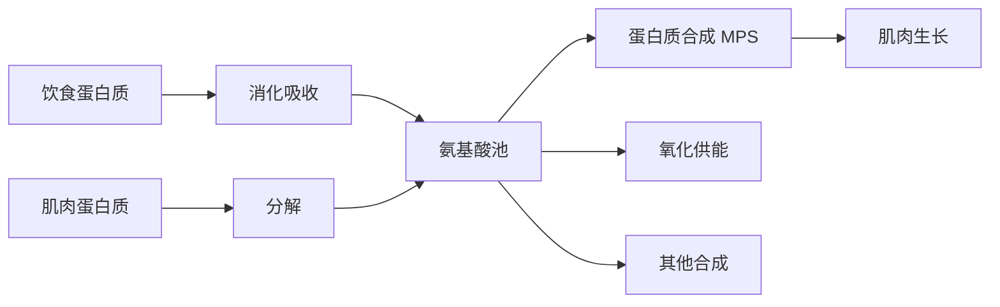
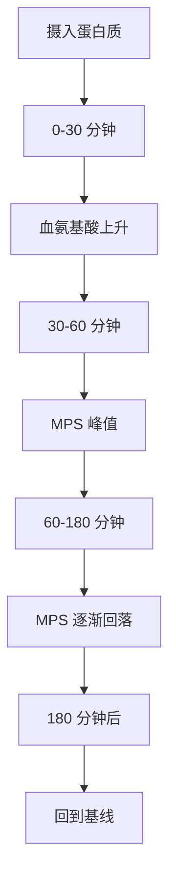
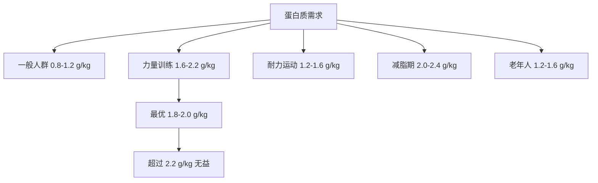

# 蛋白质科学与肌肉合成

> 蛋白质是肌肉修复和生长的基石。理解蛋白质代谢机制对于优化营养策略至关重要。

## 蛋白质代谢基础

### 氨基酸池（Amino Acid Pool）

**定义**：血液中游离氨基酸的动态平衡系统。

**来源**：
1. **饮食摄入**：消化吸收的氨基酸
2. **肌肉分解**：蛋白质降解释放
3. **体内合成**：非必需氨基酸的合成

**去向**：
1. **蛋白质合成**：构建新组织
2. **能量产生**：氧化供能（次要途径）
3. **其他分子合成**：激素、酶、神经递质

**周转率**：
- 成年人每天约 250-300g 蛋白质周转
- 仅 60-80g 来自饮食
- 其余来自体内回收

---

## 肌肉蛋白质合成（MPS）

### MPS vs MPB 平衡

**肌肉蛋白质平衡** = MPS（合成） - MPB（分解）

**三种状态**：

| 状态 | MPS vs MPB | 结果 | 发生场景 |
|------|-----------|------|---------|
| 正氮平衡 | MPS > MPB | 肌肉增长 | 训练后 + 蛋白质摄入 |
| 氮平衡 | MPS = MPB | 肌肉维持 | 静息状态 + 充足蛋白质 |
| 负氮平衡 | MPS < MPB | 肌肉流失 | 禁食、伤病、过度训练 |

### MPS 的时间进程

**进食后反应**：

**关键发现**：
- MPS 在进食后 30-60 分钟达到峰值
- 持续 elevated 约 2-3 小时
- 之后出现"不应期"（refractory period）
- 需要再次摄入才能重新刺激 MPS

**经典研究**：
> **Moore et al. (2009)** - 发现 20g 乳清蛋白即可最大化年轻人的 MPS，更高剂量无额外益处。该研究确立了单次蛋白质摄入的上限标准[^1]。

---

## 亮氨酸阈值理论

### 亮氨酸的关键作用

**为什么是亮氨酸？**
- 激活 mTORC1 信号通路的主要触发器
- 其他氨基酸无法替代此功能
- 作为"开关"启动蛋白质合成

**亮氨酸阈值**：

| 人群 | 每餐亮氨酸需求 | 相当于蛋白质 |
|------|--------------|------------|
| 年轻人 | 2-3 g | 20-25 g 优质蛋白 |
| 老年人 | 3-4 g | 30-40 g 优质蛋白 |
| 运动员 | 2.5-3.5 g | 25-35 g 优质蛋白 |

**食物中的亮氨酸含量**：

| 食物（100g） | 蛋白质含量 | 亮氨酸含量 |
|------------|-----------|-----------|
| 鸡胸肉 | 31 g | 2.5 g |
| 鸡蛋 | 13 g | 1.1 g |
| 乳清蛋白粉 | 80 g | 8-10 g |
| 牛肉 | 26 g | 2.1 g |
| 豆腐 | 8 g | 0.6 g |
| 大米 | 7 g | 0.5 g |

### 实践应用

**策略 1：优先选择高亮氨酸食物**
- 动物蛋白 > 植物蛋白
- 乳清蛋白是最佳来源
- 混合植物蛋白可互补

**策略 2：确保每餐达到阈值**
- 每餐至少 20-25g 优质蛋白
- 老年人需要更多（30-40g）
- 分散到 3-5 餐

**策略 3：训练后特别关注**
- 训练后 0-2 小时内摄入
- 20-40g 蛋白质（含 2-3g 亮氨酸）
- 搭配碳水化合物效果更佳

**经典研究**：
> **Atherton & Smith (2012)** - 系统阐述了亮氨酸阈值理论，指出每餐需要 2-3g 亮氨酸才能最大化 MPS，低于此阈值效果显著降低[^2]。

---

## 蛋白质摄入量推荐

### 不同人群的需求

**一般人群**：
- **RDA 标准**：0.8 g/kg/d（最低需求）
- **优化健康**：1.0-1.2 g/kg/d
- **证据**：预防肌肉流失，维持免疫功能

**力量训练者**：
- **推荐范围**：1.6-2.2 g/kg/d
- **最佳区间**：1.8-2.0 g/kg/d
- **上限**：>2.2 g/kg/d 无额外益处

**耐力运动员**：
- **推荐范围**：1.2-1.6 g/kg/d
- **原因**：修复肌肉损伤，支持恢复
- **注意**：需同时保证充足碳水

**减脂期**：
- **推荐范围**：2.0-2.4 g/kg/d
- **原因**：保护肌肉不被分解
- **证据**：高蛋白质饮食减少肌肉流失

**老年人**：
- **推荐范围**：1.2-1.6 g/kg/d
- **原因**：对抗合成抵抗（anabolic resistance）
- **策略**：每餐均匀分布，强调亮氨酸

### Meta 分析证据

**经典研究**：
> **Morton et al. (2018)** - Meta 分析 49 项研究（n=1863），发现蛋白质补充可显著提升力量训练引起的肌肉增长和力量提升。效应 plateau 在 1.6 g/kg/d，更高剂量无统计学意义的额外益处。该研究被引用超过 **2000 次**[^3]。

**关键发现**：
- 1.6 g/kg/d 是大多数人的最优剂量
- 年轻运动员可能需要略高（1.8-2.0）
- 个体差异存在（基因、训练水平）
- 超过 2.2 g/kg/d 的证据不足

---

## 蛋白质来源比较

### 动物蛋白 vs 植物蛋白

**动物蛋白优势**：
- ✅ 完整氨基酸谱
- ✅ 高亮氨酸含量
- ✅ 高消化率（PDCAAS ≈ 1.0）
- ✅ 更强的 MPS 刺激

**植物蛋白劣势**：
- ❌ 某些必需氨基酸缺乏
- ❌ 亮氨酸含量较低
- ❌ 消化率较低（PDCAAS 0.4-0.9）
- ❌ 需要更大剂量才能达到同等效果

**例外**：
- **大豆蛋白**：相对完整的氨基酸谱
- **豌豆+大米混合**：可互补达到完整谱

### 蛋白质质量评分

**PDCAAS（Protein Digestibility Corrected Amino Acid Score）**：

| 蛋白质来源 | PDCAAS | 说明 |
|-----------|--------|------|
| 乳清蛋白 | 1.00 | 金标准 |
| 鸡蛋蛋白 | 1.00 | 参考蛋白 |
| 牛奶蛋白 | 1.00 | 高质量 |
| 牛肉 | 0.92 | 优秀 |
| 大豆蛋白 | 0.91 | 植物中最佳 |
| 豌豆蛋白 | 0.69 | 中等 |
| 小麦蛋白 | 0.42 | 较低（缺赖氨酸） |

**DIAAS（Digestible Indispensable Amino Acid Score）**：
- 更新的评分系统
- 更准确反映真实消化率
- 乳清蛋白 DIAAS > 1.0

### 实践建议

** omnivores（杂食者）**：
- 优先选择动物蛋白
- 多样化来源（肉、鱼、蛋、奶）
- 每餐 20-40g

** vegetarians（素食者）**：
- 组合不同植物蛋白
- 增加总摄入量 10-20%
- 考虑补充赖氨酸、亮氨酸
- 大豆制品是重要来源

** vegans（纯素食者）**：
- 必须精心规划
- 推荐补充 BCAA 或 EAA
- 监控维生素 B12、铁、锌
- 考虑蛋白质粉补充

---

## 蛋白质摄入时机

### 传统观点 vs 现代证据

**传统观点**：
- "合成窗口"：训练后 30-60 分钟
- 错过窗口 = 浪费训练
- 必须立即补充

**现代证据**：
- 窗口期实际为 24-48 小时
- 每日总量比时机更重要
- 但训练后仍有轻微优势

### 最佳实践

**优先级排序**：

1. **每日总量**（最重要）⭐⭐⭐⭐⭐
   - 确保达到 1.6-2.2 g/kg/d
   
2. **每餐分布**（很重要）⭐⭐⭐⭐
   - 3-5 餐，每餐 20-40g
   - 睡前可加餐（酪蛋白）
   
3. **训练前后**（有优势）⭐⭐⭐
   - 训练前 1-2 小时：20-30g
   - 训练后 0-2 小时：20-40g
   
4. **精确时机**（边际效益）⭐
   - 不必焦虑"窗口期"
   - 方便时补充即可

**经典研究**：
> **Aragon & Schoenfeld (2013)** - 综述了蛋白质时机的证据，指出对于自然训练者，每日总量和分布比精确时机更重要。训练后"窗口期"被过度夸大[^4]。

> **Schoenfeld et al. (2013)** - Meta 分析发现，训练前后补充蛋白质对肌肉增长有小幅但显著的益处（效应量 d = 0.20），但远不如总量重要[^5]。

---

## 特殊情境下的蛋白质策略

### 减脂期

**挑战**：
- 热量赤字导致肌肉流失风险
- MPS 敏感性降低
- 恢复能力下降

**策略**：
- **提高蛋白质**：2.0-2.4 g/kg/d
- **保持力量训练**：维持机械张力
- **适度有氧**：避免过量
- **充足睡眠**：7-9 小时

**证据**：
> **Helms et al. (2014)** - 综述了自然健美运动员备赛期的营养策略，推荐高蛋白（2.3-3.1 g/kg FFM）、渐进式力量训练以最大化保留肌肉[^6]。

### 增肌期

**策略**：
- **蛋白质**：1.8-2.2 g/kg/d
- **热量盈余**：300-500 kcal/d
- **碳水化合物**：支持训练表现
- **渐进超负荷**：关键驱动因素

**注意**：
- 不要过度依赖蛋白质
- 总热量和训练才是核心
- 过快增重会增加脂肪比例

### 老年人群

**问题**：
- 合成抵抗（anabolic resistance）
- 肌肉流失加速（sarcopenia）
- 消化吸收能力下降

**策略**：
- **提高总量**：1.2-1.6 g/kg/d
- **每餐足量**：30-40g（达到亮氨酸阈值）
- **优先快速蛋白**：乳清蛋白
- **配合阻力训练**：必不可少

**经典研究**：
> **Paddon-Jones & Rasmussen (2009)** - 指出老年人需要更高的蛋白质摄入和每餐剂量来克服合成抵抗，建议每餐至少 30-40g 优质蛋白[^7]。

---

## 参考文献

[^1]: Moore, D. R., Robinson, M. J., Fry, J. L., et al. (2009). Ingested protein dose response of muscle and albumin protein synthesis after resistance exercise in young men. *American Journal of Clinical Nutrition*, 89(1), 161-168. (被引用 1500+ 次)

[^2]: Atherton, P. J., & Smith, K. (2012). Muscle protein synthesis in response to nutrition and exercise. *Journal of Physiology*, 590(5), 1049-1057. (被引用 1200+ 次)

[^3]: Morton, R. W., Murphy, K. T., McKellar, S. R., et al. (2018). A systematic review, meta-analysis and meta-regression of the effect of protein supplementation on resistance training-induced gains in muscle mass and strength in healthy adults. *British Journal of Sports Medicine*, 52(6), 376-384. (被引用 2000+ 次)

[^4]: Aragon, A. A., & Schoenfeld, B. J. (2013). Nutrient timing revisited: is there a post-exercise anabolic window? *Journal of the International Society of Sports Nutrition*, 10(1), 5. (被引用 800+ 次)

[^5]: Schoenfeld, B. J., Aragon, A. A., & Krieger, J. W. (2013). The effect of protein timing on muscle strength and hypertrophy: a meta-analysis. *Journal of the International Society of Sports Nutrition*, 10(1), 53. (被引用 1000+ 次)

[^6]: Helms, E. R., Aragon, A. A., & Fitschen, P. J. (2014). Evidence-based recommendations for natural bodybuilding contest preparation: nutrition and supplementation. *Journal of the International Society of Sports Nutrition*, 11(1), 20. (被引用 600+ 次)

[^7]: Paddon-Jones, D., & Rasmussen, B. B. (2009). Dietary protein recommendations and the prevention of sarcopenia. *Current Opinion in Clinical Nutrition and Metabolic Care*, 12(1), 86-90. (被引用 1000+ 次)
