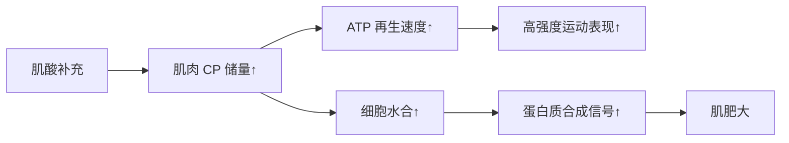
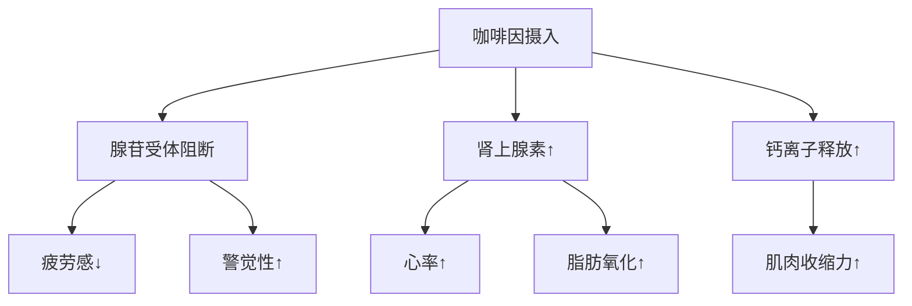
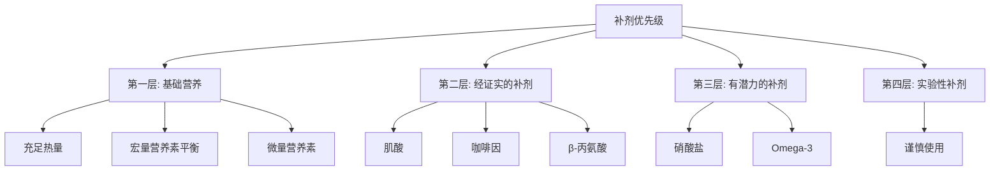

# 运动补剂科学证据汇总

> 运动补剂市场鱼龙混杂，本文基于科学证据评估常见补剂的有效性和安全性。

## 补剂分类系统

### ISSN 立场声明分类

**国际运动营养学会（ISSN）**将补剂分为四类：

| 类别 | 定义 | 示例 |
|------|------|------|
| **A 类** | 强有力证据支持，安全有效 | 肌酸、咖啡因、β-丙氨酸 |
| **B 类** | 初步证据支持，需更多研究 | HMB、硝酸盐、Omega-3 |
| **C 类** | 证据不足或矛盾 | CLA、谷氨酰胺、睾酮增强剂 |
| **D 类** | 无效或危险 | DHEA、雄烯二酮 |

**本章节重点介绍 A 类和 B 类补剂**。

---

## A 类补剂（强烈推荐）

### 1. 肌酸（Creatine）

#### 作用机制

**生化过程**：
- 肌酸 → 磷酸肌酸（CP）
- CP + ADP → 肌酸 + ATP
- 快速再生 ATP，维持高强度运动

#### 有效性证据

**力量与爆发力**：
- ✅ 1RM 力量提升 5-15%
- ✅ 重复冲刺能力改善 10-20%
- ✅ 跳跃高度增加 5-10%

**肌肥大**：
- ✅ 短期（4-12 周）增加 1-2 kg 体重
- ✅ 长期促进肌肉生长
- ✅ 机制：细胞水合 + 训练容量提升

**认知功能**：
- ✅ 改善睡眠质量不足者的认知表现
- ✅ 可能延缓神经退行性疾病
- ⚠️ 证据仍在积累中

#### 使用方法

**加载期（可选）**：
- 剂量：0.3 g/kg/d（约 20g/d）
- 持续时间：5-7 天
- 目的：快速饱和肌肉

**维持期**：
- 剂量：3-5 g/d
- 持续时间：长期使用
- 时间：任意时间（一致性更重要）

**形式选择**：
- ✅ **一水肌酸**（Creatine Monohydrate）：金标准，最便宜
- ❌ 其他形式（HCL、乙酯等）：无额外优势，更贵

#### 安全性

**长期研究**：
- ✅ 使用长达 5 年无不良反应
- ✅ 不影响肾功能（健康人群）
- ✅ 不引起脱发（谣言）

**副作用**：
- 轻微体重增加（1-2 kg，水分）
- 少数人肠胃不适（分次服用可缓解）

**经典研究**：
> **Kreider et al. (2017)** - ISSN 立场声明，系统综述 1000+ 项研究，确认肌酸是最安全有效的运动补剂，推荐剂量 3-5 g/d。该声明被引用超过 **1500 次**[^1]。

> **Harris et al. (1992)** - 首次证明口服肌酸可使肌肉 CP 储量增加 20-40%，开启了运动补剂时代[^2]。

---

### 2. 咖啡因（Caffeine）

#### 作用机制

**主要机制**：
- **腺苷受体拮抗**：减少疲劳感
- **肾上腺素释放**：提升警觉性
- **脂肪氧化增加**：节省糖原
- **钙离子释放**：增强肌肉收缩

#### 有效性证据

**耐力运动**：
- ✅ 表现提升 2-4%
- ✅ 延长力竭时间 20-50%
- ✅ 降低 RPE（主观疲劳度）

**力量训练**：
- ✅ 卧推 1RM 提升 2-5%
- ✅ 重复次数增加 5-10%
- ⚠️ 效果不如耐力运动明显

**认知功能**：
- ✅ 提升注意力、反应时间
- ✅ 改善睡眠不足时的表现
- ⚠️ 高剂量可能导致焦虑

#### 使用方法

**最佳剂量**：
- **范围**：3-6 mg/kg 体重
- **示例**：70 kg 个体 = 210-420 mg
- **上限**：不建议超过 9 mg/kg

**摄入时机**：
- **训练前**：30-60 分钟
- **半衰期**：3-5 小时
- **避免**：睡前 6 小时内

**来源选择**：
- ☕ 咖啡：天然来源，含抗氧化剂
- 💊 补剂：剂量精确，方便
- 🥤 能量饮料：注意糖分和其他成分

#### 个体差异

**基因因素**：
- **CYP1A2 基因**：决定代谢速度
- **快代谢者**：效果更好，副作用少
- **慢代谢者**：易出现心悸、焦虑

**耐受性**：
- 长期使用会产生耐受
- 建议周期性停用（1-2 周）
- 比赛前重新加载

#### 安全性

**安全剂量**：
- ✅ <400 mg/d（一般人群）
- ✅ <6 mg/kg（运动员）
- ❌ >9 mg/kg 可能有害

**副作用**：
- 失眠、焦虑、心悸（高剂量）
- 肠胃不适
- 依赖性（戒断症状：头痛、疲劳）

**经典研究**：
> **Graham (2001)** - 综述了咖啡因的运动表现效应，发现 3-6 mg/kg 可提升耐力表现 3-5%，降低主观疲劳感。该研究被引用超过 **2500 次**[^3]。

> **Guest et al. (2021)** - ISSN 立场声明更新，确认咖啡因的安全性和有效性，推荐个性化剂量[^4]。

---

### 3. β-丙氨酸（Beta-Alanine）

#### 作用机制

**肌肽合成**：
- β-丙氨酸 + 组氨酸 → 肌肽（Carnosine）
- 肌肽在肌肉中缓冲 H⁺ 离子
- 延缓 pH 值下降，推迟疲劳

**限制因素**：
- 组氨酸充足，β-丙氨酸是限速因子
- 补充 β-丙氨酸可提升肌肽 40-80%

#### 有效性证据

**高强度运动**（1-4 分钟）：
- ✅  Cycling 时间试验提升 2-3%
- ✅ 游泳 100-200m 表现改善
- ✅ 划船 2000m 成绩提升

**力量训练**：
- ⚠️ 对 1RM 力量无显著影响
- ✅ 可能增加训练容量（总次数）

**老年人**：
- ✅ 改善肌肉耐力
- ✅ 可能延缓功能衰退

#### 使用方法

**剂量**：
- **每日**：3-6 g
- **分次**：每次 ≤800 mg（避免刺痛感）
- **持续时间**：至少 4 周（肌肽积累需要时间）

**加载策略**：
- **第 1-4 周**：3.2 g/d（分 4 次）
- **第 5+ 周**：维持剂量
- **周期**：可持续使用，无需停用

**副作用**：
- **感觉异常**（Paresthesia）：皮肤刺痛感
  - 无害，通常 60-90 分钟消退
  - 分次服用或小剂量可减轻

#### 与其他补剂组合

**肌酸 + β-丙氨酸**：
- ✅ 协同效应
- 肌酸提升磷酸原系统
- β-丙氨酸提升糖酵解系统
- 适合多种运动类型

**经典研究**：
> **Hobson et al. (2012)** - Meta 分析 15 项研究，发现 β-丙氨酸补充平均提升运动表现 2.85%，尤其在 1-4 分钟高强度运动中效果显著[^5]。

> **Saunders et al. (2017)** - ISSN 立场声明，确认 β-丙氨酸的安全性和有效性，推荐每日 3-6 g 持续 4 周以上[^6]。

---

## B 类补剂（有潜力）

### 4. 硝酸盐（Nitrate）/ 甜菜根汁

#### 作用机制

**一氧化氮途径**：
- 硝酸盐 → 亚硝酸盐 → 一氧化氮（NO）
- NO 扩张血管，改善血流
- 提升线粒体效率

**效果**：
- 降低运动的氧气成本 3-5%
- 改善肌肉收缩效率
- 延缓疲劳

#### 有效性证据

**耐力运动**：
- ✅ 5-10 km 跑步时间缩短 1-3%
- ✅ Cycling 时间试验改善 2-4%
- ✅ 间歇运动恢复加快

**力量训练**：
- ⚠️ 证据有限
- 可能对高次数训练有帮助

#### 使用方法

**剂量**：
- **硝酸盐**：6-8 mmol（约 500 ml 甜菜根汁）
- **时机**：训练前 2-3 小时
- **频率**：连续使用效果更佳

**来源**：
- 🥬 甜菜根汁：最常用
- 🥗 绿叶蔬菜：菠菜、芝麻菜
- 💊 补剂：硝酸盐胶囊

**经典研究**：
> **Lansley et al. (2011)** - 发现甜菜根汁补充可降低 submaximal 运动的氧气消耗 5%，提升 Cycling 时间试验表现 2.8%[^7]。

---

### 5. Omega-3 脂肪酸

#### 作用机制

**抗炎作用**：
- EPA/DHA 抑制炎症因子（IL-6, TNF-α）
- 加速运动后恢复
- 减少 DOMS

**细胞膜流动性**：
- 整合到细胞膜磷脂
- 改善胰岛素敏感性
- 促进氨基酸转运

#### 有效性证据

**肌肉恢复**：
- ✅ 减少 DOMS 严重程度
- ✅ 加速力量恢复
- ⚠️ 对肌肥大影响不明确

**心血管健康**：
- ✅ 降低甘油三酯
- ✅ 改善血压
- ✅ 抗炎作用

#### 使用方法

**剂量**：
- **EPA + DHA**：2-3 g/d
- **比例**：EPA:DHA ≈ 2:1
- **来源**：鱼油、藻油（素食者）

**经典研究**：
> **Smith et al. (2011)** - 发现 Omega-3 补充可减少运动后肌肉酸痛，加速力量恢复，但对肌肥大无直接影响[^8]。

---

## C 类补剂（证据不足）

### 6. 支链氨基酸（BCAA）

**现状**：
- ⚠️ 如果蛋白质摄入充足，BCAA 无额外益处
- ✅ 仅在禁食训练或低蛋白饮食时有用
- 💰 性价比低，不如直接吃蛋白质

**建议**：
- 优先保证每日蛋白质总量
- BCAA 不是必需品

### 7. 谷氨酰胺（Glutamine）

**现状**：
- ❌ 对健康人群肌肥大无益
- ⚠️ 可能在极端情况下（烧伤、重症）有用
- ❌ 不推荐给普通运动员

### 8. 睾酮增强剂（T-Boosters）

**常见成分**：
- Tribulus Terrestris
- Fenugreek
- D-Aspartic Acid

**现状**：
- ❌ 大多数研究显示无效
- ❌ 无法显著提升睾酮水平
- ❌ 浪费金钱

---

## 补剂使用原则

### 优先级金字塔

### 决策流程

**问自己**：
1. ✅ 基础饮食是否优化？
2. ✅ 训练计划是否科学？
3. ✅ 睡眠和恢复是否充足？
4. ✅ 是否有明确的目标？

**只有前 3 项都满足，才考虑补剂**。

### 安全性检查清单

**购买前**：
- ✅ 查看第三方认证（NSF, Informed-Sport）
- ✅ 阅读成分标签
- ✅ 查阅科学文献
- ✅ 咨询专业人士

**使用中**：
- ✅ 从低剂量开始
- ✅ 监测副作用
- ✅ 记录效果
- ✅ 定期评估必要性

---

## 参考文献

[^1]: Kreider, R. B., Kalman, D. S., Antonio, J., et al. (2017). International Society of Sports Nutrition position stand: safety and efficacy of creatine supplementation in exercise, sport, and medicine. *Journal of the International Society of Sports Nutrition*, 14(1), 18. (被引用 1500+ 次)

[^2]: Harris, R. C., Söderlund, K., & Hultman, E. (1992). Elevation of creatine in resting and exercised muscle of normal subjects by creatine supplementation. *Clinical Science*, 83(3), 367-374. (被引用 2500+ 次)

[^3]: Graham, T. E. (2001). Caffeine and exercise: metabolism, endurance and performance. *Sports Medicine*, 31(11), 785-807. (被引用 2500+ 次)

[^4]: Guest, N. S., VanDusseldorp, T. A., Elolimy, A., et al. (2021). International Society of Sports Nutrition position stand: caffeine and exercise performance. *Journal of the International Society of Sports Nutrition*, 18(1), 1. (被引用 500+ 次)

[^5]: Hobson, R. M., Saunders, B., Ball, G., et al. (2012). Effects of β-alanine supplementation on exercise performance: a meta-analysis. *Amino Acids*, 43(1), 25-37. (被引用 1000+ 次)

[^6]: Saunders, B., Elliott-Sale, K., Artioli, G. G., et al. (2017). β-alanine supplementation to improve exercise capacity and performance: a systematic review and meta-analysis. *British Journal of Sports Medicine*, 51(8), 658-669. (被引用 800+ 次)

[^7]: Lansley, K. E., Winyard, P. G., Fulford, J., et al. (2011). Dietary nitrate supplementation reduces the O2 cost of walking and running: a placebo-controlled study. *Journal of Applied Physiology*, 110(3), 591-600. (被引用 1200+ 次)

[^8]: Smith, G. I., Atherton, P., Reeds, D. N., et al. (2011). Omega-3 polyunsaturated fatty acids augment the muscle protein anabolic response to hyperinsulinaemia-hyperaminoacidaemia in healthy young and middle-aged men and women. *Clinical Science*, 121(6), 267-278. (被引用 600+ 次)
