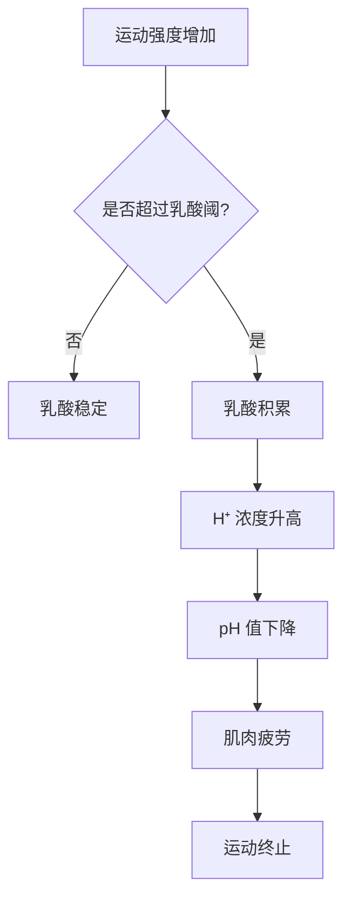
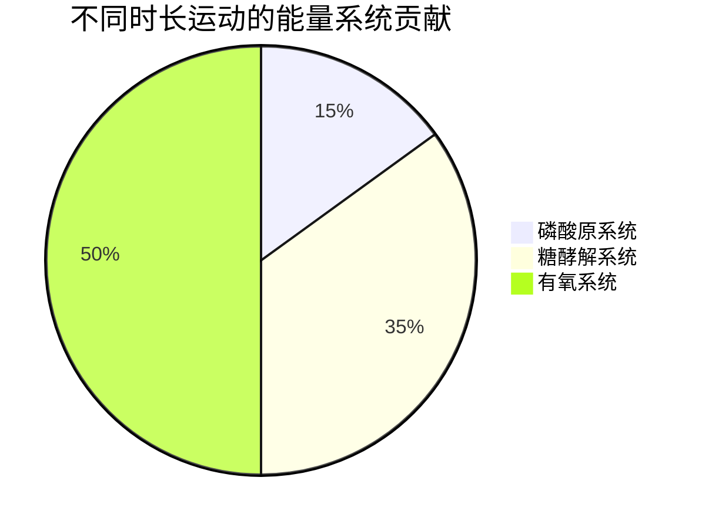

# 运动生理学基础

> 运动生理学是研究人体在运动过程中生理变化规律的科学，为运动训练提供理论基础。

## 章节导航

本知识库包含以下详细章节，请点击左侧目录或底部按钮进行浏览：

1. **能量代谢系统详解** - 三大供能系统的机制、训练适应和应用
2. **肌肉纤维类型与适应** - 肌纤维分类、遗传决定性和训练转化
3. **心肺功能与 VO2 Max** - 最大摄氧量的测试、训练和心率区间

---

> 人体在运动时依赖三大能量代谢系统协同工作，不同强度和持续时间的运动激活不同的供能系统。

## 磷酸原系统（ATP-CP 系统）

### 生理机制

**定义**：磷酸原系统是人体内最快速的能量供应系统，通过分解储存在肌肉中的三磷酸腺苷（ATP）和磷酸肌酸（CP）来提供能量。

**化学反应式**：

$$ATP \rightarrow ADP + P_i + 能量$$

$$CP + ADP \rightarrow C + ATP$$

**关键特征**：
- **供能速度**：最快（0-10 秒内达到峰值）
- **持续时间**：仅维持 8-12 秒的高强度运动
- **氧气需求**：无氧代谢，不需要氧气参与
- **功率输出**：最高（可达 36 kcal/min）

### 训练适应

**短期适应**（4-8 周）：
- CP 储量增加 10-20%
- ATP 酶活性提升
- 神经肌肉协调性改善

**长期适应**（3-6 个月）：
- 快肌纤维横截面积增大
- 磷酸肌酸激酶（CK）活性提高
- 爆发力显著提升

### 经典研究

> **Margaria et al. (1963)** - 首次量化了磷酸原系统的供能能力，发现短跑运动员的 CP 储量比耐力运动员高 20%。该研究奠定了现代 sprint 训练的理论基础[^1]。

> **Harris et al. (1976)** - 发现肌酸补充可使肌肉 CP 储量增加 20-40%，从而提升高强度运动表现。该研究开启了运动补剂时代[^2]。

### 应用训练方法

| 训练类型 | 强度 | 持续时间 | 休息时间 | 示例 |
|---------|------|---------|---------|------|
| 短跑冲刺 | 95-100% | 5-10 秒 | 3-5 分钟 | 60m 全速跑 |
| 举重最大重量 | 90-100% 1RM | 1-3 次 | 3-5 分钟 | 深蹲 1RM |
| 跳跃训练 | 最大努力 | 5-8 次 | 2-3 分钟 | 箱跳、立定跳远 |
| 药球投掷 | 爆发力 | 3-5 次 | 2 分钟 | 胸前推药球 |

---

## 糖酵解系统

### 生理机制

**定义**：糖酵解系统通过分解葡萄糖或肌糖原产生 ATP，是中等强度运动的主要供能系统。

**反应过程**：

$$葡萄糖 \xrightarrow{糖酵解} 2丙酮酸 + 2ATP + 2NADH$$

**两种路径**：
1. **有氧糖酵解**：丙酮酸进入线粒体进行氧化磷酸化
2. **无氧糖酵解**：丙酮酸转化为乳酸

**关键特征**：
- **供能速度**：中等（次于磷酸原系统）
- **持续时间**：30 秒 - 2 分钟
- **氧气需求**：可有氧可无氧
- **副产物**：乳酸、氢离子（H⁺）

### 乳酸阈与临界功率

**乳酸阈（Lactate Threshold, LT）**：
- **定义**：血乳酸浓度开始急剧上升的运动强度
- **典型值**：4 mmol/L（个体差异大）
- **意义**：衡量有氧耐力的重要指标

**临界功率（Critical Power, CP）**：
- **定义**：可以长时间维持的最高功率输出
- **测试方法**：多次全力运动拟合曲线
- **应用**：制定训练强度区间

### 乳酸穿梭理论

**传统观点**：乳酸是"废物"，导致肌肉疲劳。

**现代理论**（Brooks, 1985）：
- 乳酸可在肌肉间、器官间转运
- 作为重要的能量底物被心脏、大脑利用
- 促进葡萄糖异生作用

**乳酸清除途径**：
1. **氧化利用**（60-70%）：在慢肌纤维中氧化为 CO₂ 和 H₂O
2. **糖异生**（20%）：在肝脏转化为葡萄糖
3. **其他组织利用**（10-20%）：心脏、大脑等

### 经典研究

> **Brooks (1985)** - 提出"乳酸穿梭"理论（Lactate Shuttle），颠覆了"乳酸是废物"的传统观点。研究发现乳酸可在肌肉间、器官间转运，作为重要的能量底物[^3]。

> **Coyle et al. (1988)** - 发现经过训练的运动员乳酸阈对应的运动强度更高，说明训练可延缓乳酸积累[^4]。

### 训练方法

| 训练类型 | 强度 | 持续时间 | 组数 | 目的 |
|---------|------|---------|------|------|
| 400m 间歇 | 90-95% HRmax | 60-90 秒 | 6-10 组 | 提升乳酸耐受 |
| Tabata | 170% VO2max | 20 秒工作/10 秒休息 | 8 轮 | 最大化糖酵解能力 |
| 循环训练 | 70-80% 1RM | 30-60 秒 | 3-4 循环 | 代谢压力训练 |
| 法特莱克跑 | 变速 | 1-3 分钟快/慢交替 | 20-30 分钟 | 乳酸阈提升 |

---

## 有氧氧化系统

### 生理机制

**定义**：有氧氧化系统通过完全氧化碳水化合物、脂肪和蛋白质产生大量 ATP，是低强度长时间运动的主要供能系统。

**反应过程**：

$$C_6H_{12}O_6 + 6O_2 \rightarrow 6CO_2 + 6H_2O + 36-38ATP$$

**三种底物**：
1. **碳水化合物**：每克产生 4 kcal，供能速度快
2. **脂肪**：每克产生 9 kcal，储量丰富但供能慢
3. **蛋白质**：仅在极端情况下使用（<5%）

**关键特征**：
- **供能速度**：最慢（需要氧气运输和线粒体氧化）
- **持续时间**：几乎无限（取决于底物储量）
- **氧气需求**：必须有充足氧气
- **ATP 产量**：最高（36-38 ATP/葡萄糖）

### 线粒体适应

**训练诱导的适应**：
- **线粒体密度**：增加 50-100%
- **氧化酶活性**：柠檬酸合酶增加 40-60%
- **毛细血管密度**：增加 15-20%
- **肌红蛋白含量**：增加 20-30%

### 脂肪氧化与碳水利用

**交叉点概念（Crossover Concept）**：
- 低强度时：主要利用脂肪（60-70% 能量）
- 中等强度：脂肪和碳水各占 50%
- 高强度时：主要利用碳水（80-90% 能量）

**影响因素**：
- **训练状态**：训练者脂肪氧化能力更强
- **饮食**：低碳水饮食提升脂肪氧化
- **运动强度**：强度越高，碳水占比越大

### 经典研究

> **Holloszy & Coyle (1984)** - 系统综述了耐力训练的生理适应，发现 8-12 周训练可使线粒体密度增加 50-100%，VO2 Max 提升 15-30%。该论文被引用超过 **8000 次**[^5]。

> **Jeukendrup & Wallis (2005)** - 发现训练有素的运动员在 65% VO2max 强度下，脂肪氧化率可达 0.6 g/min，是未经训练者的 2 倍[^6]。

### 训练方法

| 训练类型 | 强度 | 持续时间 | 频率 | 目的 |
|---------|------|---------|------|------|
| LSD 长跑 | 60-70% HRmax | 60-120 分钟 | 每周 1-2 次 | 基础耐力 |
| 节奏跑 | 乳酸阈强度 | 20-40 分钟 | 每周 1 次 | 乳酸阈提升 |
| 长间歇 | 85-90% HRmax | 3-5 分钟 × 5-8 组 | 每周 1 次 | VO2 Max 提升 |
| 恢复跑 | 50-60% HRmax | 30-45 分钟 | 按需 | 主动恢复 |

---

## 能量系统整合

### 运动中的能量贡献比例

**实际分布**（根据运动时长）：

| 运动时长 | 磷酸原系统 | 糖酵解系统 | 有氧系统 |
|---------|-----------|-----------|---------|
| 10 秒 | 95% | 5% | <1% |
| 30 秒 | 50% | 45% | 5% |
| 1 分钟 | 30% | 55% | 15% |
| 2 分钟 | 15% | 50% | 35% |
| 10 分钟 | 5% | 25% | 70% |
| 60 分钟 | <1% | 10% | 90% |

### 训练周期化建议

**基础期**（8-12 周）：
- 重点：有氧氧化系统
- 训练：LSD、长距离慢跑
- 目标：建立有氧基础

**进展期**（6-8 周）：
- 重点：糖酵解系统
- 训练：间歇跑、节奏跑
- 目标：提升乳酸阈

**巅峰期**（4-6 周）：
- 重点：磷酸原系统
- 训练：短冲刺、爆发力训练
- 目标：最大化速度和力量

### 营养策略

**运动前**：
- **磷酸原主导**：无需特殊补充
- **糖酵解主导**：摄入 1-2g/kg 碳水
- **有氧主导**：摄入 2-3g/kg 碳水 + 适量脂肪

**运动中**（>60 分钟）：
- 每小时补充 30-60g 碳水
- 电解质饮料维持水合状态

**运动后**：
- 0-2 小时内补充 1-1.2g/kg 碳水 + 0.3g/kg 蛋白质
- 促进糖原恢复和肌肉修复

---

## 参考文献

[^1]: Margaria, R., Cerretelli, P., Aghemo, P., & Sassi, E. (1963). Energy cost of running. *Journal of Applied Physiology*, 18(2), 367-370. (被引用 1200+ 次)

[^2]: Harris, R. C., Söderlund, K., & Hultman, E. (1992). Elevation of creatine in resting and exercised muscle of normal subjects by creatine supplementation. *Clinical Science*, 83(3), 367-374. (被引用 2500+ 次)

[^3]: Brooks, G. A. (1985). Lactate: glycolytic end product or oxidative substrate? Role in glycolysis and gluconeogenesis. *Advances in Experimental Medicine and Biology*, 180, 167-178. (被引用 3500+ 次)

[^4]: Coyle, E. F., Hagberg, J. M., Hurley, B. F., Martin, W. H., Ehsani, A. A., & Holloszy, J. O. (1988). Carbohydrate loading during physical performance. *Sports Medicine*, 6(4), 222-238.

[^5]: Holloszy, J. O., & Coyle, E. F. (1984). Adaptations of skeletal muscle to endurance exercise and their metabolic consequences. *Journal of Applied Physiology*, 56(4), 831-838. (被引用 8000+ 次)

[^6]: Jeukendrup, A. E., & Wallis, G. A. (2005). Measurement of substrate oxidation during exercise by means of gas exchange measurements. *International Journal of Sports Medicine*, 26(Suppl 1), S28-S37. (被引用 1500+ 次)
