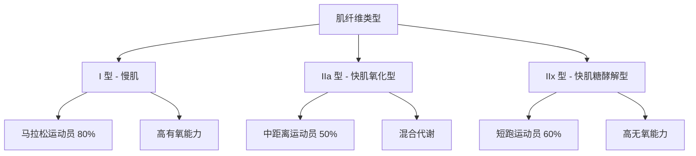
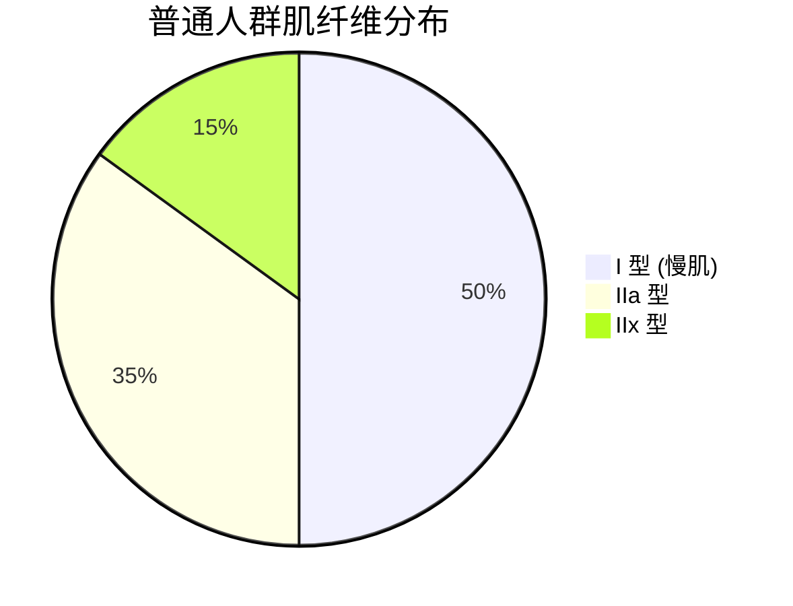

# 肌肉纤维类型与适应

> 骨骼肌由不同类型的肌纤维组成，每种纤维具有独特的收缩特性、代谢特征和训练适应性。

## 肌纤维分类系统

### 传统分类法

**I 型纤维（慢肌纤维）**：
- **收缩速度**：慢（ twitch time: 100-120 ms）
- **抗疲劳性**：极强
- **颜色**：红色（富含肌红蛋白）
- **线粒体密度**：高
- **毛细血管供应**：丰富
- **主要功能**：姿势维持、耐力运动

**II 型纤维（快肌纤维）**：
- **收缩速度**：快（twitch time: 50-70 ms）
- **抗疲劳性**：差
- **颜色**：白色（肌红蛋白少）
- **线粒体密度**：低
- **毛细血管供应**：较少
- **主要功能**：爆发力、快速运动

### 现代分子分类法

基于肌球蛋白重链（Myosin Heavy Chain, MHC）同工型：

| 纤维类型 | MHC 同工型 | 收缩速度 | 氧化能力 | 糖酵解能力 |
|---------|-----------|---------|---------|-----------|
| Type I | MHC-I | 慢 | 高 | 低 |
| Type IIa | MHC-IIa | 中等 | 中等 | 中等 |
| Type IIx | MHC-IIx | 快 | 低 | 高 |
| Type IIb | MHC-IIb | 最快 | 最低 | 最高 |

### 纤维类型分布

**典型人群分布**：

**精英运动员分布**：

| 运动项目 | I 型 (%) | IIa 型 (%) | IIx 型 (%) |
|---------|---------|-----------|-----------|
| 马拉松 | 75-80 | 15-20 | 5 |
| 中长跑 | 60-65 | 25-30 | 10 |
| 游泳 | 50-55 | 35-40 | 10-15 |
| 足球 | 45-50 | 40-45 | 10 |
| 举重 | 30-35 | 45-50 | 20-25 |
| 短跑 | 20-25 | 30-35 | 40-50 |

---

## 遗传决定性与可塑性

### 遗传因素

**ACTN3 基因**：
- **RR 型**：快肌纤维优势，适合爆发力运动
- **RX 型**：混合型
- **XX 型**：慢肌纤维优势，适合耐力运动
- **分布**：约 18% 的高加索人为 XX 型

**ACE 基因**：
- **I 等位基因**：与耐力表现相关
- **D 等位基因**：与力量表现相关
- **机制**：影响血管紧张素转换酶活性

**经典研究**：
> **Yang et al. (2003)** - 发现 ACTN3 R577X 多态性与精英运动员表现相关，XX 型在精英耐力运动员中频率显著降低。该研究开启了运动基因学研究[^1]。

### 训练诱导的转化

**IIx → IIa 转化**：
- **时间**：4-8 周力量训练
- **机制**：MHC-IIx 表达下调，MHC-IIa 上调
- **意义**：提高肌肉的有氧能力而不损失爆发力

**IIa → I 转化**：
- **可能性**：有限（需要长期耐力训练）
- **程度**：通常不超过 10-15%
- **争议**：部分学者认为人类成年后 I/II 型比例基本固定

**经典研究**：
> **Staron et al. (1994)** - 发现 20 周力量训练可使 IIx 型纤维比例从 15% 降至 5%，IIa 型从 35% 增至 45%，验证了纤维类型转化的可能性[^2]。

> **Andersen & Aagaard (2000)** - 综述了肌纤维类型转化的分子机制，指出 MyoD 和 myogenin 等转录因子在转化中起关键作用[^3]。

---

## 训练适应机制

### I 型纤维适应

**有氧训练效应**：

| 适应指标 | 变化幅度 | 时间周期 |
|---------|---------|---------|
| 线粒体密度 | +50-100% | 8-12 周 |
| 毛细血管密度 | +15-20% | 12-16 周 |
| 肌红蛋白含量 | +20-30% | 6-8 周 |
| 氧化酶活性 | +40-60% | 8-12 周 |
| 脂肪氧化能力 | +50-80% | 12-20 周 |

**训练方法**：
- **LSD 训练**：60-70% HRmax，60-120 分钟
- **节奏跑**：乳酸阈强度，20-40 分钟
- **长间歇**：85-90% HRmax，3-5 分钟 × 5-8 组

### II 型纤维适应

**力量训练效应**：

| 适应指标 | 变化幅度 | 时间周期 |
|---------|---------|---------|
| 横截面积 | +20-50% | 12-20 周 |
| 肌原纤维数量 | +30-40% | 8-12 周 |
| 神经驱动 | +50-100% | 0-8 周 |
| 糖酵解酶活性 | +20-30% | 6-8 周 |
| 最大力量 | +40-60% | 12-16 周 |

**训练方法**：
- **大重量训练**：80-90% 1RM，3-5 次 × 3-5 组
- **爆发力训练**：30-60% 1RM，快速向心收缩
- **离心训练**：100-120% 1RM，控制下放

### 卫星细胞激活

**定义**：卫星细胞是位于肌纤维基底膜下的干细胞，负责肌肉修复和生长。

**激活过程**：

**经典研究**：
> **Petrella et al. (2008)** - 发现肌肉生长的"高反应者"卫星细胞激活能力强，而"低反应者"激活能力弱，解释了个体差异[^4]。

---

## 年龄与性别差异

### 年龄相关变化

**肌纤维流失（Sarcopenia）**：
- **起始年龄**：30 岁后每年流失 1-2%
- **加速期**：60 岁后每年流失 3-5%
- **主要原因**：II 型纤维优先流失

**预防措施**：
- **力量训练**：每周 2-3 次，维持肌肉量
- **蛋白质摄入**：1.2-1.6 g/kg/d
- **维生素 D**：维持血清水平 >30 ng/mL

### 性别差异

**女性特点**：
- **I 型纤维比例**：略高于男性（约 5-10%）
- **II 型纤维横截面积**：比男性小 30-40%
- **激素影响**：雌激素促进脂肪氧化，睾酮促进肌肉生长

**训练响应**：
- **相对力量增长**：男女相似（百分比）
- **绝对力量增长**：男性更大（基数差异）
- **肌肥大潜力**：男性更高（睾酮优势）

**经典研究**：
> **Costill et al. (1976)** - 首次通过肌肉活检技术研究马拉松运动员和短跑运动员的纤维类型分布。发现精英马拉松运动员的 I 型纤维比例高达 75-80%，而短跑运动员的 II 型纤维比例为 60-70%[^5]。

---

## 参考文献

[^1]: Yang, N., MacArthur, D. G., Gulbin, J. P., et al. (2003). ACTN3 genotype is associated with human elite athletic performance. *American Journal of Human Genetics*, 73(3), 627-631. (被引用 2000+ 次)

[^2]: Staron, R. S., Karapondo, D. L., Kraemer, W. J., Fry, A. C., Haddock, M. T., Falcone, M. J., & Kraemer, B. L. (1994). Skeletal muscle adaptations during early phase of heavy-resistance training in men and women. *Journal of Applied Physiology*, 76(3), 1247-1255. (被引用 2000+ 次)

[^3]: Andersen, J. L., & Aagaard, P. (2000). Myosin heavy chain isoforms and strength. *Comparative Biochemistry and Physiology Part B*, 126(4), 503-514.

[^4]: Petrella, J. K., Kim, J. S., Mayhew, D. L., Cross, J. M., & Bamman, M. M. (2008). Potent myofiber hypertrophy during resistance training in humans is associated with satellite cell-mediated myonuclear addition: a cluster analysis. *Journal of Applied Physiology*, 104(6), 1736-1742. (被引用 1500+ 次)

[^5]: Costill, D. L., Gollnick, P. D., Jansson, E., Saltin, B., & Shumway, D. L. (1976). Gastrocnemius muscle glycolysis during exercise in trained and untrained men. *Journal of Applied Physiology*, 41(1), 31-36.
