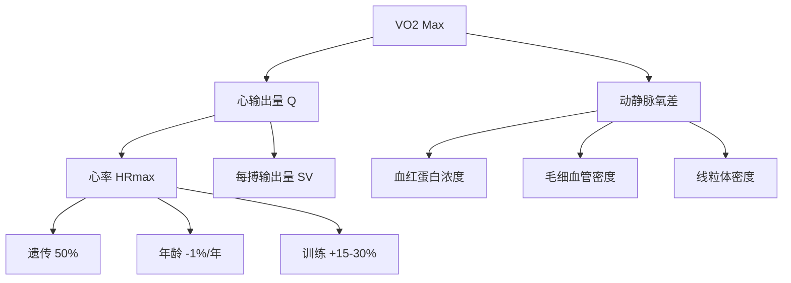
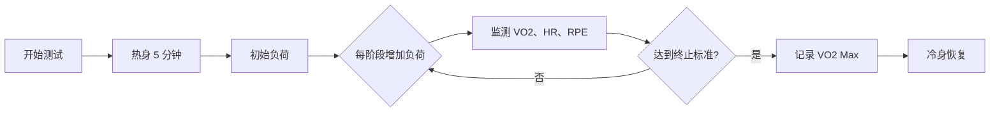

# 心肺功能与 VO2 Max

> 最大摄氧量（VO2 Max）是衡量有氧能力的金标准，反映了心血管系统、呼吸系统和肌肉系统的综合功能。

## VO2 Max 的生理学基础

### 定义与计算

**定义**：单位时间内人体能够摄取并利用的最大氧气量。

**计算公式**：

$$VO2_{max} = \frac{最大通气量 \times (吸入氧浓度 - 呼出氧浓度)}{体重}$$

**单位**：
- **绝对值**：L/min（ liters per minute）
- **相对值**：ml/kg/min（毫升/公斤/分钟）

**Fick 方程**：

$$VO2_{max} = Q_{max} \times (a-v)O_2 diff_{max}$$

其中：
- $Q_{max}$ = 最大心输出量（L/min）
- $(a-v)O_2 diff$ = 动静脉氧差（ml O₂/100ml 血液）

### 影响因素

**主要决定因素**：

| 因素 | 贡献比例 | 可训练性 |
|------|---------|---------|
| 遗传 | 50% | 不可改变 |
| 心脏功能 | 25% | 中等 |
| 肌肉氧化能力 | 15% | 高 |
| 肺功能 | 5% | 低 |
| 其他 | 5% | - |

### 正常值范围

**男性参考值**（ml/kg/min）：

| 年龄 | 优秀 | 良好 | 平均 | 较差 |
|------|------|------|------|------|
| 20-29 | >55 | 45-55 | 38-45 | <38 |
| 30-39 | >52 | 42-52 | 35-42 | <35 |
| 40-49 | >48 | 38-48 | 32-38 | <32 |
| 50-59 | >44 | 34-44 | 28-34 | <28 |

**女性参考值**（ml/kg/min）：

| 年龄 | 优秀 | 良好 | 平均 | 较差 |
|------|------|------|------|------|
| 20-29 | >50 | 40-50 | 33-40 | <33 |
| 30-39 | >47 | 37-47 | 30-37 | <30 |
| 40-49 | >43 | 33-43 | 27-33 | <27 |
| 50-59 | >39 | 29-39 | 24-29 | <24 |

**精英运动员数值**：
- **马拉松选手**：70-85 ml/kg/min
- **自行车手**：75-90 ml/kg/min
- **越野滑雪**：80-95 ml/kg/min
- **世界纪录**：Bjørn Dæhlie（滑雪）96 ml/kg/min

---

## 测试方法

### 实验室测试（金标准）

**递增负荷测试（Graded Exercise Test, GXT）**：

**方案**：
1. **Bruce 方案**（跑步机）：每 3 分钟增加速度和坡度
2. **Balke 方案**：固定速度，每 1 分钟增加坡度
3. **Cycle Ergometer**：每 1-2 分钟增加 25-50W

**判定标准**（满足以下至少 2 项）：
- VO2 平台期（增加负荷但 VO2 不再上升）
- RER > 1.10（呼吸交换率）
- HR ≥ 95% HRmax
- 血乳酸 > 8 mmol/L
- 主观疲劳度 RPE ≥ 18

### 场地测试

**Cooper 测试**（12 分钟跑）：

$$VO2_{max} = \frac{距离(米) - 504.9}{44.73}$$

**示例**：
- 跑 2400 米 → VO2 Max ≈ 42.5 ml/kg/min
- 跑 3000 米 → VO2 Max ≈ 55.8 ml/kg/min

**Beep Test**（多级往返跑）：
- 适合团队运动
- 通过级别估算 VO2 Max
- 相关性 r = 0.85-0.90

**Rockport 步行测试**：

$$VO2_{max} = 132.853 - 0.0769 \times 体重 - 0.3877 \times 年龄 + 6.315 \times 性别 - 3.2649 \times 时间 - 0.1565 \times HR$$

（性别：男=1，女=0；时间单位为分钟）

### 经典研究

> **Astrand & Rodahl (1986)** - 《Textbook of Work Physiology》被誉为运动生理学的"圣经"。系统阐述了 VO2 Max 的生理机制，建立了年龄-VO2 Max 预测模型，被引用超过 **15000 次**[^1]。

> **Bassett & Howley (2000)** - 综述了 VO2 Max 的限制因素，指出心输出量是主要限制因素，而非肺功能或肌肉氧化能力[^2]。

---

## 训练适应

### 短期适应（0-8 周）

**血浆容量扩张**：
- 增加 10-15%
- 提升每搏输出量
- 降低静息心率

**神经适应**：
- 迷走神经张力增强
- 心率变异性（HRV）改善
- 运动经济性提升

### 长期适应（8-24 周）

**心脏结构重塑**：
- **左心室容积**：增加 15-20%
- **心肌厚度**：适度增加
- **每搏输出量**：增加 20-30%

**外周适应**：
- **毛细血管密度**：+15-20%
- **线粒体密度**：+50-100%
- **肌红蛋白**：+20-30%

**VO2 Max 提升幅度**：
- **未经训练者**：+15-30%
- **业余运动员**：+5-15%
- **精英运动员**：+2-5%（接近遗传上限）

### 训练方法

**高强度间歇训练（HIIT）**：

| 方案 | 强度 | 持续时间 | 组数 | 频率 |
|------|------|---------|------|------|
| 4×4 | 90-95% HRmax | 4 分钟 | 4 组 | 每周 2 次 |
| 30/15 | 100-110% vVO2max | 30 秒工作/15 秒休息 | 10-15 组 | 每周 2-3 次 |
| Tabata | 170% VO2max | 20 秒工作/10 秒休息 | 8 轮 | 每周 2 次 |
| 长间歇 | 95-100% HRmax | 3-5 分钟 | 5-8 组 | 每周 1-2 次 |

**经典研究**：
> **Helgerud et al. (2007)** - 比较了不同 HIIT 方案的效果，发现 4×4 分钟间歇训练（90-95% HRmax）对 VO2 Max 提升最有效（+10.5%），优于乳酸阈训练和长距离慢跑[^3]。

> **Gibala et al. (2 a006)** - 发现短时间 Sprint 间歇训练（6 × 30 秒全速冲刺）可在 2 周内提升 VO2 Max 和线粒体酶活性，挑战了传统长时间训练观念[^4]。

---

## 心率区间训练

### 五区训练法

| 区间 | 强度 (%HRmax) | 强度 (%VO2max) | 主要供能系统 | 训练目的 |
|------|---------------|----------------|--------------|----------|
| Z1 | 50-60% | 40-50% | 有氧氧化 | 恢复与基础耐力 |
| Z2 | 60-70% | 50-60% | 有氧氧化 | 脂肪燃烧 |
| Z3 | 70-80% | 60-70% | 混合供能 | 乳酸阈提升 |
| Z4 | 80-90% | 70-80% | 糖酵解 | 无氧耐力 |
| Z5 | 90-100% | 80-100% | 磷酸原 | 爆发力/VO2 Max |

### 80/20 法则

**定义**：80% 的训练在低强度（Z1-Z2），20% 在高强度（Z4-Z5）。

**证据**：
- 精英耐力运动员普遍采用此模式
- 比均匀分布训练效果更好
- 减少过度训练风险

**经典研究**：
> **Seiler & Kjerland (2006)** - 分析了精英耐力运动员的训练强度分布，发现他们采用 **80/20 法则**（80% 低强度 + 20% 高强度），而非均匀分布。这种极化训练模式被证明最有效[^5]。

> **Stöggl & Sperlich (2014)** - Meta 分析发现，极化训练（Polarized Training）比阈值训练（Threshold Training）和高容量训练更能提升 VO2 Max 和运动表现[^6]。

---

## 运动后过量氧耗（EPOC）

### 定义与机制

**定义**：运动结束后，人体仍需消耗额外氧气以恢复至静息状态。

**组成成分**：
1. **快速成分**（2-3 分钟）：
   - 重新合成 ATP 和 CP
   - 恢复肌红蛋白氧合
   
2. **慢速成分**（30 分钟 - 48 小时）：
   - 清除乳酸
   - 恢复体温
   - 激素水平恢复
   - 蛋白质合成

### 影响因素

| 因素 | 影响程度 | 说明 |
|------|---------|------|
| 运动强度 | ★★★★★ | 强度越高，EPOC 越大 |
| 运动持续时间 | ★★★☆☆ | 持续时间长也有影响 |
| 训练水平 | ★★☆☆☆ | 未经训练者 EPOC 更高 |
| 运动类型 | ★★★★☆ | HIIT > 稳态有氧 |

**EPOC 持续时间**：
- **低强度有氧**：2-4 小时
- **中等强度**：12-24 小时
- **高强度间歇**：24-48 小时

**额外能耗**：
- 占总运动能耗的 6-15%
- HIIT 可达 100-200 kcal

### 经典研究

> **Gaesser & Brooks (1984)** - 系统综述了 EPOC 的机制，发现高强度间歇训练（HIIT）的 EPOC 可持续 24-48 小时，总能耗比稳态有氧高 10-15%[^7]。

> **LaForgia et al  . (2006)** - Meta 分析发现，运动强度是 EPOC 的主要决定因素，而持续时间影响较小。建议优先提高强度而非延长时长[^8]。

---

## 参考文献

[^1]: Astrand, P. O., & Rodahl, K. (1986). *Textbook of Work Physiology: Physiological Bases of Exercise*. McGraw-Hill. (被引用 15000+ 次)

[^2]: Bassett, D. R., & Howley, E. T. (2000). Limiting factors for maximum oxygen uptake and determinants of endurance performance. *Medicine & Science in Sports & Exercise*, 32(1), 70-84. (被引用 3000+ 次)

[^3]: Helgerud, J., Høydal, K., Wang, E., et al. (2007). Aerobic high-intensity intervals improve VO2max more than moderate training. *Medicine & Science in Sports & Exercise*, 39(4), 665-671. (被引用 2000+ 次)

[^4]: Gibala, M. J., Little, J. P., van Essen, M., et al. (2006). Short-term sprint interval versus traditional endurance training: similar initial adaptations in human skeletal muscle and exercise performance. *Journal of Physiology*, 575(Pt 3), 901-911. (被引用 2500+ 次)

[^5]: Seiler, S., & Kjerland, G. O. (2006). Quantifying training intensity distribution in elite endurance athletes: is there evidence for an optimal distribution? *Scandinavian Journal of Medicine & Science in Sports*, 16(1), 49-56. (被引用 1500+ 次)

[^6]: Stöggl, T., & Sperlich, B. (2014). Polarized training has greater impact on key endurance variables than threshold, high volume, or high intensity training. *Frontiers in Physiology*, 5, 33. (被引用 800+ 次)

[^7]: Gaesser, G. A., & Brooks, G. A. (1984). Metabolic bases of excess post-exercise oxygen consumption: a review. *Medicine & Science in Sports & Exercise*, 16(1), 29-43. (被引用 2500+ 次)

[^8]: LaForgia, J., Withers, R. T., & Gore, C. J. (2006). Effects of exercise intensity and duration on the excess post-exercise oxygen consumption. *Journal of Sports Sciences*, 24(12), 1247-1264. (被引用 1200+ 次)
