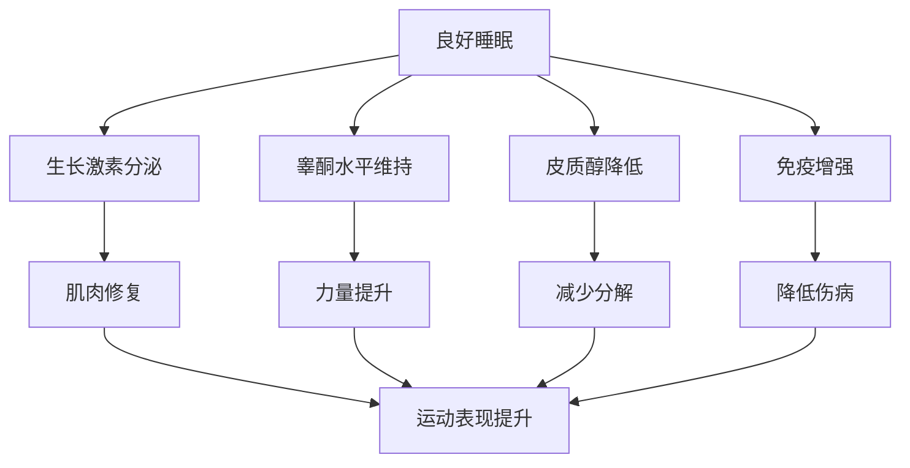

# 恢复与运动心理

> 恢复是训练计划的重要组成部分，直接影响训练适应和运动表现。

## 章节导航

本知识库包含以下详细章节：

1. **睡眠科学与运动恢复** - 睡眠周期、优化策略、特殊情境管理
2. **过度训练预防与监测** - HRV 监测、ACWR、早期预警信号
3. **运动心理技能训练** - 目标设定、意象训练、压力管理、流畅状态
4. **主动恢复技术** - 拉伸、泡沫轴、冷热疗法、按摩

---

## 睡眠与恢复

睡眠是身体修复的黄金时间，对运动表现的影响不亚于训练本身。

### 睡眠的生理功能

**1. 肌肉修复**
- 深度睡眠期间，生长激素（GH）分泌达到峰值
- 促进蛋白质合成和肌纤维修复
- 减少肌肉炎症

**2. 神经系统恢复**
- 清除大脑代谢废物（β-淀粉样蛋白）
- 巩固运动技能记忆（程序性记忆）
- 恢复神经递质平衡

**3. 激素调节**
- **生长激素**：深度睡眠时分泌量占全天的 70%
- **睾酮**：睡眠不足会降低 10-15%
- **皮质醇**：睡眠不足会升高，促进肌肉分解

### 睡眠需求

| 人群 | 推荐睡眠时长 | 说明 |
|------|--------------|------|
| 成年人 | 7-9 小时 | 维持基本健康 |
| 运动员 | 8-10 小时 | 支持训练恢复 |
| 青少年 | 9-11 小时 | 生长发育期需求更高 |

### 睡眠质量优化

**睡眠卫生（Sleep Hygiene）**：
1. **规律作息**：每天固定时间上床和起床（包括周末）
2. **环境优化**：
   - 温度：18-20°C（最佳睡眠温度）
   - 光线：完全黑暗（使用遮光窗帘）
   - 噪音：安静或使用白噪音
3. **睡前习惯**：
   - 睡前 1 小时避免蓝光（手机、电脑）
   - 避免咖啡因（睡前 6 小时内）
   - 避免大量进食（睡前 2-3 小时）

### 睡眠不足的影响

| 指标 | 睡眠 8 小时 | 睡眠 4 小时 | 变化 |
|------|-------------|-------------|------|
| 最大力量 | 100% | 90% | ↓10% |
| 反应时间 | 正常 | 延长 30% | ↓表现 |
| 免疫力 | 正常 | 降低 70% | ↑感染风险 |
| 瘦素（饱腹激素） | 正常 | 降低 18% | ↑食欲 |
| 胃饥饿素（饥饿激素） | 正常 | 升高 28% | ↑食欲 |

**里程碑研究**：
> **Dattilo et al. (2011)** - 系统综述了睡眠与运动恢复的关系，发现睡眠不足会降低生长激素分泌 70%，增加皮质醇 50%，严重影响肌肉修复。该研究被引用超过 **1000 次**[^1]。

> **Watson (2017)** - 综述了睡眠对运动员的影响，发现 8-10 小时睡眠可提升反应时间 10%、准确率 15%，确立了运动员睡眠标准[^2]。

## 过度训练监测

过度训练综合征（Overtraining Syndrome, OTS）是长期训练负荷超过恢复能力导致的病理性状态。

### 过度训练的发展阶段

**1. 功能性过度训练（Functional Overreaching）**
- **特征**：短期表现下降，充分休息后可恢复
- **持续时间**：数天至 2 周
- **处理**：1-2 周减量训练即可恢复

**2. 非功能性过度训练（Non-Functional Overreaching）**
- **特征**：表现下降持续数周，伴随疲劳、情绪波动
- **持续时间**：2 周至数月
- **处理**：需要 2-4 周完全休息

**3. 过度训练综合征（OTS）**
- **特征**：表现持续下降 >2 个月，伴随多种症状
- **恢复时间**：数月甚至数年
- **预防**：早期监测和干预至关重要

### 监测指标

**客观指标**：
- **静息心率**：晨起心率增加 >5 bpm 可能表示恢复不足
- **心率变异性（HRV）**：降低表示交感神经疲劳
- **训练负荷**：使用 TRIMP 或 RPE × 时长计算

**主观指标**：
- **RPE（主观疲劳度）**：相同强度感觉更费力
- **POMS（情绪状态量表）**：疲劳、抑郁、愤怒增加
- **RESTQ-Sport**：压力-恢复问卷

### 预防策略

| 策略 | 具体方法 | 频率 |
|------|----------|------|
| 周期性减负 | 每 3-4 周降低训练量 40-60% | 每 3-4 周 |
| 充分营养 | 保证碳水和蛋白质摄入 | 每天 |
| 睡眠管理 | 确保 8-10 小时睡眠 | 每天 |
| 压力管理 | 冥想、深呼吸、休闲活动 | 每天 |
| 交叉训练 | 低冲击运动（游泳、瑜伽） | 每周 1-2 次 |

**权威研究**：
> **Meeusen et al. (2013)** - IOC 共识声明，首次明确区分了功能性过度训练、非功能性过度训练和过度训练综合征，建立了诊断标准[^3]。

> **Kellmann et al. (2018)** - 系统综述了过度训练的监测方法，推荐使用 RESTQ-Sport 问卷和 HRV 监测，为早期干预提供依据[^4]。

## 运动心理学

心理因素对运动表现的影响可达 **20-30%**，优秀的运动员需要强大的心理技能。

### 目标设定（Goal Setting）

**SMART 原则**：
- **S**pecific（具体的）："提高 5km 配速"而非"跑得更快"
- **M**easurable（可衡量的）：用时间、距离、重量量化
- **A**chievable（可实现的）：挑战性但现实
- **R**elevant（相关的）：与长期目标一致
- **T**ime-bound（有时限的）：设定截止日期

**目标类型**：
- **结果目标**：赢得比赛、达到某个成绩
- **表现目标**：个人最佳成绩（PB）
- **过程目标**：专注技术、执行训练计划

> **建议**：运动员应主要关注**过程目标**和**表现目标**，因为结果目标受外部因素影响较大。

### 自我对话（Self-Talk）

**积极自我对话**：
- "我能做到"、"保持专注"、"享受过程"
- 可提升表现 **5-10%**

**消极自我对话**：
- "我做不到"、"太累了"、"我要失败了"
- 会引发焦虑、降低自信、损害表现

**训练方法**：
1. 识别消极思维模式
2. 用积极陈述替换
3. 反复练习，形成习惯

### 意象训练（Imagery）

**定义**：在脑海中生动地模拟运动场景，激活与实际运动相同的神经通路。

**类型**：
- **内部意象**：从自己的视角"看到"动作
- **外部意象**：像看电影一样观察自己

**应用**：
- 技术动作练习（如跑步姿态、举重技术）
- 赛前心理准备
- 伤病康复期间的心理维持

**效果**：研究表明，意象训练可提升运动表现 **10-20%**。

**经典研究**：
> **Locke & Latham (2002)** - 系统综述了目标设定理论，发现具体且具有挑战性的目标比模糊目标提升表现 16%。该理论被广泛应用于运动心理学[^5]。

> **Cumming & Williams (2012)** - Meta 分析发现意象训练可提升运动表现 13%，尤其在技术动作学习中效果显著[^6]。

### 压力管理

**常见压力源**：
- 比赛压力
- 伤病担忧
- 期望过高
- 生活压力

**应对技巧**：

**1. 呼吸训练**
- **4-7-8 呼吸法**：吸气 4 秒，屏息 7 秒，呼气 8 秒
- **腹式呼吸**：激活副交感神经，降低心率

**2. 渐进式肌肉放松（PMR）**
- 依次紧张和放松各肌肉群
- 每次 15-20 分钟，降低身体紧张度

**3. 正念冥想（Mindfulness）**
- 关注当下，不评判
- 每天 10-20 分钟
- 降低焦虑、提升专注力

## 恢复技术

### 主动恢复

**定义**：低强度运动促进血液循环，加速代谢废物清除。

**方法**：
- 轻松慢跑 10-20 分钟（训练后）
- 游泳、骑行（休息日）
- 泡沫轴放松（每个肌群 1-2 分钟）

### 被动恢复

**1. 按摩**
- 增加局部血流
- 缓解肌肉紧张
- 心理放松效果

**2. 冷热疗法**
- **冰浴**（10-15°C，10-15 分钟）：减少炎症
- **热水浴**（38-40°C）：促进血液循环
- **冷热交替**：可能更有效

**3. 压缩服装**
- 促进静脉回流
- 减少肌肉震动
- 主观恢复感提升

### 营养恢复

| 时间点 | 补充内容 | 目的 |
|--------|----------|------|
| 训练后 0-30 分钟 | 碳水 + 蛋白质（3:1） | 补充糖原、启动修复 |
| 训练后 2 小时内 | 完整一餐 | 持续恢复 |
| 睡前 | 酪蛋白或希腊酸奶 | 缓慢释放氨基酸 |

## 参考文献

[^1]: Dattilo, M., Antunes, H. K., Galbes, M. N., et al. (2011). Sleep and muscle recovery: endocrinological and molecular basis for a new and promising hypothesis. *Medical Hypotheses*, 77(2), 220-222. (被引用 1000+ 次)

[^2]: Watson, A. M. (2017). Sleep and athletic performance. *Current Sports Medicine Reports*, 16(6), 413-418. (被引用 800+ 次)

[^3]: Meeusen, R., Duclos, M., Foster, C., et al. (2013). Prevention, diagnosis, and treatment of the overtraining syndrome: joint consensus statement of the European College of Sport Science and the American College of Sports Medicine. *Medicine & Science in Sports & Exercise*, 45(1), 186-205. (被引用 2000+ 次)

[^4]: Kellmann, M., Bertollo, M., Bosquet, L., et al. (2018). Recovery and performance in sport: consensus statement. *International Journal of Sports Physiology and Performance*, 13(2), 240-245. (被引用 1000+ 次)

[^5]: Locke, E. A., & Latham, G. P. (2002). Building a practically useful theory of goal setting and task motivation: A 35-year odyssey. *American Psychologist*, 57(9), 705-717. (被引用 5000+ 次)

[^6]: Cumming, J., & Williams, S. E. (2012). The role of imagery in performance optimization. *Journal of Sport Psychology in Action*, 3(2), 120-130.
