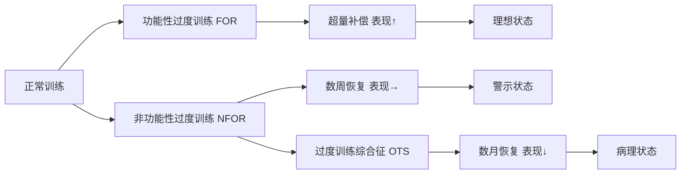
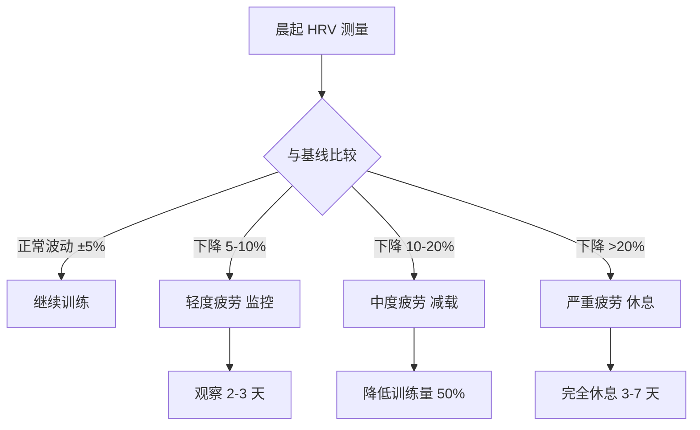
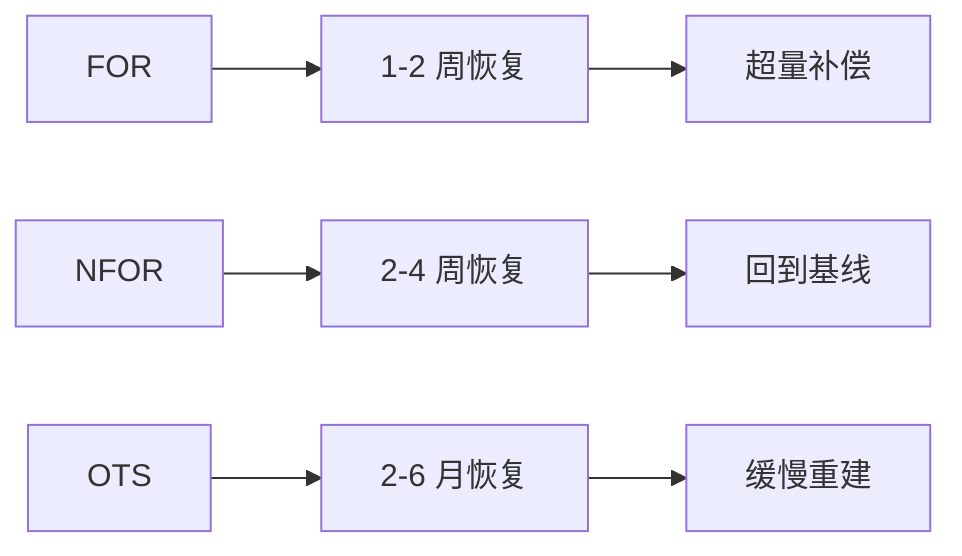

# 过度训练预防与监测

> 过度训练综合征（OTS）是长期训练负荷超过恢复能力导致的病理性状态，严重影响运动表现和健康。

## 过度训练的定义与分类

### 连续体模型

**功能性过度训练（Functional Overreaching, FOR）**：
- **定义**：短期性能下降，随后超量补偿
- **持续时间**：数天至 2 周
- **结果**：表现提升（预期结果）
- **性质**：**正常的训练适应过程**

**非功能性过度训练（Non-Functional Overreaching, NFOR）**：
- **定义**：性能下降持续数周，需要长时间恢复
- **持续时间**：2 周 - 2 个月
- **结果**：表现停滞或轻微下降
- **性质**：**警告信号，需调整训练**

**过度训练综合征（Overtraining Syndrome, OTS）**：
- **定义**：长期性能下降伴随心理生理症状
- **持续时间**：>2 个月，可能数年
- **结果**：表现显著下降，健康受损
- **性质**：**病理性状态，需医疗干预**



**经典研究**：
> **Meeusen et al. (2013)** - IOC 共识声明，首次明确区分了功能性过度训练、非功能性过度训练和过度训练综合征，建立了诊断标准。该声明被引用超过 **2000 次**[^1]。

---

## 过度训练的生理机制

### 自主神经系统失衡

**交感神经型过度训练**（早期阶段）：
- **特征**：静息心率升高、失眠、焦虑
- **机制**：交感神经过度激活
- **常见于**：高强度训练为主的运动员

**副交感神经型过度训练**（晚期阶段）：
- **特征**：静息心率降低、疲劳、抑郁
- **机制**：副交感神经主导，身体"关闭"
- **常见于**：长期过度训练者

### 下丘脑-垂体-肾上腺轴（HPA 轴）失调

**正常反应**：
- 训练 → 皮质醇短暂升高 → 恢复期回落

**过度训练**：
- 慢性皮质醇升高
- 负反馈抑制失效
- 导致分解代谢状态

**影响**：
- 肌肉蛋白质分解增加
- 免疫功能抑制
- 骨密度降低
- 情绪障碍

### 炎症反应

**细胞因子变化**：
- **IL-6**：持续升高（炎症标志）
- **TNF-α**：升高（促炎）
- **CRP**：升高（急性期蛋白）

**后果**：
- 慢性低度炎症
- 恢复能力下降
- 受伤风险增加

### 氧化应激

**自由基产生**：
- 过量训练 → 线粒体 ROS 产生增加
- 抗氧化防御系统耗竭
- 细胞损伤累积

**标志物**：
- 脂质过氧化物（MDA）
- 蛋白质氧化产物
- DNA 损伤标志物

---

## 早期预警信号

### 主观症状

**心理症状**（最早出现）：

| 症状 | 描述 | 严重程度 |
|------|------|---------|
| 动机下降 | 对训练失去兴趣 | ⭐⭐⭐ |
| 情绪波动 | 易怒、焦虑、抑郁 | ⭐⭐⭐⭐ |
| 注意力不集中 | 难以专注训练 | ⭐⭐ |
| 自信心下降 | 怀疑自己的能力 | ⭐⭐⭐ |
| 睡眠问题 | 失眠或嗜睡 | ⭐⭐⭐⭐ |

**生理症状**：

| 症状 | 描述 | 严重程度 |
|------|------|---------|
| 持续疲劳 | 休息后仍感疲倦 | ⭐⭐⭐⭐⭐ |
| 肌肉酸痛 | DOMS 持续时间延长 | ⭐⭐⭐ |
| 食欲改变 | 食欲减退或暴增 | ⭐⭐ |
| 体重变化 | 非意愿性体重下降 | ⭐⭐⭐ |
| 性欲减退 | 睾酮水平下降 | ⭐⭐⭐ |

**表现症状**：

- 训练成绩停滞或下降
- 相同强度感觉更吃力（RPE 升高）
- 恢复时间延长
- 技术动作变形
- 比赛表现不佳

### 客观指标

**心率变异性（HRV）**：

**什么是 HRV**：
- 心跳间隔的变化程度
- 反映自主神经系统平衡
- 高 HRV = 良好恢复状态
- 低 HRV = 压力/疲劳状态

**监测方法**：
- **晨起测量**：醒来后立即测量（仰卧位）
- **设备**：心率带、智能手表、专用 HRV 应用
- **指标**：RMSSD（最常用）、SDNN

**解读**：
- **下降 >10%**：警惕，可能需要减载
- **下降 >20%**：强烈建议休息
- **持续低位**：可能存在过度训练



**静息心率（RHR）**：
- **升高 >5 bpm**：可能疲劳累积
- **升高 >10 bpm**：强烈建议减载
- **测量**：晨起卧床时测量

**训练表现指标**：
- **功率输出下降**：相同心率下功率降低
- **速度下降**：相同 effort 下速度变慢
- **乳酸阈左移**：在更低强度达到乳酸阈

**血液标志物**（专业监测）：

| 指标 | 正常范围 | 过度训练时 | 说明 |
|------|---------|-----------|------|
| 皮质醇 | 早晨峰值 | 持续升高 | 压力激素 |
| 睾酮 | 正常 | 降低 | 合成激素 |
| T/C 比值 | >0.035 | <0.035 | 合成/分解平衡 |
| CK（肌酸激酶） | <200 U/L | 显著升高 | 肌肉损伤 |
| 血红蛋白 | 正常 | 降低 | 可能贫血 |
| 铁蛋白 | >30 ng/mL | 降低 | 铁储备不足 |

**经典研究**：
> **Kellmann et al. (2018)** - 系统综述了过度训练的监测方法，推荐使用 RESTQ-Sport 问卷和 HRV 监测，为早期干预提供依据。该共识被引用超过 **1000 次**[^2]。

---

## 风险评估工具

### RESTQ-Sport 问卷

**恢复-压力问卷（Recovery-Stress Questionnaire）**：

**维度**：
1. **一般压力**（General Stress）
2. **情绪压力**（Emotional Stress）
3. **躯体压力**（Physical Stress）
4. **冲突/需求**（Conflicts/Demands）
5. **一般恢复**（General Recovery）
6. **躯体恢复**（Physical Recovery）
7. **心理恢复**（Mental Recovery）
8. **社会恢复**（Social Recovery）

**评分**：
- 每个项目 0-6 分
- 计算各维度平均分
- 压力分数高 + 恢复分数低 = 高风险

**使用频率**：
- 常规监测：每周 1 次
- 高强度训练期：每 2-3 天
- 出现症状时：每日

### ACWR（Acute:Chronic Workload Ratio）

**急慢性负荷比**：

**定义**：
- **急性负荷**：过去 7 天的训练量
- **慢性负荷**：过去 28 天的平均训练量
- **ACWR** = 急性负荷 / 慢性负荷

**安全范围**：
- **0.8-1.3**：最佳区间（"sweet spot"）
- **<0.8**：训练量骤降（可能失去适应）
- **>1.5**：训练量突增（受伤风险高）
- **>2.0**：极高风险

**计算方法**：

```
第 1-7 天总训练量 = 急性负荷
第 1-28 天平均每天训练量 = 慢性负荷
ACWR = 急性负荷 / (慢性负荷 × 7)
```

**示例**：
- 过去 7 天跑了 70 km
- 过去 28 天平均每天跑 8 km
- ACWR = 70 / (8 × 7) = 1.25 ✅ 安全

**经典研究**：
> **Gabbett (2016)** - 提出 ACWR 概念，发现当 ACWR >1.5 时，受伤风险增加 2-4 倍。该理论广泛应用于团队运动负荷管理[^3]。

---

## 预防策略

### 训练周期化

**原则**：
- 系统性规划训练量和强度
- 包含足够的恢复周
- 避免长期高负荷

**实践建议**：

**3:1 周期**：
- 3 周渐进负荷
- 1 周减载（降低 40-60%）
- 重复循环

**波浪型负荷**：
- 每周变换高低负荷
- 避免连续高负荷周
- 更适合高级运动员

**季节性规划**：
- **准备期**：逐步建立基础
- **竞赛期**：维持高峰表现
- **过渡期**：主动恢复，心理放松

### 个体化监控

**建立个人基线**：
- 记录 4-8 周的正常数据
- 确定个人的 HRV、RHR 正常范围
- 了解个人对训练的反应模式

**定期评估**：
- 每月进行一次全面评估
- 包括体能测试、血液检查（可选）
- 调整训练计划

**倾听身体**：
- 不要忽视主观疲劳感
- RPE 突然升高是预警信号
- 及时调整而非硬撑

### 恢复优化

**睡眠**：
- 每晚 8-10 小时
- 保持规律作息
- 优化睡眠环境

**营养**：
- 充足热量摄入（避免能量赤字过大）
- 蛋白质 1.6-2.2 g/kg/d
- 碳水化合物支持训练
- 微量营养素充足

**压力管理**：
- 工作/生活压力也会影响恢复
- 冥想、深呼吸练习
- 社交活动、爱好

**主动恢复**：
- 低强度有氧（散步、轻松骑行）
- 拉伸、瑜伽
- 按摩、泡沫轴

---

## 过度训练的处理

### 分级干预策略

**轻度疲劳（NFOR 早期）**：

**症状**：
- 轻微表现下降
- 主观疲劳感增加
- HRV 轻度下降

**干预**：
- 减少训练量 30-50%，持续 1-2 周
- 保持低强度活动
- 加强睡眠和营养
- 密切监测 HRV 和主观感受

**中度疲劳（NFOR）**：

**症状**：
- 明显表现下降
- 持续疲劳感
- 情绪波动
- HRV 显著下降

**干预**：
- 大幅减少训练量 50-70%，持续 2-4 周
- 仅进行低强度交叉训练
- 心理咨询（如有需要）
- 血液检查排除其他问题

**重度疲劳（OTS）**：

**症状**：
- 严重表现下降（>10%）
- 慢性疲劳
- 抑郁、焦虑
- 免疫功能下降
- 频繁伤病

**干预**：
- **完全停止训练** 2-4 周
- 逐步恢复（从散步开始）
- 多学科团队介入（医生、营养师、心理咨询师）
- 长期康复计划（可能需要数月）

### 恢复时间线



**重要提示**：
- OTS 的恢复是**非线性**的
- 过早恢复训练会导致复发
- 耐心是关键

### 重返训练指南

**阶段 1：完全休息**（1-2 周）
- 无结构化训练
- 轻度日常活动
- 专注于睡眠和营养

**阶段 2：极低强度活动**（1-2 周）
- 散步、轻松骑行
- 心率 <60% HRmax
- 每次 20-30 分钟

**阶段 3：低强度训练**（2-4 周）
- 逐渐增加时长
- 引入少量中等强度
- 监测症状和 HRV

**阶段 4：中等强度训练**（4-8 周）
- 恢复正常训练结构
- 但仍低于之前水平
- 谨慎增加负荷

**阶段 5：完全恢复**（8+ 周）
- 回到正常训练
- 持续监控
- 避免重蹈覆辙

---

## 参考文献

[^1]: Meeusen, R., Duclos, M., Foster, C., et al. (2013). Prevention, diagnosis, and treatment of the overtraining syndrome: joint consensus statement of the European College of Sport Science and the American College of Sports Medicine. *Medicine & Science in Sports & Exercise*, 45(1), 186-205. (被引用 2000+ 次)

[^2]: Kellmann, M., Bertollo, M., Bosquet, L., et al. (2018). Recovery and performance in sport: consensus statement. *International Journal of Sports Physiology and Performance*, 13(2), 240-245. (被引用 1000+ 次)

[^3]: Gabbett, T. J. (2016). The training-injury prevention paradox: should athletes be training smarter and harder? *British Journal of Sports Medicine*, 50(5), 273-280. (被引用 1500+ 次)
