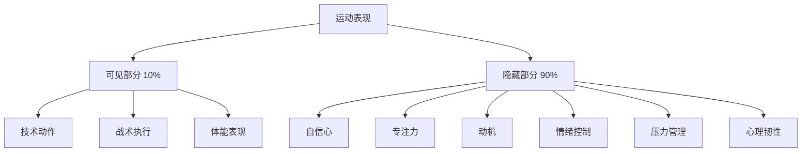
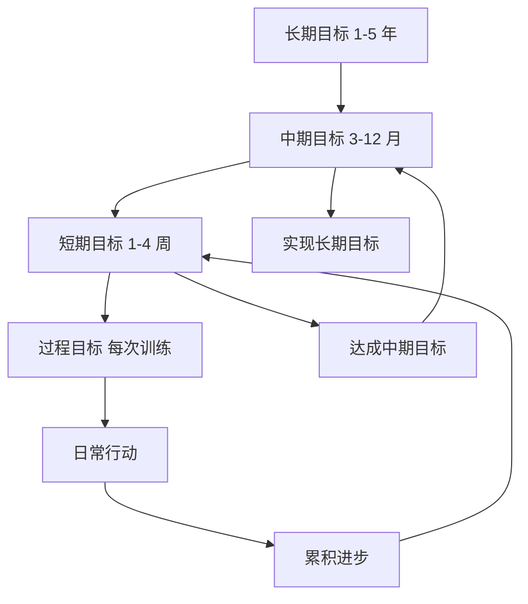
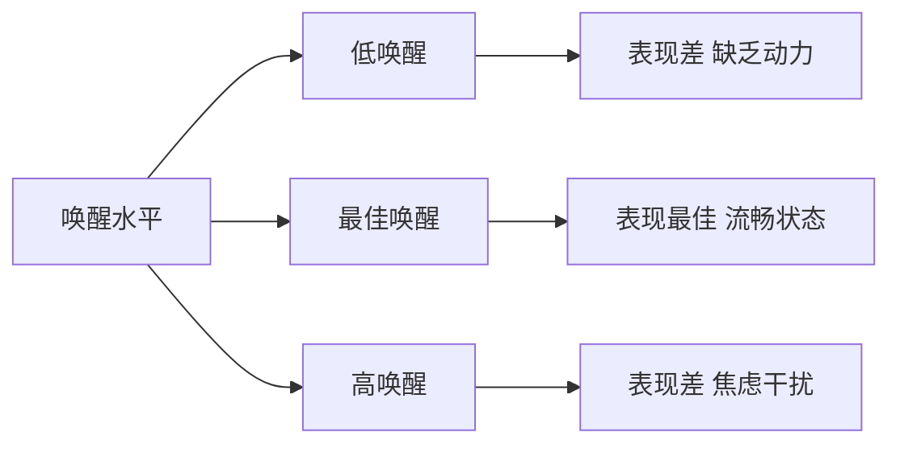
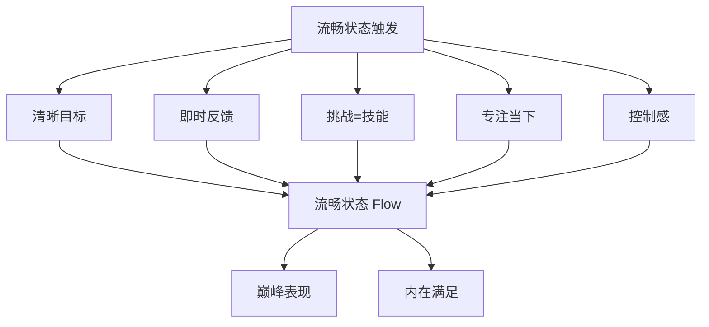

# 运动心理技能训练

> 心理因素对运动表现的影响可达 20-30%，优秀的运动员需要强大的心理技能。

## 运动心理学基础

### 心理表现模型

**冰山模型**：



**关键理念**：
- 技术和体能是基础，但心理决定上限
- 高水平竞争中，心理差异是关键
- 心理技能可以像肌肉一样训练

### 心理技能的分类

**认知技能**：
- 目标设定
- 意象训练（可视化）
- 自我对话
- 注意力控制

**情绪技能**：
- 焦虑管理
- 愤怒控制
- 自信建立
- 动机维持

**行为技能**：
- 预表现例行程序
- 呼吸调节
- 放松技巧
- 恢复策略

---

## 目标设定理论

### SMART 原则

**Specific（具体的）**：
- ❌ "我想跑得更快"
- ✅ "我想在 3 个月内将 5km PB 从 25 分钟提升到 23 分钟"

**Measurable（可衡量的）**：
- ❌ "我想变得更强"
- ✅ "我想将深蹲 1RM 从 100kg 提升到 120kg"

**Achievable（可实现的）**：
- 挑战性但现实
- 考虑当前水平和资源
- ❌ "一个月跑进马拉松 3 小时"（对于初学者）
- ✅ "6 个月内跑进马拉松 4 小时"（有跑步基础）

**Relevant（相关的）**：
- 与长期目标一致
- 对个人有意义
- 符合价值观

**Time-bound（有时限的）**：
- 设定明确截止日期
- 创建紧迫感
- 便于追踪进度

### 目标层级系统

**长期目标**（1-5 年）：
- 愿景性、方向性
- 示例："成为省级马拉松冠军"

**中期目标**（3-12 个月）：
- 里程碑式
- 示例："今年完成首个全马，成绩 sub 4:00"

**短期目标**（1-4 周）：
- 具体行动导向
- 示例："本周完成 4 次跑步训练，总里程 40km"

**过程目标**（每次训练）：
- 关注执行而非结果
- 示例："今天节奏跑保持目标配速，RPE 7/10"



### 目标类型平衡

**结果目标**（Outcome Goals）：
- 关注最终结果
- 示例：赢得比赛、达到某个成绩
- **优点**：提供方向
- **缺点**：不完全可控

**表现目标**（Performance Goals）：
- 关注个人表现
- 示例：PB、技术改进
- **优点**：更可控
- **缺点**：仍受外部因素影响

**过程目标**（Process Goals）：
- 关注执行过程
- 示例：训练一致性、技术要点
- **优点**：完全可控
- **缺点**：需要耐心

**最佳实践**：
- 三种目标结合使用
- 日常训练聚焦过程目标
- 比赛前关注表现目标
- 赛季末评估结果目标

**经典研究**：
> **Locke & Latham (2002)** - 系统综述了目标设定理论，发现具体且具有挑战性的目标比模糊目标提升表现 16%。该理论被广泛应用于运动心理学，被引用超过 **5000 次**[^1]。

---

## 意象训练（Visualization）

### 什么是意象训练？

**定义**：在脑海中生动地重现或预演运动表现的心理练习。

**神经科学基础**：
- 意象激活的脑区与实际执行相似
- 强化神经通路
- 提升动作熟练度

**证据**：
- 意象训练可提升表现 10-20%
- 与实际训练结合效果最佳
- 对技术动作学习特别有效

### PETTLEP 模型

**有效的意象训练应包含 7 个要素**：

**P - Physical（身体）**：
- 穿着比赛服装
- 在真实环境中进行
- 模拟实际姿势

**E - Environment（环境）**：
- 真实的比赛场地
- 包括观众、噪音等
- 天气条件

**T - Task（任务）**：
- 与实际任务一致
- 包括完整动作序列
- 考虑战术决策

**T - Timing（时间）**：
- 实时速度（real-time）
- 不要加速或减速
- 保持真实节奏

**L - Learning（学习）**：
- 根据技能水平调整
- 初学者：简化版本
- 高级者：复杂情境

**E - Emotion（情绪）**：
- 重现比赛时的情绪
- 包括压力、兴奋
- 练习情绪调节

**P - Perspective（视角）**：
- **内部视角**：从自己眼睛看（推荐）
- **外部视角**：像看电影看自己
- 根据目的选择

### 意象训练脚本示例

**赛前准备意象**（5 分钟）：

```
1. 闭上眼睛，深呼吸 3 次
2. 想象自己站在起跑线
   - 感受脚下的地面
   - 听到周围的噪音
   - 看到其他选手
3. 感受身体的感觉
   - 肌肉紧张度适中
   - 呼吸平稳
   - 心跳略微加快但可控
4. 回忆成功的训练经历
   - 想起轻松完成节奏跑的感觉
   - 感受自信和平静
5. 预演比赛开始
   - 听到发令枪
   - 平稳起步
   - 找到节奏
6. 想象中途遇到困难
   - 感到疲劳
   - 使用积极自我对话
   - 调整呼吸，坚持下去
7. 想象冲过终点
   - 看到计时牌
   - 感受成就感
   - 微笑、庆祝
8. 慢慢睁开眼睛
```

### 应用场景

**技术学习**：
- 新动作的 mentally rehearsal
- 纠正错误动作
- 提升动作流畅度

**比赛准备**：
- 预演比赛流程
- 应对各种情境
- 建立自信

**伤病恢复**：
- 维持神经通路
- 减少技能退化
- 加速重返赛场

**压力情境**：
- 练习关键时刻表现
- 建立应对策略
- 降低焦虑

**经典研究**：
> **Cumming & Williams (2012)** - Meta 分析发现意象训练可提升运动表现 13%，尤其在技术动作学习中效果显著。PETTLEP 模型被证明是最有效的意象训练框架[^2]。

---

## 自我对话（Self-Talk）

### 自我对话的类型

**指导性自我对话**（Instructional）：
- 关注技术要点
- 示例："膝盖抬高"、"手臂放松"、"保持节奏"
- **适用**：技术学习、动作执行

**激励性自我对话**（Motivational）：
- 提升信心和努力
- 示例："我可以做到"、"坚持住"、"我很强大"
- **适用**：疲劳时刻、困难情境

**积极自我对话** vs **消极自我对话**：

| 消极对话 | 积极重构 |
|---------|---------|
| "我太累了" | "我的身体很强壮" |
| "我做不到" | "我可以一步一步来" |
| "这太难了" | "这是一个挑战，我喜欢挑战" |
| "我会失败" | "我会尽力，这就是成功" |

### 自我对话训练步骤

**步骤 1：觉察**
- 记录训练/比赛中的内心对话
- 识别消极模式
- 了解触发情境

**步骤 2：中断**
- 意识到消极对话时立即停止
- 使用"停！"或拍手打断
- 深呼吸重置

**步骤 3：替换**
- 准备积极的替代语句
- 个性化、有意义
- 简短、有力

**步骤 4：练习**
- 日常训练中刻意使用
- 形成自动化反应
- 逐步内化

### 个人化口号库

**建立自己的口号清单**：

**力量训练**：
- "推！"
- "控制离心"
- "最后一组，全力以赴"
- "我的身体比想象中强大"

**耐力运动**：
- "保持节奏"
- "一步接一步"
- "痛苦是暂时的，骄傲是永恒的"
- "我现在感觉很好"

**比赛时刻**：
- "这是我的时刻"
- "我为此训练了很久"
- "享受这个过程"
- "无论结果如何，我都骄傲"

---

## 注意力控制

### 注意力焦点

**内部焦点**（Internal Focus）：
- 关注身体动作
- 示例："感受股四头肌收缩"
- **适用**：技术学习初期

**外部焦点**（External Focus）：
- 关注动作效果
- 示例："把地面推开"、"向前移动"
- **适用**：技术熟练后，表现更佳

**经典研究**：
> **Wulf (2013)** - 综述了注意力焦点的研究，发现外部焦点比内部焦点产生更好的运动表现和学习效果，因为减少了意识干扰[^3]。

### Nideffer 的 TAIS 模型

**注意力宽窄 × 内外向**：

**Broad-External（宽阔-外向）**：
- 扫描环境，评估局势
- 示例：足球运动员观察全场
- **应用**：战术决策

**Narrow-External（狭窄-外向）**：
- 聚焦特定外部线索
- 示例：篮球运动员瞄准篮筐
- **应用**：精准执行

**Broad-Internal（宽阔-内向）**：
- 分析信息，制定计划
- 示例：教练思考战术
- **应用**：战略规划

**Narrow-Internal（狭窄-内向）**：
- 专注于身体感觉
- 示例：跑步者监控呼吸和步频
- **应用**：节奏控制

### 注意力训练方法

**正念冥想**（Mindfulness）：
- 提升当下觉察能力
- 减少杂念干扰
- 改善情绪调节

**练习**：
- 每天 10 分钟冥想
- 专注呼吸
- 观察思绪但不跟随

**注意力锚点**：
- 选择一个焦点作为"锚"
- 分心时回到锚点
- 示例：呼吸、步频、技术要点

**情境模拟训练**：
- 在压力下练习专注
- 逐渐增加干扰
- 建立抗干扰能力

---

## 压力管理与焦虑控制

### 倒 U 型理论（Yerkes-Dodson Law）

**原理**：
- 过低唤醒：表现差（缺乏动力）
- 适度唤醒：表现最佳
- 过高唤醒：表现差（焦虑干扰）

**个体差异**：
- 每个人最佳唤醒水平不同
- 复杂任务需要较低唤醒
- 简单/力量任务可承受较高唤醒



### 焦虑类型

**躯体焦虑**（Somatic Anxiety）：
- 生理症状：心跳加速、出汗、肌肉紧张
- **管理**：放松技巧、呼吸控制

**认知焦虑**（Cognitive Anxiety）：
- 心理症状：担忧、负面思维、注意力分散
- **管理**：认知重构、自我对话

### 放松技巧

**腹式呼吸**：
1. 坐或躺，一手放胸口，一手放腹部
2. 通过鼻子缓慢吸气 4 秒（腹部鼓起）
3. 屏息 2 秒
4. 通过嘴巴缓慢呼气 6 秒（腹部收缩）
5. 重复 5-10 次

**渐进性肌肉放松**（PMR）：
1. 从脚部开始，紧张肌肉 5 秒
2. 突然放松，感受松弛感 10 秒
3. 依次向上：小腿、大腿、臀部、腹部...
4. 直到面部肌肉
5. 全身扫描，释放剩余紧张

**可视化平静场景**：
- 想象一个让你平静的地方
- 调动所有感官
- 停留 3-5 分钟

### 认知重构

**识别扭曲思维**：

| 扭曲类型 | 示例 | 重构 |
|---------|------|------|
| 灾难化 | "如果失败就完了" | "即使不理想，也能从中学习" |
| 过度概括 | "我总是表现不好" | "这次不理想，但我有过成功经历" |
| 读心术 | "别人觉得我不行" | "我无法知道别人的想法，专注自己" |
| 应该陈述 | "我应该完美" | "我尽力就好，完美不现实" |

**ABC 模型**：
- **A**ctivating Event（触发事件）
- **B**elief（信念/解释）
- **C**onsequence（结果/情绪）

**示例**：
- A：比赛前心跳加速
- B（消极）："我太紧张了，会搞砸"
- C：焦虑加剧，表现下降
- B（积极）："这是正常的兴奋，说明我在乎"
- C：接受并转化为能量，表现提升

---

## 心理韧性（Mental Toughness）

### 心理韧性的 4C 模型

**Control（控制感）**：
- 相信自己能影响结果
- 专注于可控因素
- 不被外界干扰

**Commitment（承诺）**：
- 对目标的坚定投入
- 即使困难也坚持
- 长期视角

**Challenge（挑战观）**：
- 将困难视为成长机会
- 拥抱不确定性
- 从失败中学习

**Confidence（自信）**：
- 相信自己的能力
- 基于准备的真实自信
- 面对压力时保持稳定

### 培养心理韧性的方法

**暴露疗法**：
- 逐步面对恐惧情境
- 从低压力开始
- 建立成功经验

**逆境训练**：
- 故意设置困难条件
- 恶劣天气训练
- 疲劳状态下练习技术

**反思实践**：
- 训练日志记录
- 赛后复盘
- 识别成长点

**支持系统**：
- 教练指导
- 队友支持
- 家人理解
- 专业心理咨询

**经典研究**：
> **Jones et al. (2007)** - 提出了心理韧性的 4C 模型，并通过访谈精英运动员验证了其构成要素。该模型成为运动心理学领域的重要框架[^4]。

---

## 流畅状态（Flow State）

### 什么是流畅状态？

**特征**：
- 完全沉浸于当前任务
- 时间感扭曲（过得很快或很慢）
- 行动与意识融合
- 失去自我意识
- 内在动机驱动
- 表现达到巅峰

**触发条件**：
1. **清晰的目标**
2. **即时反馈**
3. **挑战与技能平衡**
4. **专注当下**
5. **控制感**
6. **失去自我意识**
7. **时间感扭曲**
8. **体验本身即奖励**



### 进入流畅状态的策略

**赛前准备**：
- 建立预表现例行程序
- 意象训练预演
- 设定过程目标

**赛中维持**：
- 专注当下，不想过去和未来
- 信任训练，不过度思考
- 享受过程，不执着结果

**环境设计**：
- 消除干扰
- 创造仪式感
- 合适的音乐（如适用）

---

## 参考文献

[^1]: Locke, E. A., & Latham, G. P. (2002). Building a practically useful theory of goal setting and task motivation: A 35-year odyssey. *American Psychologist*, 57(9), 705-717. (被引用 5000+ 次)

[^2]: Cumming, J., & Williams, S. E. (2012). The role of imagery in performance optimization. *Journal of Sport Psychology in Action*, 3(2), 120-130. (被引用 800+ 次)

[^3]: Wulf, G. (2013). Attentional focus and motor learning: a review of 15 years of research. *International Review of Sport and Exercise Psychology*, 6(1), 77-104. (被引用 1500+ 次)

[^4]: Jones, G., Hanton, S., & Connaughton, D. (2007). A framework of mental toughness in the world's best performers. *The Sport Psychologist*, 21(2), 243-264. (被引用 1200+ 次)
