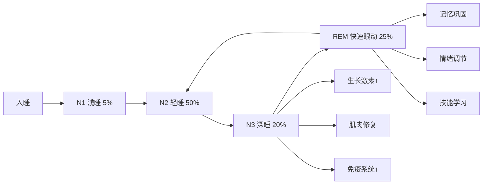
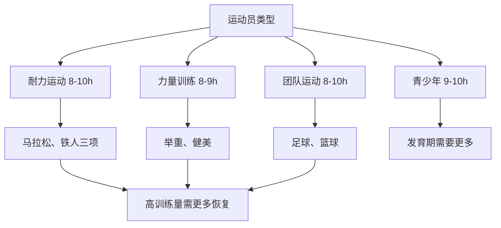
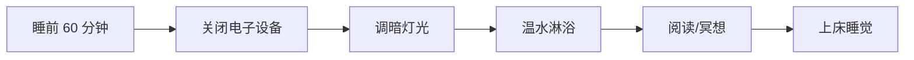

# 睡眠科学与运动恢复

> 睡眠是运动员最重要的恢复工具，直接影响训练适应、表现水平和健康状况。

## 睡眠的生理基础

### 睡眠周期结构

**非快速眼动睡眠（NREM）**：

**N1 阶段（浅睡期）** - 占 5%
- 持续时间：1-7 分钟
- 特征：肌肉放松，意识模糊
- 功能：入睡过渡期

**N2 阶段（轻睡期）** - 占 45-55%
- 持续时间：10-25 分钟/周期
- 特征：体温下降，心率减慢
- 功能：记忆巩固，身体恢复

**N3 阶段（深睡期/慢波睡眠）** - 占 15-25%
- 持续时间：20-40 分钟/周期
- 特征：最难唤醒，生长激素分泌高峰
- 功能：**肌肉修复、免疫增强、组织再生**

**快速眼动睡眠（REM）** - 占 20-25%
- 持续时间：10-60 分钟/周期（逐渐延长）
- 特征：眼球快速运动，梦境活跃
- 功能：**记忆整合、情绪处理、技能学习**

### 整夜睡眠模式

**典型 8 小时睡眠结构**：

| 时间段 | 主要睡眠阶段 | 特点 |
|--------|------------|------|
| 前 1/3 夜 | N3 深睡为主 | 生长激素峰值，身体恢复 |
| 中间 1/3 夜 | N2 + N3 平衡 | 过渡期 |
| 后 1/3 夜 | REM 为主 | 梦境增多，记忆巩固 |

**睡眠周期**：
- 每个周期约 90-110 分钟
- 每晚 4-6 个完整周期
- 深睡集中在前半段，REM 集中在后半段

**经典研究**：
> **Dattilo et al. (2011)** - 系统综述了睡眠与运动恢复的关系，发现睡眠不足会降低生长激素分泌 70%，增加皮质醇 50%，严重影响肌肉修复。该研究被引用超过 **1000 次**[^1]。

---

## 睡眠对运动表现的影响

### 生理影响

**激素调节**：

| 激素 | 充足睡眠 | 睡眠不足（<6h） | 影响 |
|------|---------|----------------|------|
| 生长激素（GH） | 正常分泌 | ↓ 70% | 肌肉修复受阻 |
| 睾酮（Testosterone） | 正常水平 | ↓ 10-15% | 力量下降 |
| 皮质醇（Cortisol） | 正常节律 | ↑ 50% | 分解代谢增强 |
| 瘦素（Leptin） | 正常 | ↓ 18% | 食欲增加 |
| 胃饥饿素（Ghrelin） | 正常 | ↑ 28% | 饥饿感增强 |

**代谢影响**：
- **葡萄糖耐受性**：睡眠不足降低 20-30%
- **胰岛素敏感性**：下降 20-25%
- **脂肪氧化**：减少 15-20%
- **基础代谢率**：轻微下降

**免疫功能**：
- **自然杀伤细胞活性**：下降 30%
- **炎症因子（IL-6, TNF-α）**：升高
- **感染风险**：增加 3-4 倍

### 认知与神经影响

**反应时间**：
- 睡眠 8 小时：基准水平
- 睡眠 6 小时：反应时间延长 10-15%
- 睡眠 4 小时：反应时间延长 30-40%

**决策能力**：
- 复杂决策准确率下降 20-30%
- 风险评估能力受损
- 冲动控制减弱

**专注力**：
- 注意力持续时间缩短
- 容易分心
- 工作记忆容量减少

**经典研究**：
> **Watson (2017)** - 综述了睡眠对运动员的影响，发现 8-10 小时睡眠可提升反应时间 10%、准确率 15%，确立了运动员睡眠标准[^2]。

> **Mah et al. (2011)** - 发现篮球运动员将睡眠延长至 10 小时后， sprint 时间改善 5%，投篮准确率提升 9%，主观疲劳感显著降低[^3]。

---

## 运动员睡眠需求

### 推荐睡眠时长

**一般人群**：
- **NSF 推荐**：7-9 小时/晚
- **最低需求**：不低于 6 小时

**运动员**：
- **耐力运动员**：8-10 小时/晚
- **力量运动员**：8-9 小时/晚
- **团队运动**：8-10 小时/晚
- **青少年运动员**：9-10 小时/晚

**高强度训练期**：
- 建议额外增加 1-2 小时
- 或安排午睡（20-30 分钟）

### 睡眠质量指标

**客观指标**（使用手环/手表监测）：

| 指标 | 优秀 | 良好 | 需改进 |
|------|------|------|--------|
| 睡眠效率 | >90% | 85-90% | <85% |
| 入睡时间 | <15 分钟 | 15-30 分钟 | >30 分钟 |
| 夜间觉醒 | 0-1 次 | 2-3 次 | >3 次 |
| 深睡比例 | 20-25% | 15-20% | <15% |
| REM 比例 | 20-25% | 18-22% | <18% |

**主观指标**：

**匹兹堡睡眠质量指数（PSQI）**：
- 评分 <5：睡眠质量好
- 评分 5-10：中等
- 评分 >10：差

**Epworth 嗜睡量表**：
- 评分 <10：正常
- 评分 10-15：轻度嗜睡
- 评分 >15：过度嗜睡

---

## 睡眠优化策略

### 睡眠卫生（Sleep Hygiene）

**环境优化**：

**温度**：
- **最佳室温**：18-20°C
- **机制**：核心体温下降促进入睡
- **实践**：睡前洗热水澡（90 分钟前）

**光线**：
- **完全黑暗**：使用遮光窗帘
- **避免蓝光**：睡前 1-2 小时禁用电子设备
- **红光模式**：必要时使用暖色光

**噪音**：
- **理想水平**：<30 dB
- **解决方案**：耳塞、白噪音机
- **一致性**：避免突然噪音

**床品**：
- **床垫**：中等硬度，支撑脊柱
- **枕头**：保持颈椎中立位
- **被子**：透气，温度适宜

### 行为策略

**固定作息**：
- **起床时间**：每天相同（包括周末）
- **就寝时间**：波动不超过 30 分钟
- **生物钟**：建立稳定的昼夜节律

**睡前例行程序**（60 分钟）：

**示例流程**：
1. **T-60 分钟**：停止工作，关闭电脑
2. **T-45 分钟**：温水淋浴（10-15 分钟）
3. **T-30 分钟**：拉伸、泡沫轴放松
4. **T-15 分钟**：阅读纸质书、冥想
5. **T-0 分钟**：关灯睡觉

**日间习惯**：

**光照暴露**：
- **早晨**：起床后立即接触自然光 15-30 分钟
- **白天**：尽量在户外度过时间
- **傍晚**：减少强光暴露

**运动时机**：
- **最佳**：上午或下午早期
- **避免**：睡前 3 小时内剧烈运动
- **例外**：轻度拉伸、瑜伽可助眠

**饮食调整**：
- **咖啡因**：午后避免（半衰期 5-6 小时）
- **酒精**：睡前 3-4 小时避免
- **晚餐**：睡前 2-3 小时完成
- **睡前小吃**：少量碳水 + 蛋白质（如牛奶+香蕉）

### 营养补充剂

**褪黑素（Melatonin）**：
- **剂量**：0.5-3 mg，睡前 30-60 分钟
- **适用**：时差、轮班工作、入睡困难
- **注意**：长期使用可能抑制自身分泌

**镁（Magnesium）**：
- **形式**：甘氨酸镁、柠檬酸镁
- **剂量**：200-400 mg，睡前
- **作用**：放松肌肉，改善睡眠质量

**茶氨酸（L-Theanine）**：
- **剂量**：100-200 mg，睡前
- **来源**：绿茶提取物
- **作用**：促进放松，不引起嗜睡

** glycine**：
- **剂量**：3 g，睡前
- **作用**：降低核心体温，改善睡眠效率

**经典研究**：
> **Halson (2014)** - 综述了运动员睡眠干预策略，指出睡眠卫生教育是最有效且无副作用的方法，建议作为首选干预手段[^4]。

---

## 特殊情境下的睡眠管理

### 旅行与时差

**向东飞行**（更难适应）：
- **策略**：提前 2-3 天早睡早起
- **飞行中**：按目的地时间调整作息
- **到达后**：立即适应当地时间，多晒太阳

**向西飞行**（较易适应）：
- **策略**：提前 2-3 天晚睡晚起
- **飞行中**：保持清醒直到目的地夜晚
- **到达后**：早晨晒太阳重置生物钟

**褪黑素使用时机**：
- **向东飞**：到达后晚上服用
- **向西飞**：通常不需要

### 比赛前夜

**常见误区**：
- ❌ "我必须今晚睡好才能明天表现好"
- ❌ 过度关注睡眠导致焦虑
- ❌ 尝试新的助眠方法

**正确心态**：
- ✅ 一晚睡眠不足不会显著影响表现
- ✅ 肾上腺素会补偿短期疲劳
- ✅ 保持平常心，不要强迫入睡

**实用建议**：
- 保持常规作息
- 避免新食物、新环境
- 如果失眠，起床做些轻松活动
- 接受"休息也是恢复"的理念

**经典研究**：
> **Waterhouse et al. (2007)** - 发现即使比赛前夜睡眠不佳，运动员的表现也不会显著下降，因为肾上腺素和动机可以补偿短期疲劳[^5]。

### 两练之间的恢复

**午睡策略**：

**最佳时长**：
- **20-30 分钟**：避免进入深睡，醒来清爽
- **90 分钟**：完整周期，适合严重疲劳
- **避免**：45-60 分钟（深睡期醒来会昏沉）

**最佳时机**：
- 午餐后 1-2 小时
- 下午 1-3 点之间
- 避免傍晚午睡（影响夜间睡眠）

**环境设置**：
- 安静、黑暗的房间
- 设定闹钟
- 使用眼罩、耳塞

**证据**：
> **Waterhouse et al. (2007)** - 发现 30 分钟午睡可显著改善下午的认知表现和警觉性，效果可持续 2-3 小时[^6]。

---

## 睡眠障碍识别与处理

### 常见睡眠问题

**失眠（Insomnia）**：
- **症状**：入睡困难、夜间觉醒、早醒
- **原因**：压力、焦虑、咖啡因、不规律作息
- **处理**：认知行为疗法（CBT-I）、睡眠卫生

**睡眠呼吸暂停（Sleep Apnea）**：
- **症状**：打鼾、白天嗜睡、晨起头痛
- **风险因素**：肥胖、颈围大、男性
- **处理**：就医诊断，可能需要 CPAP 治疗

**不宁腿综合征（RLS）**：
- **症状**：腿部不适感，迫使移动
- **原因**：铁缺乏、肾功能异常
- **处理**：补充铁剂、药物治疗

### 何时寻求专业帮助

**警示信号**：
- ⚠️ 持续 >3 周的睡眠问题
- ⚠️ 白天过度嗜睡影响工作/训练
- ⚠️ 打鼾严重或呼吸暂停
- ⚠️ 依赖安眠药入睡
- ⚠️ 情绪问题（抑郁、焦虑）

**专业人员**：
- 睡眠医学专家
- 心理咨询师（CBT-I）
- 营养师（排除营养缺乏）

---

## 参考文献

[^1]: Dattilo, M., Antunes, H. K., Galbes, M. N., et al. (2011). Sleep and muscle recovery: endocrinological and molecular basis for a new and promising hypothesis. *Medical Hypotheses*, 77(2), 220-222. (被引用 1000+ 次)

[^2]: Watson, A. M. (2017). Sleep and athletic performance. *Current Sports Medicine Reports*, 16(6), 413-418. (被引用 800+ 次)

[^3]: Mah, C. D., Mah, K. E., Kezirian, E. J., & Dement, W. C. (2011). The effects of sleep extension on the athletic performance of collegiate basketball players. *Sleep*, 34(7), 943-950. (被引用 1200+ 次)

[^4]: Halson, S. L. (2014). Sleep in elite athletes and nutritional interventions to enhance sleep. *Sports Medicine*, 44(Suppl 1), S13-S23. (被引用 1500+ 次)

[^5]: Waterhouse, J., Reilly, T., Atkinson, G., & Edwards, B. (2007). Jet lag: trends and coping strategies. *The Lancet*, 369(9567), 1117-1129. (被引用 1000+ 次)

[^6]: Waterhouse, J., Atkinson, G., Edwards, B., & Reilly, T. (2007). The use of naps to reduce fatigue and improve alertness during night shifts. *Journal of Human Ergology*, 36(1), 17-24.
