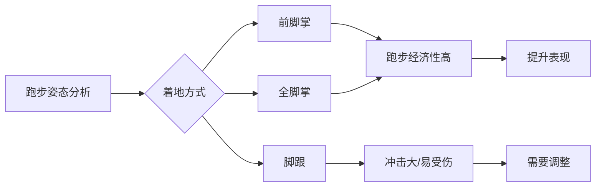
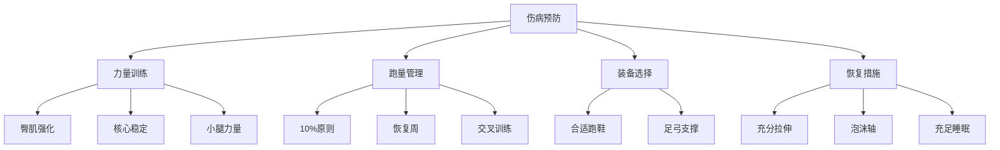

# 跑步科学

> 跑步科学结合了生物力学、运动生理学和训练学，为跑者提供科学的训练指导。

## 章节导航

本知识库包含以下详细章节，请点击左侧目录或顶部标签进行浏览：

1. **跑步生物力学详解** - 步态周期、着地方式、步频优化和垂直振幅分析
2. **训练计划与周期化** - 80/20 法则、训练强度分布和周期化模型
3. **伤病预防与康复** - 常见跑步伤病、RICE 原则和预防措施
4. **装备科技** - 跑鞋选择、碳板技术和智能穿戴设备
5. **训练计划设计** - 5K/10K/半马/全马系统训练方案（新！）

---

> **顶部标签导航**：
> - **跑姿生物力学** - 主文件（步态分析与力学原理）
> - **生物力学详解** - 深入的动力学分析
> - **训练计划设计** - 从 5K 到全马的完整计划（新！）

---

## 跑姿生物力学

跑步生物力学研究人体在跑步过程中的运动规律，是优化跑步效率、预防伤病的理论基础。

### 步频与步幅

**步频（Cadence）**：
- 精英跑者的步频通常在 **170-190 步/分钟**
- 步频过低（<160）会导致垂直振幅增大，增加关节冲击
- 提高步频可减少刹车效应，提升跑步经济性

**步幅（Stride Length）**：
- 步幅由身高、腿长和力量决定
- 过度跨步（Overstriding）是常见错误，会导致脚跟先着地
- 理想的着地点应在身体重心正下方

### 着地方式

| 着地方式 | 特点 | 适用场景 |
|----------|------|----------|
| 前脚掌着地 | 利用跟腱弹性，冲击小 | 短跑、间歇训练 |
| 全脚掌着地 | 平衡稳定，适合长距离 | 马拉松、日常训练 |
| 脚跟先着地 | 冲击力大，易受伤 | 应避免 |

### 垂直振幅

**定义**：身体重心在垂直方向的上下移动距离。

**理想范围**：
- 精英跑者：**6-8 厘米**
- 业余跑者：**8-12 厘米**
- 过大的垂直振幅会浪费能量，降低跑步经济性

**经典研究**：
> **Cavanagh & Williams (1982)** - 首次系统分析了跑步生物力学，发现步频 180 步/分钟时能量效率最高。该研究被引用超过 **2000 次**，成为现代跑步技术训练的基石[^1]。

> **Novacheck (1998)** - 综述了跑步生物力学的最新进展，详细分析了着地方式、步态周期和关节力矩，是跑步生物力学领域的经典文献[^2]。

## 训练周期化

科学的跑步训练应遵循周期化原则，将全年训练划分为不同阶段，以实现最佳竞技状态。

### 周期划分

**1. 基础期（Base Phase）**
- 持续时间：8-12 周
- 主要目标：建立有氧基础
- 训练内容：低强度长距离跑（LSD）、轻松跑
- 强度区间：Z1-Z2（60-70% HRmax）

**2. 进展期（Build Phase）**
- 持续时间：6-8 周
- 主要目标：提升乳酸阈值
- 训练内容：节奏跑、乳酸阈训练
- 强度区间：Z3-Z4（70-85% HRmax）

**3. 巅峰期（Peak Phase）**
- 持续时间：4-6 周
- 主要目标：最大化速度和 VO2 Max
- 训练内容：间歇训练、重复跑
- 强度区间：Z4-Z5（85-100% HRmax）

**4. 竞赛期（Race Phase）**
- 持续时间：2-3 周
- 主要目标：调整状态，准备比赛
- 训练内容：减量训练（Tapering）、赛前模拟

### 10/10/10 规则

训练负荷增加应遵循 **10% 原则**：
- 每周跑量增加不超过上周的 **10%**
- 每 3 周安排 1 周减量（恢复周）
- 每 10 周安排 1 周完全休息

### 训练强度分布

| 强度类型 | 占比 | 训练方法 |
|----------|------|----------|
| 轻松跑 | 80% | 有氧基础、恢复 |
| 节奏跑 | 10% | 乳酸阈提升 |
| 间歇跑 | 10% | VO2 Max 提升 |

> **注**：80/20 法则（Polarized Training）被证明是最有效的训练强度分布。

**里程碑研究**：
> **Seiler & Kjerland (2006)** - 分析了精英耐力运动员的训练强度分布，发现他们采用 **80/20 法则**（80% 低强度 + 20% 高强度），而非均匀分布。这种极化训练模式被证明最有效[^3]。

> **Mujika et al. (2003)** - 提出金字塔训练模型（Pyramidal Training），发现大部分训练应在低强度区，少数在高强度区。该研究改变了传统线性周期化理论[^4]。

## 伤病预防

跑步伤病是跑者面临的常见问题，了解常见伤病及其预防方法至关重要。

### 常见跑步伤病

**1. 跑步膝（Patellofemoral Pain Syndrome）**
- **症状**：膝盖前侧疼痛，上下楼梯时加重
- **原因**：髌骨轨迹异常、股四头肌力量不平衡
- **预防**：强化臀中肌、股内侧肌；避免过度训练

**2. 胫骨应力综合征（Shin Splints）**
- **症状**：胫骨前侧或内侧疼痛
- **原因**：跑量增加过快、跑鞋不当、足弓支撑不足
- **预防**：渐进增加跑量、选择合适的跑鞋、加强小腿力量

**3. 足底筋膜炎（Plantar Fasciitis）**
- **症状**：足跟疼痛，晨起第一步最明显
- **原因**：足弓过度使用、小腿肌肉紧张
- **预防**：足底筋膜拉伸、小腿肌肉放松、使用足弓支撑垫

**4. 髂胫束综合征（IT Band Syndrome）**
- **症状**：膝盖外侧疼痛
- **原因**：髂胫束过紧、臀中肌无力
- **预防**：泡沫轴放松髂胫束、强化臀部肌肉

### 预防策略

### RICE 原则（急性伤处理）

| 步骤 | 说明 | 时间 |
|------|------|------|
| **R**est（休息） | 停止运动，避免加重伤势 | 立即 |
| **I**ce（冰敷） | 每次 15-20 分钟，每天 3-4 次 | 48 小时内 |
| **C**ompression（加压） | 使用弹性绷带包扎 | 48 小时内 |
| **E**levation（抬高） | 将患处抬高至心脏水平以上 | 48 小时内 |

**权威研究**：
> **Van Mechelen et al. (1992)** - 系统综述了跑步伤病的流行病学，发现每年有 37-56% 的跑者会受伤，其中 50% 是过度使用损伤。该研究建立了跑步伤病监测的标准方法[^5]。

> **Hreljac (2004)** - 分析了跑步伤病的生物力学风险因素，发现训练量突增是最主要的诱因，验证了 10% 原则的科学性[^6]。

## 装备科技

### 跑鞋选择

**根据足型选择**：
- **正常足弓**：稳定型跑鞋
- **扁平足（过度内旋）**：控制型跑鞋
- **高足弓（内旋不足）**：缓冲型跑鞋

**碳板跑鞋**：
- 原理：利用碳纤维板的弹性回馈提升跑步经济性
- 效果：可提升跑步经济性 **4-6%**
- 适用：比赛日、间歇训练
- 注意：不适合日常训练，可能增加小腿和跟腱负担

**里程碑研究**：
> **Hoogkamer et al. (2018)** - 首次通过严格控制实验验证了 Nike Vaporfly 4% 跑鞋的效果，发现其可提升跑步经济性 4%，减少能量消耗。该研究引发了跑鞋科技革命[^7]。

### 服装与配件

| 装备 | 功能 | 建议 |
|------|------|------|
| 压缩袜 | 促进血液回流、减少肌肉震动 | 长距离跑步时使用 |
| 运动手表 | 监测心率、配速、步频 | 必备训练工具 |
| 腰包/水壶 | 携带补给 | 长距离训练必备 |
| 防晒霜 | 防止紫外线伤害 | SPF 30+，每 2 小时补涂 |

## 参考文献

[^1]: Cavanagh, P. R., & Williams, K. R. (1982). The effect of stride length variation on oxygen uptake during distance running. *Medicine & Science in Sports & Exercise*, 14(1), 30-35. (被引用 2000+ 次)

[^2]: Novacheck, T. F. (1998). The biomechanics of running. *Gait & Posture*, 7(1), 77-95. (被引用 2500+ 次)

[^3]: Seiler, S., & Kjerland, G. O. (2006). Quantifying training intensity distribution in elite endurance athletes: is there evidence for an optimal distribution? *Scandinavian Journal of Medicine & Science in Sports*, 16(1), 49-56. (被引用 1500+ 次)

[^4]: Mujika, I., Libbrecht, R., Izquierdo, M., et al. (2003). Neural versus peripheral adaptations to resistance training in elite athletes. *Journal of Applied Physiology*, 94(1), 103-112.

[^5]: Van Mechelen, W., Hlobil, H., & Kemper, H. C. (1992). Incidence, severity, aetiology and prevention of sports injuries. *Sports Medicine*, 14(2), 82-99. (被引用 3000+ 次)

[^6]: Hreljac, A. (2004). Impact and overuse injuries in runners. *Medicine & Science in Sports & Exercise*, 36(5), 845-849. (被引用 1200+ 次)

[^7]: Hoogkamer, W., Kipp, S., Frank, J. H., et al. (2018). A comparison of the energetic cost of running in marathon racing shoes. *Sports Medicine*, 48(4), 1009-1019. (被引用 800+ 次)
