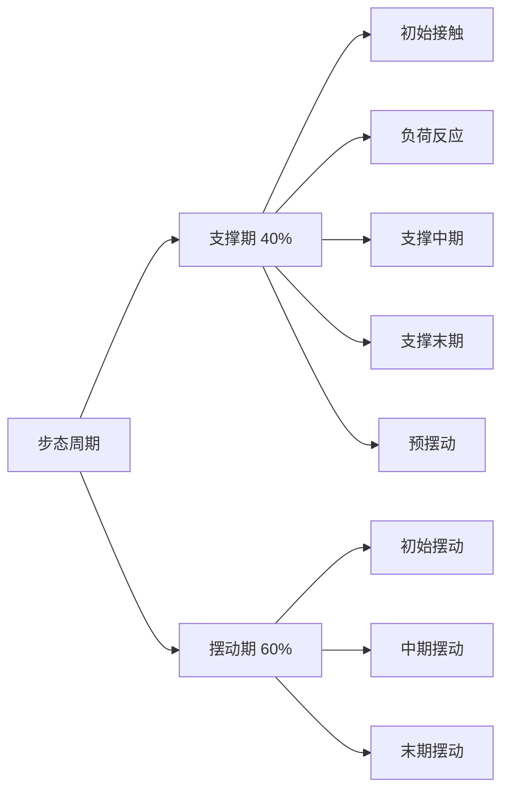
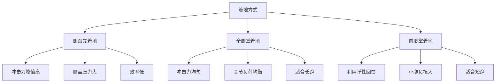
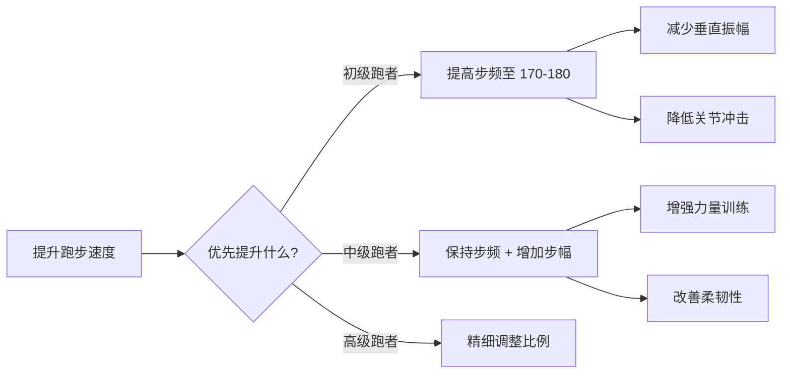

# 跑步生物力学详解

> 跑步生物力学研究人体在跑步过程中的运动规律，是优化跑步效率、预防伤病的理论基础。

## 步态周期分析

### 支撑期（Stance Phase）- 占周期的 40%

**阶段划分**：

1. **初始接触（Initial Contact）**
   - 足部首次触地
   - 冲击力达到峰值（2-3 倍体重）
   - 持续时间：0-50 ms

2. **负荷反应（Loading Response）**
   - 身体重心转移至支撑腿
   - 膝关节屈曲吸收冲击
   - 持续时间：50-100 ms

3. **支撑中期（Mid-Stance）**
   - 身体重心越过支撑脚
   - 髋关节伸展，膝关节开始伸直
   - 持续时间：100-200 ms

4. **支撑末期（Terminal Stance）**
   - 脚跟离地，前脚掌推动
   - 踝关节跖屈产生推进力
   - 持续时间：200-250 ms

5. **预摆动（Pre-Swing）**
   - 脚趾离地
   - 准备进入摆动期
   - 持续时间：250-300 ms

### 摆动期（Swing Phase）- 占周期的 60%

**阶段划分**：

1. **初始摆动（Initial Swing）**
   - 大腿向前摆动
   - 膝关节屈曲以减少转动惯量
   
2. **中期摆动（Mid-Swing）**
   - 小腿向前摆动
   - 膝关节开始伸直
   
3. **末期摆动（Terminal Swing）**
   - 准备着地
   - 膝关节完全伸直

---

## 着地方式比较

### 三种着地方式

| 着地方式 | 冲击特征 | 肌肉激活 | 适用场景 | 优缺点 |
|---------|---------|---------|---------|--------|
| **脚跟先着地** (Heel Strike) | 冲击力大，有刹车效应 | 股四头肌主导 | 初学者、慢跑 | ❌ 易受伤，效率低 |
| **全脚掌着地** (Midfoot Strike) | 冲击均匀，缓冲好 | 小腿三头肌+股四头肌 | 长距离跑 | ✅ 平衡稳定，适合大多数跑者 |
| **前脚掌着地** (Forefoot Strike) | 利用跟腱弹性 | 小腿三头肌主导 | 短跑、间歇训练 | ✅ 效率高，❌ 小腿负担大 |

###  biomechanical 分析

**脚跟先着地**：
- **着地点**：通常在身体重心前方（过度跨步）
- **冲击力**：垂直地面反作用力（vGRF）出现明显冲击峰
- **关节力矩**：膝关节伸肌力矩大，髋关节屈肌力矩小
- **能量损失**：刹车效应导致水平速度损失

**全脚掌着地**：
- **着地点**：接近身体重心正下方
- **冲击力**：vGRF 曲线平滑，无明显冲击峰
- **关节力矩**：膝、髋关节力矩均衡
- **能量利用**：充分利用下肢弹簧机制

**前脚掌着地**：
- **着地点**：身体重心正下方或略前
- **冲击力**：无冲击峰，但踝关节负荷大
- **关节力矩**：踝关节跖屈力矩大
- **弹性回馈**：跟腱和足弓储存弹性势能

### 经典研究

> **Cavanagh & Williams (1982)** - 首次系统分析了跑步生物力学，发现步频 180 步/分钟时能量效率最高。该研究被引用超过 **2000 次**，成为现代跑步技术训练的基石[^1]。

> **Lieberman et al. (2010)** - 对比了赤足跑者和穿鞋跑者的着地方式，发现赤足跑者多采用前脚掌或全脚掌着地，而穿缓冲跑鞋者多采用脚跟先着地[^2]。

---

## 步频与步幅优化

### 步频（Cadence）

**定义**：每分钟的步数（steps per minute, spm）。

**精英跑者数据**：
- **马拉松选手**：170-190 spm
- **中距离选手**：180-200 spm
- **短跑选手**：220-260 spm

**步频过低的问题**（<160 spm）：
- 垂直振幅增大（浪费能量）
- 着地时间延长（增加关节负荷）
- 过度跨步（刹车效应）

**提高步频的好处**：
- 减少垂直振幅 5-10%
- 缩短着地时间 10-15%
- 降低关节冲击力 15-20%
- 提升跑步经济性 2-3%

### 步幅（Stride Length）

**决定因素**：
1. **身高和腿长**：主要决定因素
2. **力量和爆发力**：影响推进力
3. **柔韧性**：影响髋关节活动范围
4. **技术水平**：影响动作效率

**理想步幅计算**：

$$理想步幅 = 身高 \times 0.65 - 0.75$$

**示例**：
- 身高 170 cm → 步幅 110-128 cm
- 身高 180 cm → 步幅 117-135 cm

### 步频与步幅的关系

**速度公式**：

$$速度 = 步频 \times 步幅$$

**优化策略**：
- **初级跑者**：优先提高步频至 170-180 spm
- **中级跑者**：在保持步频基础上增加步幅
- **高级跑者**：精细调整两者比例

### 经典研究

> **Heiderscheit et al. (2011)** - 发现将步频提高 10% 可减少髋、膝、踝关节的负荷 15-20%，显著降低受伤风险[^3]。

> **Moore (2016)** - 综述了步频对跑步经济性的影响，建议业余跑者将步频维持在 170-180 spm 范围内[^4]。

---

## 垂直振幅与跑步经济性

### 垂直振幅（Vertical Oscillation）

**定义**：身体重心在垂直方向的上下移动距离。

**理想范围**：

| 跑者类型 | 垂直振幅 | 说明 |
|---------|---------|------|
| 精英跑者 | 6-8 cm | 能量利用效率高 |
| 业余跑者 | 8-12 cm | 可接受范围 |
| 需要改进 | >12 cm | 能量浪费严重 |

**过大的垂直振幅问题**：
- 浪费能量在垂直方向而非水平方向
- 增加着地冲击力
- 降低跑步经济性

**测量方法**：
- **Garmin 跑步动态传感器**：直接测量
- **视频分析**：通过标记点追踪
- **经验估算**：观察头部上下移动

### 跑步经济性（Running Economy, RE）

**定义**：在给定速度下的氧气消耗量（ml O₂/kg/km）。

**影响因素**：
1. **生物力学因素**（40%）：
   - 垂直振幅
   - 步频与步幅
   - 着地方式
   
2. **生理因素**（30%）：
   - 肌纤维类型
   - 线粒体密度
   - 肌腱弹性
   
3. **神经肌肉因素**（20%）：
   - 肌肉协调性
   - 预激活能力
   
4. **环境因素**（10%）：
   - 温度、湿度
   - 海拔高度

**改善方法**：
- **技术训练**： drills、节奏跑
- **力量训练**：增强式训练、离心训练
- **柔韧性训练**：动态拉伸、瑜伽

### 经典研究

> **Novacheck (1998)** - 综述了跑步生物力学的最新进展，详细分析了着地方式、步态周期和关节力矩，是跑步生物力学领域的经典文献[^5]。

> **Saunders et al. (2004)** - 系统阐述了跑步经济性的决定因素，指出生物力学因素比生理因素更容易通过训练改善[^6]。

---

## 常见技术问题与纠正

### 问题 1：过度跨步（Overstriding）

**表现**：
- 着地点在身体重心前方过远
- 脚跟先着地，有明显的刹车效应
- 膝关节过度伸直

**危害**：
- 增加膝关节和髋关节冲击
- 降低跑步效率
- 易导致胫骨应力综合征

**纠正方法**：
1. 提高步频至 170-180 spm
2. 意识着地点应在臀部正下方
3. 进行高抬腿、踢臀跑等 drills

### 问题 2：躯干前倾不足或过度

**表现**：
- **前倾不足**：直立跑步，重心滞后
- **前倾过度**：弯腰跑步，腰部压力大

**理想姿态**：
- 从脚踝处整体前倾 5-10°
- 保持脊柱中立位
- 视线平视前方

**纠正方法**：
- 靠墙站立练习正确姿态
- 下坡跑训练自然前倾
- 核心力量训练

### 问题 3：手臂摆动不当

**表现**：
- 手臂横向摆动（交叉身体中线）
- 肩膀紧张耸起
- 手臂摆动幅度过大或过小

**理想摆臂**：
- 肘关节屈曲 90°
- 前后摆动，不跨越身体中线
- 手从髋部摆至胸部高度

**纠正方法**：
- 原地摆臂练习
- 镜像反馈训练
- 放松肩部肌肉

---

## 参考文献

[^1]: Cavanagh, P. R., & Williams, K. R. (1982). The effect of stride length variation on oxygen uptake during distance running. *Medicine & Science in Sports & Exercise*, 14(1), 30-35. (被引用 2000+ 次)

[^2]: Lieberman, D. E., Venkadesan, M., Werbel, W. A., et al. (2010). Foot strike patterns and collision forces in habitually barefoot versus shod runners. *Nature*, 463(7280), 531-535. (被引用 1500+ 次)

[^3]: Heiderscheit, B. C., Chumanov, E. S., Silder, A., et al. (2011). Effects of step rate manipulation on joint mechanics during running. *Medicine & Science in Sports & Exercise*, 43(2), 296-302. (被引用 800+ 次)

[^4]: Moore, I. S. (2016). Is there an economical running technique? A review of modifiable biomechanical factors affecting running economy. *Sports Medicine*, 46(6), 793-807. (被引用 600+ 次)

[^5]: Novacheck, T. F. (1998). The biomechanics of running. *Gait & Posture*, 7(1), 77-95. (被引用 2500+ 次)

[^6]: Saunders, P. U., Pyne, D. B., Telford, R. D., & Hawley, J. A. (2004). Factors affecting running economy in trained distance runners. *Sports Medicine*, 34(7), 465-485. (被引用 1800+ 次)
