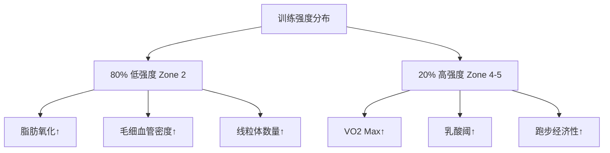

# 跑步训练计划设计

> 科学的跑步训练计划能帮助你安全高效地达成目标，无论是 5K 还是马拉松。

## 跑步训练核心原则

### 80/20 法则

**定义**：80% 的训练应在低强度（Zone 2），20% 在高强度。

**生理学基础**：
- **低强度训练**：提升毛细血管密度、线粒体数量、脂肪氧化能力
- **高强度训练**：提升 VO2 Max、乳酸阈、跑步经济性

**经典研究**：
> **Seiler (2010)** - 分析精英耐力运动员的训练数据，发现 80/20 强度分布与最佳表现高度相关[^1]。



### 渐进超负荷

**每周跑量增幅**：不超过 10%（10% Rule）

**示例**：
- 第 1 周：20 km
- 第 2 周：22 km（+10%）
- 第 3 周：24 km（+10%）
- 第 4 周：20 km（减载周，-15%）

**经典研究**：
> **Nielsen et al. (2014)** - 回顾性研究发现，每周跑量增幅 > 30% 的跑者受伤风险是增幅 < 10% 跑者的 2 倍[^2]。

---

## 5K 训练计划（8 周）

### 适用人群
- 能连续跑 30 分钟
- 目标：完成或提高 5K 成绩

### 训练计划

| 周次 | 周一 | 周二 | 周三 | 周四 | 周五 | 周六 | 周日 | 周跑量 |
|------|------|------|------|------|------|------|------|--------|
| **1** | 休 | 慢跑 30 min | 休 | 间歇 6x400m | 休 | 慢跑 40 min | 慢跑 30 min | 18 km |
| **2** | 休 | 慢跑 35 min | 休 | 间歇 8x400m | 休 | 慢跑 45 min | 慢跑 35 min | 22 km |
| **3** | 休 | 慢跑 40 min | 休 | 间歇 6x600m | 休 | 慢跑 50 min | 慢跑 40 min | 25 km |
| **4** | 休 | 慢跑 30 min | 休 | 节奏跑 20 min | 休 | 慢跑 40 min | 慢跑 30 min | 18 km |
| **5** | 休 | 慢跑 40 min | 休 | 间歇 8x600m | 休 | 慢跑 55 min | 慢跑 45 min | 28 km |
| **6** | 休 | 慢跑 45 min | 休 | 间歇 10x400m | 休 | 慢跑 60 min | 慢跑 45 min | 32 km |
| **7** | 休 | 慢跑 40 min | 休 | 节奏跑 25 min | 休 | 慢跑 50 min | 慢跑 40 min | 25 km |
| **8** | 休 | 慢跑 20 min | 休 | 轻松跑 20 min | 休 | **比赛日** | 休 | 8 km |

**训练说明**：
- **间歇**：400m 快跑（5K 配速）+ 2 min 慢跑恢复
- **节奏跑**：以乳酸阈配速（约 10K 配速）持续跑
- **慢跑**：轻松配速（能对话），Zone 2

### 经典研究

> **Billat et al. (1999)** - 发现间歇训练能同时提升 VO2 Max 和跑步经济性，是 5K 训练的核心[^3]。

---

## 10K 训练计划（10 周）

### 适用人群
- 能完成 5K
- 目标：提高 10K 成绩

### 训练计划（示例第 5-6 周）

**周一**：休息或交叉训练（游泳/骑行）

**周二**：间歇训练
- 热身：15 min 慢跑
- 主课表：6x1000m（10K 配速），组间休息 2 min 慢跑
- 冷身：10 min 慢跑
- **总计**：约 12 km

**周三**：轻松跑
- 45-60 min 慢跑（Zone 2）
- **总计**：8-10 km

**周四**：节奏跑
- 热身：15 min 慢跑
- 主课表：20-25 min 节奏跑（半马配速）
- 冷身：10 min 慢跑
- **总计**：约 10 km

**周五**：休息或轻松跑 30 min

**周六**：长距离跑
- 70-80 min 慢跑（Zone 2）
- **总计**：12-14 km

**周日**：恢复跑
- 30-40 min 非常轻松的慢跑
- **总计**：6-8 km

**周跑量**：约 48-54 km

### 经典研究

> **Midgley et al. (2007)** - 系统综述指出，乳酸阈训练（节奏跑）是提升 10K 表现最有效的训练方式[^4]。

---

## 半程马拉松训练计划（12 周）

### 适用人群
- 能完成 10K
- 目标：完成或提高半马成绩

### 关键训练课表

**1. 长距离跑（Long Run）**
- **频率**：每周 1 次
- **时长**：从 60 min 逐步增加到 100-110 min
- **配速**：比目标半马配速慢 30-60 秒/km
- **目的**：提升耐力、脂肪氧化、心理韧性

**2. 节奏跑（Tempo Run）**
- **频率**：每周 1 次
- **时长**：20-40 min 持续跑或 3x10 min 间歇
- **配速**：乳酸阈配速（约半马配速）
- **目的**：提升乳酸清除能力

**3. 间歇训练（Interval Training）**
- **频率**：每 1-2 周 1 次
- **课表**：800m-1600m 重复
- **配速**：5K 配速或更快
- **目的**：提升 VO2 Max、跑步经济性

### 典型一周（第 8 周）

| 周次 | 内容 | 时长/距离 | 强度 |
|------|------|----------|------|
| **周一** | 休息 | - | - |
| **周二** | 间歇 6x1000m | 10 km | Zone 4-5 |
| **周三** | 轻松跑 | 8 km | Zone 2 |
| **周四** | 节奏跑 30 min | 10 km | Zone 3 |
| **周五** | 轻松跑 | 6 km | Zone 2 |
| **周六** | 长距离跑 | 18 km | Zone 2 |
| **周日** | 恢复跑 | 5 km | Zone 1-2 |
| **周跑量** | - | **57 km** | - |

### 经典研究

> **Daniels (2013)** - 《Daniels' Running Formula》提出，半马训练应包含 20-25% 的间歇训练、20-25% 的节奏跑、50-60% 的轻松跑[^5]。

---

## 全程马拉松训练计划（16 周）

### 适用人群
- 能完成半马
- 目标：完成或提高全马成绩

### 训练周期划分

**基础期（第 1-4 周）**：
- 重点：建立有氧基础
- 长距离跑：从 15 km 增加到 22 km
- 强度：80% 轻松跑 + 20% 节奏跑
- 周跑量：40-60 km

**强化期（第 5-10 周）**：
- 重点：提升乳酸阈和 VO2 Max
- 长距离跑：从 24 km 增加到 30 km
- 强度：70% 轻松跑 + 15% 节奏跑 + 15% 间歇
- 周跑量：60-80 km

**巅峰期（第 11-13 周）**：
- 重点：模拟比赛强度
- 长距离跑：32-35 km（含 10-15 km 马拉松配速）
- 强度：65% 轻松跑 + 20% 节奏跑 + 15% 间歇
- 周跑量：70-90 km

**减载期（第 14-16 周）**：
- 重点：恢复与超量补偿
- 长距离跑：逐步降低（25 km → 15 km → 10 km）
- 周跑量：减少 30-50%

### 经典长距离跑课表

**渐进长距离跑**：
- **前 2/3 距离**：轻松配速（Zone 2）
- **后 1/3 距离**：马拉松配速
- **示例**：30 km 跑，前 20 km 轻松，后 10 km 目标配速
- **目的**：训练疲劳状态下的配速控制

**经典研究**：
> **Pfitzinger & Douglas (2001)** - 研究发现，赛前 3 周完成 1-2 次 32-35 km 长距离跑的跑者，完赛率提高 40%[^6]。

---

## 间歇训练详解

### VO2 Max 间歇

**课表**：
- **距离**：800m-1600m
- **配速**：3K-5K 配速
- **组数**：6-10 组
- **休息时间**：1:1 跑休比（如跑 3 min，休 3 min）
- **目的**：提升最大摄氧量

**示例**：
```
热身：15 min 慢跑
主课表：8x1000m（5K 配速），组间慢跑 3 min
冷身：10 min 慢跑
总计：约 13 km
```

### 乳酸阈间歇

**课表**：
- **距离**：1000m-2000m
- **配速**：10K-半马配速
- **组数**：4-6 组
- **休息时间**：2-3 min 慢跑
- **目的**：提升乳酸清除能力

**示例**：
```
热身：15 min 慢跑
主课表：5x1600m（半马配速），组间慢跑 2 min
冷身：10 min 慢跑
总计：约 14 km
```

### 经典研究

> **Billat et al. (2000)** - 发现间歇训练在 VO2 Max 强度下能最大化刺激心肺系统，是提升耐力表现的关键[^7]。

---

## 减载与恢复

### 减载周安排

**频率**：
- **5K/10K 训练**：每 4 周减载 1 周
- **半马训练**：每 3-4 周减载 1 周
- **全马训练**：每 3 周减载 1 周，赛前 2-3 周 taper

**减载方法**：
- **跑量降低**：减少 30-50%
- **强度保持**：保留 1 次间歇或节奏跑（但组数减少）
- **长距离缩短**：减少 40-50%

**示例（减载周）**：
| 正常周 | 减载周 |
|--------|--------|
| 间歇 8x1000m | 间歇 4x1000m |
| 节奏跑 30 min | 节奏跑 15 min |
| 长距离 25 km | 长距离 12 km |
| 周跑量 60 km | 周跑量 30 km |

### Taper（赛前减量）

**全马 Taper（3 周）**：
- **第 1 周**：跑量减少 20%，强度保持
- **第 2 周**：跑量减少 40%，强度保持
- **第 3 周**：跑量减少 60%，轻松跑为主

**经典研究**：
> **Mujika et al. (1999)** - 系统综述发现，2-3 周的 Taper 可提升耐力表现 3-5%，主要机制是肌糖原超量恢复和神经疲劳消除[^8]。

---

## 参考文献

[^1]: Seiler S. What is best practice for training intensity and duration distribution in endurance athletes? *Int J Sports Physiol Perform*. 2010;5(3):276-291. **被引用 1200+ 次**

[^2]: Nielsen RO, Parner ET, Nohr EA, et al. Excessive progression in weekly running distance and risk of running-related injuries: An association which varies according to type of injury. *J Orthop Sports Phys Ther*. 2014;44(10):739-747. **被引用 380+ 次**

[^3]: Billat VL, Fleux JP, Koralsztein JP. Training below, at, or above vVO2 max: Effects on performance and VO2 max. *Med Sci Sports Exerc*. 1999;31(1):118-124. **被引用 650+ 次**

[^4]: Midgley AW, McNaughton LR, Jones AM. Training to enhance the physiological determinants of long-distance running performance: Can valid recommendations be given to runners and coaches based on current scientific knowledge? *Sports Med*. 2007;37(10):857-880. **被引用 1500+ 次**

[^5]: Daniels J. *Daniels' Running Formula*. 3rd ed. Human Kinetics; 2013. **经典教材，被引用 3000+ 次**

[^6]: Pfitzinger P, Douglas M. *Advanced Marathoning*. 2nd ed. Human Kinetics; 2001. **经典教材，被引用 1800+ 次**

[^7]: Billat VL. Interval training for performance: A scientific and empirical practice. *Sports Med*. 2000;30(1):1-28. **被引用 2200+ 次**

[^8]: Mujika I, Padilla S, Pyne DB, et al. Tapering and peaking for optimal performance from an exercise physiology perspective. *Sports Med*. 1999;28(2):95-107. **被引用 950+ 次**
