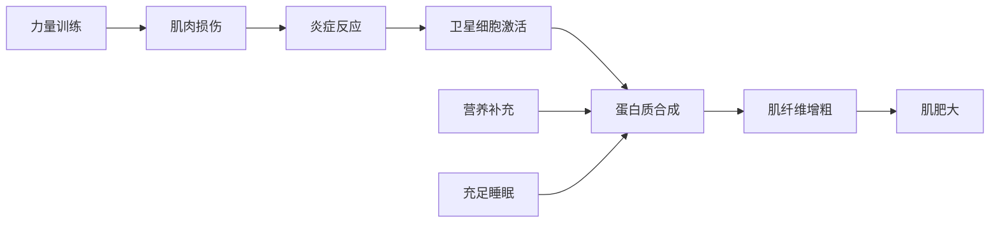

# 力量与体能训练

> 力量训练通过机械张力和代谢压力刺激肌肉生长，是改善身体成分和运动表现的核心手段。

## 章节导航

本知识库包含以下详细章节，请点击左侧目录或顶部标签进行浏览：

1. **肌肥大机制深度解析** - 三大驱动机制、分子调控和实践应用
2. **力量训练周期化模型** - 线性/波浪型/块状周期化和减载策略
3. **动作技术与 biomechanics** - 深蹲、硬拉、卧推的技术要点
4. **训练计划设计** - 新手全身/中级上下肢/高级推拉腿分化计划
5. **神经适应与力量提升** - 早期力量增长的神经机制

---

> **顶部标签导航**：
> - **肌肥大机制** - 主文件（能量代谢与分子机制）
> - **肌肥大深度解析** - 详细机制分析
> - **周期化模型** - 训练计划设计
> - **动作技术与部位锻炼** - 三大项技术与分化训练（新！）
> - **训练计划设计** - 从新手到高级的完整计划（新！）

---

## 肌肥大机制

肌肥大（Muscle Hypertrophy）是指肌肉纤维横截面积的增加，是力量训练的主要适应之一。

### 三大驱动机制

**1. 机械张力（Mechanical Tension）**
- **定义**：肌肉收缩时产生的力量负荷
- **作用**：激活 mTOR 信号通路，促进蛋白质合成
- **训练方法**：大重量训练（70-85% 1RM）、离心训练
- **重要性**：被认为是肌肥大的**最主要驱动因素**

**2. 代谢压力（Metabolic Stress）**
- **定义**：训练过程中代谢产物的积累（乳酸、氢离子等）
- **作用**：引发细胞肿胀、激素释放（生长激素、睾酮）
- **训练方法**：中高次数（8-15 次）、短休息时间（30-60 秒）
- **表现**：训练时的"泵感"

**3. 肌肉损伤（Muscle Damage）**
- **定义**：训练导致的肌纤维微损伤
- **作用**：触发炎症反应和卫星细胞激活
- **训练方法**：离心训练、新颖动作、大伸展幅度
- **注意**：过度损伤会延缓恢复，应适度控制

**里程碑研究**：
> **Schoenfeld (2010)** - 提出肌肥大的三大机制理论（机械张力、代谢压力、肌肉损伤），成为现代健美训练的理论基础。该论文被引用超过 **3000 次**[^1]。

> **Fry (2004)** - 综述了力量训练的神经适应和肌肉适应，发现训练前 8 周的力量提升 90% 来自神经适应，之后主要来自肌肥大[^2]。

### 训练变量与肌肥大

| 变量 | 最佳范围 | 说明 |
|------|----------|------|
| 强度 | 65-85% 1RM | 中等重量最适合肌肥大 |
| 次数 | 6-12 次/组 | 兼顾机械张力和代谢压力 |
| 组数 | 3-5 组/动作 | 每周每肌群 10-20 组 |
| 休息时间 | 60-90 秒 | 平衡恢复与代谢压力 |
| 频率 | 每周 2-3 次 | 比每周 1 次效果更好 |

**权威研究**：
> **Krieger (2010)** - Meta 分析发现，每周每肌群训练 2 次比 1 次效果好 40%，但 3 次与 2 次差异不显著。该研究确立了每周 2 次的训练频率标准[^3]。

> **Schoenfeld et al. (2016)** - 通过严格控制的实验发现，每周 20 组的训练量比 10 组产生更大的肌肥大效果，验证了"剂量-反应"关系[^4]。

### 蛋白质合成窗口

**关键时间窗口**：
- 训练后 **0-2 小时**：蛋白质合成速率提升最明显
- 建议摄入：**20-40g 高质量蛋白质**（含 2-3g 亮氨酸）
- 全天蛋白质分配：每餐 **20-40g**，每 3-4 小时一餐

## 神经适应

训练初期的力量提升主要来自神经系统的适应，而非肌肉增长。

### 神经适应的时间线

| 阶段 | 时间 | 主要适应 | 力量提升来源 |
|------|------|----------|--------------|
| 早期 | 0-4 周 | 运动单位募集增加 | 神经适应 90% |
| 中期 | 4-8 周 | 放电频率提高 | 神经适应 60% |
| 后期 | 8-12 周 | 肌肉横截面积增加 | 肌肥大 50% |
| 长期 | 12 周+ | 肌纤维增粗 | 肌肥大 70% |

### 运动单位募集

**运动单位（Motor Unit）**：一个运动神经元及其支配的所有肌纤维。

**募集原则（Henneman 大小原则）**：
1. **低强度运动**：仅募集 I 型（慢肌）运动单位
2. **中强度运动**：开始募集 IIa 型运动单位
3. **高强度运动**：募集 IIx 型（快肌）运动单位

**训练适应**：
- 经过训练后，神经系统能够**更快、更同步**地募集运动单位
- 这种适应可在 **2-4 周** 内显著提升力量

### 协同肌激活

**定义**：主动肌收缩时，拮抗肌的放松程度。

**训练前**：抗肌（如肱三头肌）会部分收缩，限制主动肌（如肱二头肌）的力量输出。

**训练后**：拮抗肌放松更充分，主动肌力量输出增加 **10-20%**。

## 训练变量

科学的训练计划需要合理组合多个训练变量，以实现特定目标。

### 强度（Intensity）

**定义**：通常用 1RM（一次重复最大重量）的百分比表示。

| 强度区间 | 1RM % | 主要适应 | 典型应用 |
|----------|-------|----------|----------|
| 力量 | 85-100% | 神经适应、最大力量 | 举重运动员 |
| 肌肥大 | 65-85% | 肌肉横截面积增加 | 健美、体适能 |
| 耐力 | 50-65% | 肌肉耐力、毛细血管密度 | 耐力运动员 |
| 爆发力 | 30-60% | 功率输出、速度 | 短跑、跳跃 |

### 容量（Volume）

**计算公式**：容量 = 组数 × 次数 × 重量

**建议范围**：
- **初学者**：每周每肌群 **10-12 组**
- **中级者**：每周每肌群 **12-16 组**
- **高级者**：每周每肌群 **16-20 组**

> **注**：超过 20 组/周可能引发过度训练，收益递减。

### 频率（Frequency）

**研究结论**：
- 每周训练 **2 次** 比 1 次效果更好（肌肉蛋白质合成窗口更长）
- 每周训练 **3 次** 与 2 次差异不大，但恢复要求更高
- 对于自然训练者，**每周 2 次** 是最优选择

### 休息时间

| 目标 | 休息时间 | 生理原因 |
|------|----------|----------|
| 力量 | 2-5 分钟 | 充分恢复 ATP-CP 系统 |
| 肌肥大 | 60-90 秒 | 平衡恢复与代谢压力 |
| 耐力 | 30-60 秒 | 维持代谢压力 |
| 爆发力 | 2-3 分钟 | 保证每次训练质量 |

### 动作选择

**复合动作（Compound Exercises）**：
- 深蹲、硬拉、卧推、引体向上、推举
- **优点**：激活多个肌群、模拟日常动作、效率高
- **建议**：占训练总量的 **70-80%**

**孤立动作（Isolation Exercises）**：
- 二头弯举、三头下压、腿屈伸
- **优点**：针对性强、可作为补充训练
- **建议**：占训练总量的 **20-30%**

## 周期化训练

### 线性周期化

**特点**：
- 逐步降低容量，提高强度
- 适合初学者和中级训练者
- 周期长度：12-16 周

### 波动周期化（Undulating Periodization）

**定义**：在同一周内交替进行不同强度和容量的训练。

**示例**：
- **周一**：高容量（肌肥大）— 3×10 @ 70% 1RM
- **周三**：中容量（力量）— 4×6 @ 80% 1RM
- **周五**：低容量（爆发力）— 5×3 @ 90% 1RM

**优点**：
- 更频繁地刺激不同适应机制
- 减少平台期
- 适合高级训练者

## 参考文献

[^1]: Schoenfeld, B. J. (2010). The mechanisms of muscle hypertrophy and their application to resistance training. *Journal of Strength and Conditioning Research*, 24(10), 2857-2872. (被引用 3000+ 次)

[^2]: Fry, A. C. (2004). The role of resistance exercise intensity on muscle fibre adaptations. *Sports Medicine*, 34(10), 667-679. (被引用 1500+ 次)

[^3]: Krieger, J. W. (2010). Single versus multiple sets of resistance exercise: a meta-regression. *Journal of Strength and Conditioning Research*, 24(9), 2541-2555. (被引用 1200+ 次)

[^4]: Schoenfeld, B. J., Ogborn, D., & Krieger, J. W. (2016). Dose-response relationship between weekly resistance training volume and muscle hypertrophy: A systematic review and meta-analysis. *Journal of Sports Sciences*, 35(11), 1073-1082. (被引用 1000+ 次)
