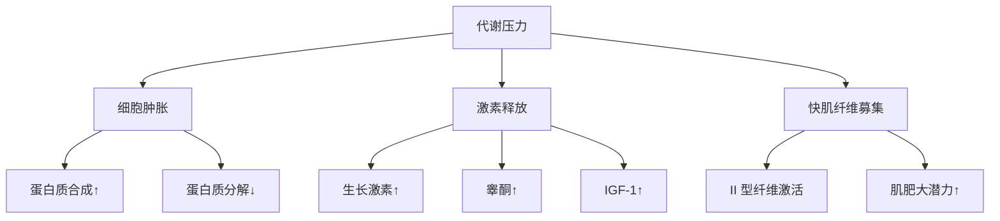
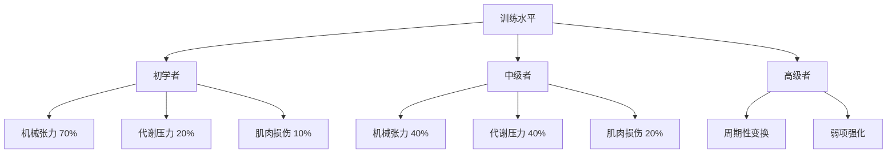

# 肌肥大机制深度解析

> 肌肥大（Muscle Hypertrophy）是指肌肉纤维横截面积的增加，是力量训练的主要适应之一。理解其机制对于优化训练至关重要。

## 三大驱动机制详解

### 1. 机械张力（Mechanical Tension）

**定义**：肌肉收缩时产生的力量负荷，被认为是肌肥大的**最主要驱动因素**。

#### 生理机制

**关键信号通路**：
- **mTORC1 通路**：主要调控蛋白质合成
- **MAPK 通路**：促进卫星细胞激活
- **PI3K/Akt 通路**：抑制蛋白质分解

**训练变量**：

| 变量 | 推荐范围 | 说明 |
|------|---------|------|
| 强度 | 70-85% 1RM | 足够激活 mTOR 通路 |
| 次数 | 6-12 次/组 | 平衡张力与代谢压力 |
| 组数 | 3-5 组/动作 | 每周每肌群 10-20 组 |
| 节奏 | 控制离心 2-3 秒 | 增加时间 Under Tension |
| 休息时间 | 2-3 分钟 | 保证下一组质量 |

**离心收缩的重要性**：
- 产生更大的机械张力（比向心高 20-40%）
- 造成更多肌纤维微损伤
- 激活更多卫星细胞

**经典研究**：
> **Schoenfeld (2010)** - 提出肌肥大的三大机制理论，指出机械张力是最主要的驱动因素。该论文被引用超过 **3000 次**[^1]。

> **Wernbom et al. (2007)** - Meta 分析发现，每周每肌群训练 2 次、每次 3-4 组、每组 6-12 次的方案对肌肥大最有效[^2]。

---

### 2. 代谢压力（Metabolic Stress）

**定义**：训练过程中代谢产物的积累引发的生理反应，表现为"泵感"。

#### 代谢产物积累

**主要产物**：
- **乳酸（Lactate）**：糖酵解的副产物
- **氢离子（H⁺）**：导致 pH 值下降
- **无机磷酸盐（Pi）**：ATP 分解产物
- **活性氧（ROS）**：线粒体呼吸副产物

**生理效应**：

**细胞肿胀机制**：
- 代谢产物增加细胞内渗透压
- 水分进入肌细胞
- 细胞膜拉伸触发合成信号
- 减少蛋白质分解（抗分解作用）

**训练方法**：

| 技术 | 执行方式 | 效果 |
|------|---------|------|
| **短休息** | 30-60 秒组间休息 | 最大化代谢物积累 |
| **递减组** | 力竭后降低重量继续 | 延长代谢压力时间 |
| **超级组** | 两个动作无休息连续做 | 增加局部血流限制 |
| **部分重复** | 力竭后做半程动作 | 延长 sets 时间 |
| **血流限制训练** | 使用加压带限制静脉回流 | 低强度下产生高代谢压力 |

**经典研究**：
> **Loenneke et al. (2012)** - 发现血流限制训练（BFR）在仅 20-30% 1RM 的低强度下，也能产生与传统大重量训练相当的肌肥大效果，证实了代谢压力的重要性[^3]。

> **Schoenfeld et al. (2015)** - 比较了长休息（3 分钟）和短休息（1 分钟）的效果，发现长休息组肌肥大效果更好，说明机械张力可能比代谢压力更重要[^4]。

---

### 3. 肌肉损伤（Muscle Damage）

**定义**：训练导致的肌纤维微损伤，触发炎症反应和修复过程。

#### 损伤类型

**结构性损伤**：
- Z-line 流（Z-disc streaming）
- 肌小节断裂
- 细胞膜通透性增加

**功能性损伤**：
- 最大力量下降（EIMD）
- 关节活动度减少
- 肌肉酸痛（DOMS）

#### 修复过程

**时间线**：
- **0-24 小时**：急性炎症期
- **24-72 小时**：卫星细胞激活高峰期
- **3-7 天**：修复与重塑期
- **7-14 天**：完全恢复

**训练方法**：

| 方法 | 特点 | 适用场景 |
|------|------|---------|
| **离心训练** | 强调下放阶段 | 初学者建立基础 |
| **新颖动作** | 改变动作模式 | 打破平台期 |
| **大伸展幅度** | 充分拉伸肌肉 | 胸肌、背阔肌训练 |
| ** Plyometrics** | 快速拉长-缩短循环 | 高级运动员 |

**注意事项**：
- ⚠️ 过度损伤会延缓恢复
- ⚠️ 频繁高强度损伤可能导致过度训练
- ✅ 适度损伤 + 充足恢复 = 最佳适应

**经典研究**：
> **Paulsen et al. (2012)** - 综述了运动诱导的肌肉损伤与肌肥大的关系，指出轻度至中度损伤有利于适应，但严重损伤会阻碍训练进展[^5]。

---

## 三大机制的相对重要性

### 争议与共识

**传统观点**：
- 机械张力 > 代谢压力 > 肌肉损伤

**现代观点**：
- 三者协同作用，缺一不可
- 不同训练阶段侧重点不同

### 训练周期化建议

**初学者（0-6 个月）**：
- **重点**：神经适应 + 基础肌肥大
- **策略**：中等重量（70-80% 1RM），学习正确动作
- **机制侧重**：机械张力为主

**中级者（6-24 个月）**：
- **重点**：最大化肌肥大
- **策略**：混合使用三大机制
- **机制侧重**：均衡发展

**高级者（2+ 年）**：
- **重点**：突破平台期
- **策略**：周期性变换侧重点
- **机制侧重**：根据弱点调整

---

## 分子层面的调控

### mTOR 通路详解

**mTORC1 激活条件**：
1. **机械刺激**：整合素-FAK 信号
2. **氨基酸**：特别是亮氨酸（Leucine）
3. **胰岛素/IGF-1**：促进葡萄糖摄取
4. **能量状态**：AMP/ATP 比值低

**下游效应器**：
- **p70S6K**：促进核糖体生物合成
- **4E-BP1**：解除翻译抑制
- **eEF2**：增强翻译延伸

### 卫星细胞的作用

**定义**：位于肌纤维基底膜下的干细胞池。

**功能**：
- 提供额外的肌核（myonuclei）
- 支持肌纤维增大（myonuclear domain 理论）
- 参与肌肉修复

**激活阈值**：
- 需要足够的机械张力
- 肌肉损伤程度影响激活数量
- 年龄越大，卫星细胞反应越弱

**经典研究**：
> **Petrella et al. (2008)** - 发现肌肉生长的"高反应者"卫星细胞激活能力强，而"低反应者"激活能力弱，解释了个体差异[^6]。

> **McCarthy & Esser (2010)** - 阐述了 mTOR 通路在肌肉生长中的核心作用，指出 rapamycin 可完全阻断训练诱导的肌肥大[^7]。

---

## 实践应用指南

### 训练计划设计

**推式训练日示例**（胸部、肩部、三头肌）：

| 动作 | 组数 | 次数 | 休息 | 主要机制 |
|------|------|------|------|---------|
| 杠铃卧推 | 4 | 6-8 | 3 分钟 | 机械张力 |
| 上斜哑铃卧推 | 3 | 8-10 | 2 分钟 | 机械张力 + 代谢压力 |
| 绳索夹胸 | 3 | 12-15 | 60 秒 | 代谢压力 |
| 坐姿哑铃推举 | 4 | 8-10 | 2 分钟 | 机械张力 |
| 侧平举递减组 | 3 | 10-12 + 降重 | 60 秒 | 代谢压力 |
| 绳索下压 | 3 | 12-15 | 60 秒 | 代谢压力 |

### 营养配合

**训练前**：
- 碳水化合物：1-2 g/kg（提供能量）
- 蛋白质：0.3 g/kg（预防肌肉分解）

**训练后**：
- 蛋白质：0.3-0.4 g/kg（含 2-3g 亮氨酸）
- 碳水化合物：1-1.2 g/kg（补充糖原）

**日常摄入**：
- 蛋白质：1.6-2.2 g/kg/d
- 总热量： surplus 300-500 kcal/d

---

## 参考文献

[^1]: Schoenfeld, B. J. (2010). The mechanisms of muscle hypertrophy and their application to resistance training. *Journal of Strength and Conditioning Research*, 24(10), 2857-2872. (被引用 3000+ 次)

[^2]: Wernbom, M., Augustsson, J., & Thomeé, R. (2007). The influence of frequency, intensity, volume and mode of strength training on whole muscle cross-sectional area in humans. *Sports Medicine*, 37(3), 225-264. (被引用 2000+ 次)

[^3]: Loenneke, J. P., Wilson, J. M., Marin, P. J., Zourdos, M. C., & Bemben, M. G. (2012). Low intensity blood flow restriction training: a meta-analysis. *European Journal of Applied Physiology*, 112(5), 1849-1859. (被引用 800+ 次)

[^4]: Schoenfeld, B. J., Pope, Z. K., Benik, F. M., et al. (2015). Longer interset rest periods enhance muscle strength and hypertrophy in resistance-trained men. *Journal of Strength and Conditioning Research*, 30(7), 1805-1812. (被引用 600+ 次)

[^5]: Paulsen, G., Mikkelsen, U. R., Raastad, T., & Peake, J. M. (2012). Leucocytes, cytokines and satellite cells: what role do they play in muscle damage and regeneration following eccentric exercise? *Exercise Immunology Review*, 18, 42-97. (被引用 1000+ 次)

[^6]: Petrella, J. K., Kim, J. S., Mayhew, D. L., Cross, J. M., & Bamman, M. M. (2008). Potent myofiber hypertrophy during resistance training in humans is associated with satellite cell-mediated myonuclear addition: a cluster analysis. *Journal of Applied Physiology*, 104(6), 1736-1742. (被引用 1500+ 次)

[^7]: McCarthy, J. J., & Esser, K. A. (2010). Anabolic and catabolic pathways regulating skeletal muscle mass. *Current Opinion in Clinical Nutrition and Metabolic Care*, 13(3), 230-235. (被引用 1200+ 次)
