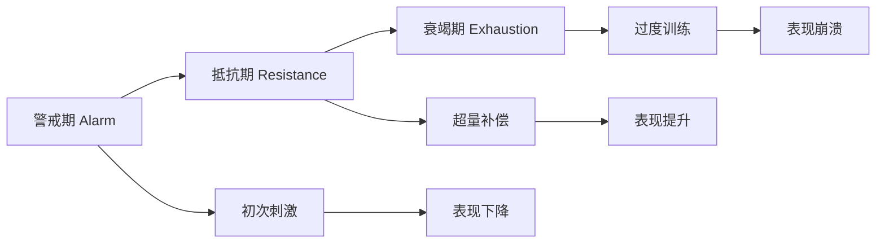
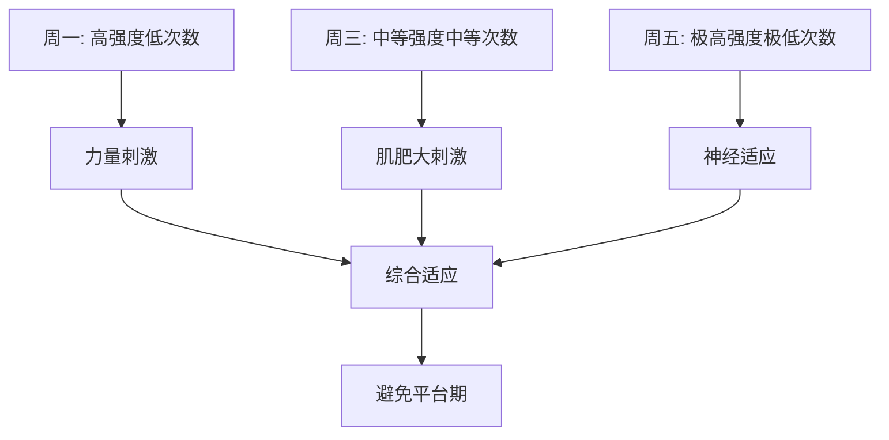
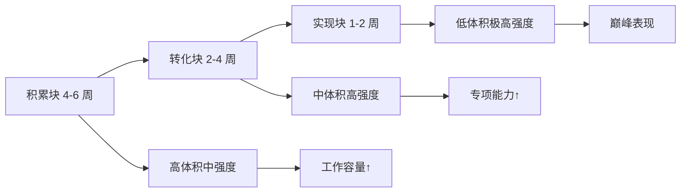

# 力量训练周期化模型

> 周期化（Periodization）是系统性地规划训练变量，以最大化长期适应并避免平台期的科学方法。

## 周期化理论基础

### 为什么需要周期化？

**问题**：
- 持续相同训练 → 适应停滞（平台期）
- 过度训练风险增加
- 心理疲劳与动机下降

**解决方案**：
- 系统性改变训练变量
- 平衡刺激与恢复
- 在目标时间点达到巅峰状态

### GAS 理论（General Adaptation Syndrome）

**提出者**：Hans Selye (1936)

**三阶段模型**：

**应用**：
- **警戒期**：新刺激导致暂时性表现下降
- **抵抗期**：身体适应，表现超越基线（超量补偿）
- **衰竭期**：刺激过强或恢复不足，导致过度训练

**关键**：在抵抗期结束时引入新刺激，避免进入衰竭期。

---

## 周期化模型分类

### 1. 线性周期化（Linear Periodization）

**特点**：
- 强度逐渐增加，体积逐渐减少
- 适合初学者和力量举运动员
- 周期通常为 12-16 周

**典型结构**：

| 阶段 | 持续时间 | 强度 (%1RM) | 次数/组 | 组数 | 目的 |
|------|---------|------------|--------|------|------|
| 肌肥大期 | 4 周 | 65-75% | 8-12 | 4-5 | 增加肌肉量 |
| 力量期 | 4 周 | 75-85% | 5-8 | 3-4 | 提升神经适应 |
| 巅峰期 | 2-3 周 | 85-95% | 2-5 | 3 | 最大化力量 |
| 减载期 | 1 周 | 50-60% | 8-10 | 2 | 主动恢复 |

**优点**：
- ✅ 简单易执行
- ✅ 适合新手快速进步
- ✅ 可预测性强

**缺点**：
- ❌ 高级运动员适应性差
- ❌ 单一能力发展，忽视其他素质
- ❌ 长期效果递减

**经典研究**：
> **Rhea et al. (2002)** - Meta 分析发现，线性周期化对未经训练者有效，但对有训练经验者效果有限[^1]。

---

### 2. 波浪型周期化（Undulating Periodization）

#### 每日波浪型（DUP - Daily Undulating Periodization）

**特点**：
- 每次训练改变强度和体积
- 一周内涵盖多种刺激
- 适合中高级运动员

**示例（每周 3 次训练）**：

| 训练日 | 强度 | 次数 | 重点 |
|--------|------|------|------|
| 周一 | 85% 1RM | 3-5 次 | 力量 |
| 周三 | 75% 1RM | 8-10 次 | 肌肥大 |
| 周五 | 95% 1RM | 1-3 次 | 神经适应 |

#### 每周波浪型（WUP - Weekly Undulating Periodization）

**特点**：
- 每周改变训练重点
- 比 DUP 变化频率低
- 适合时间有限的训练者

**示例（4 周循环）**：

| 周次 | 重点 | 强度范围 | 体积 |
|------|------|---------|------|
| 第 1 周 | 肌肥大 | 70-75% | 高 |
| 第 2 周 | 力量 | 80-85% | 中 |
| 第 3 周 | 巅峰力量 | 90-95% | 低 |
| 第 4 周 | 减载 | 50-60% | 很低 |

**优点**：
- ✅ 同时发展多种能力
- ✅ 减少单调性
- ✅ 更适合高级运动员

**缺点**：
- ❌ 计划复杂度高
- ❌ 需要更多监控
- ❌ 不适合完全新手

**经典研究**：
> **Prestes et al. (2009)** - 比较了线性周期化和波浪型周期化，发现波浪型对力量提升效果更好（+14.8% vs +8.3%）[^2]。

> **Peterson et al. (2008)** - Meta 分析指出，非线性周期化对有训练经验者更有效[^3]。

---

### 3. 块状周期化（Block Periodization）

**提出者**：Vladimir Issurin (2008)

**特点**：
- 将训练分为三个专注的"块"
- 每个块集中发展特定能力
- 适合精英运动员

**三个块**：

**1. 积累块（Accumulation Block）** - 4-6 周
- **重点**：一般体能、技术基础
- **强度**：中等（60-75%）
- **体积**：高
- **目标**：建立工作容量

**2. 转化块（Transmutation Block）** - 2-4 周
- **重点**：专项能力转化
- **强度**：中高（75-85%）
- **体积**：中等
- **目标**：将基础能力转化为专项表现

**3. 实现块（Realization Block）** - 1-2 周
- **重点**：巅峰表现
- **强度**：极高（90-100%）
- **体积**：很低
- **目标**：比赛或测试日达到最佳状态

**优点**：
- ✅ 高度专业化
- ✅ 适合精英运动员
- ✅ 可在目标日期精准巅峰

**缺点**：
- ❌ 需要长时间规划
- ❌ 不适合业余爱好者
- ❌ 错误执行风险高

**经典研究**：
> **Issurin (2010)** - 系统阐述了块状周期化的理论基础，指出传统周期化无法同时优化多种能力，而块状周期化通过集中刺激解决此问题[^4]。

---

## 减载策略（Deload）

### 为什么需要减载？

**生理原因**：
- 累积疲劳影响表现
- 神经系统需要恢复
- 预防过度训练

**心理原因**：
- 缓解训练倦怠
- 重新激发动机
- 提高训练满意度

### 减载方法

**方法 1：降低体积**
- 组数减少 40-60%
- 保持强度不变
- 适合力量导向训练者

**方法 2：降低强度**
- 重量减少 20-30%
- 保持组数不变
- 适合技术改进期

**方法 3：完全休息**
- 停止训练 5-7 天
- 仅进行轻度活动
- 适合严重疲劳或伤病恢复

**方法 4：主动恢复**
- 改为低强度有氧
- 瑜伽、游泳、骑行
- 促进血液循环

### 减载频率

| 训练水平 | 建议频率 | 持续时间 |
|---------|---------|---------|
| 初学者 | 每 6-8 周 | 1 周 |
| 中级者 | 每 4-6 周 | 1 周 |
| 高级者 | 每 3-4 周 | 5-7 天 |
| 精英运动员 | 根据比赛日程 | 个性化 |

---

## 实践应用：12 周力量计划

### 目标：提升深蹲 1RM

**阶段 1：积累期（第 1-4 周）**

| 周次 | 强度 | 组数×次数 | 辅助动作 |
|------|------|----------|---------|
| 1 | 70% | 4×8 | 腿举、腿弯举 |
| 2 | 72% | 4×8 | 腿举、腿弯举 |
| 3 | 75% | 5×6 | 前蹲、臀桥 |
| 4 | 60% | 3×10 | 减载周 |

**阶段 2：强化期（第 5-8 周）**

| 周次 | 强度 | 组数×次数 | 辅助动作 |
|------|------|----------|---------|
| 5 | 80% | 5×5 | 罗马尼亚硬拉 |
| 6 | 82% | 5×5 | 罗马尼亚硬拉 |
| 7 | 85% | 6×3 | 箱式深蹲 |
| 8 | 65% | 3×8 | 减载周 |

**阶段 3：巅峰期（第 9-12 周）**

| 周次 | 强度 | 组数×次数 | 辅助动作 |
|------|------|----------|---------|
| 9 | 90% | 4×2 | 轻辅助 |
| 10 | 92% | 3×2 | 轻辅助 |
| 11 | 95% | 2×1 | 极少辅助 |
| 12 | 测试 1RM | - | 完全恢复 |

**预期进展**：
- 初始 1RM：100 kg
- 第 12 周预计：115-120 kg（+15-20%）

---

## 监控与调整

### 客观指标

**训练日志**：
- 记录每次训练的负荷、次数、组数
- 追踪渐进超负荷
- 识别平台期

**表现测试**：
- 每月测试关键动作 3-5RM
- 估算 1RM 变化
- 避免频繁测试最大重量

**身体指标**：
- 体重变化
- 围度测量（臂围、胸围、腿围）
- 体脂率（可选）

### 主观指标

**RPE（Rating of Perceived Exertion）**：
- 1-10 分制评估训练难度
- RPE 8-9 = 最佳训练强度
- RPE >9.5 = 可能过度训练

**睡眠质量**：
- 使用手环监测睡眠时长和质量
- 目标：7-9 小时高质量睡眠

**肌肉酸痛**：
- 轻微酸痛正常（DOMS）
- 持续剧烈疼痛需调整

**动机水平**：
- 训练热情下降是预警信号
- 考虑心理减载

### 调整策略

**情况 1：进展顺利**
- 按计划继续
- 可适当增加负荷

**情况 2：平台期（2-3 周无进展）**
- 检查恢复（睡眠、营养、压力）
- 考虑提前减载
- 变换训练动作

**情况 3：表现下降**
- 立即减载
- 评估是否过度训练
- 可能需要 1-2 周完全休息

---

## 参考文献

[^1]: Rhea, M. R., Alvar, B. A., Ball, S. D., & Burkett, L. N. (2002). Three sets of weight training superior to one set with equal intensity for eliciting strength. *Journal of Strength and Conditioning Research*, 16(4), 525-529.

[^2]: Prestes, J., Frollini, J., de Lima, C., et al. (2009). Comparison between linear and daily undulating periodized resistance training to increase strength. *Journal of Strength and Conditioning Research*, 23(9), 2437-2442. (被引用 800+ 次)

[^3]: Peterson, M. D., Rhea, M. R., & Alvar, B. A. (2008). Applications of the dose-response for muscular strength development: a review of meta-analytic efficacy and reliability for designing training prescription. *Journal of Strength and Conditioning Research*, 22(6), 1689-1697. (被引用 1000+ 次)

[^4]: Issurin, V. B. (2010). New horizons for the methodology and physiology of training periodization. *Sports Medicine*, 40(3), 189-206. (被引用 1500+ 次)
