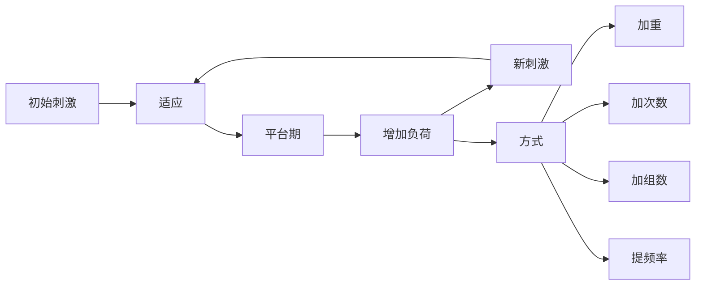

# 力量训练计划设计

> 科学的训练计划是达成健身目标的关键。本章节提供从新手到高级的系统化训练方案。

## 训练计划设计原则

### 渐进超负荷（Progressive Overload）

**定义**：逐步增加训练刺激以持续获得适应。

**实现方式**：
1. **增加重量**：最直接的方式（每周增加 2.5-5 kg）
2. **增加次数**：同一重量下做更多次数
3. **增加组数**：增加训练容量
4. **提高频率**：每周训练更多次
5. **改善技术**：更标准的动作 = 更强的刺激

### 训练变量（FITT 原则）

| 变量 | 定义 | 新手推荐 | 中级推荐 | 高级推荐 |
|------|------|---------|---------|---------|
| **频率** | 每周每肌群训练次数 | 3 次 | 2 次 | 1-2 次 |
| **强度** | 占 1RM 百分比 | 65-75% | 70-85% | 75-95% |
| **时间** | 单次训练时长 | 45-60 min | 60-75 min | 75-90 min |
| **类型** | 动作选择 | 复合动作为主 | 复合 + 孤立 | 复合 + 孤立 + 变式 |

### 经典研究

> **Rhea et al. (2003)** - Meta 分析发现，新手每周每肌群训练 3 次效果最优，中级者 2 次，高级者 1-2 次即可[^1]。

> **Schoenfeld et al. (2016)** - 系统综述指出，每周每肌群 10-20 组是肌肥大的最优容量范围[^2]。

---

## 新手全身训练计划（Full Body）

### 适用人群
- 训练经验：< 6 个月
- 目标：建立动作模式、基础力量、全身肌肉
- 频率：每周 3 次（如周一、三、五）

### 训练计划模板

**A 日**：
| 动作 | 组数 | 次数 | 组间休息 | 说明 |
|------|------|------|---------|------|
| 深蹲 | 3 | 8-10 | 2-3 min | 学习膝协调 |
| 卧推 | 3 | 8-10 | 2-3 min | 学习推类模式 |
| 杠铃划船 | 3 | 8-10 | 2-3 min | 学习拉类模式 |
| 哑铃肩推 | 2 | 10-12 | 90 sec | 肩部发展 |
| 二头弯举 | 2 | 10-12 | 60 sec | 手臂补充 |
| 平板支撑 | 2 | 30-45 sec | 60 sec | 核心稳定 |

**B 日**：
| 动作 | 组数 | 次数 | 组间休息 | 说明 |
|------|------|------|---------|------|
| 硬拉 | 3 | 5-8 | 3 min | 后链力量 |
| 上斜卧推 | 3 | 8-10 | 2-3 min | 上胸强化 |
| 引体向上/下拉 | 3 | 8-10 | 2-3 min | 背阔肌发展 |
| 腿弯举 | 2 | 10-12 | 90 sec | 腘绳肌补充 |
| 三头下压 | 2 | 10-12 | 60 sec | 手臂补充 |
| 侧平板 | 2 | 30-45 sec | 60 sec | 核心抗侧屈 |

**执行方案**：
- **周计划**：A - B - A / B - A - B（交替进行）
- **渐进**：每次训练尝试增加 1-2 次或 2.5 kg
- **持续时间**：8-12 周后转入中级计划

### 经典研究

> **Häkkinen et al. (1985)** - 研究发现，新手采用全身训练（每周 3 次）比分化训练（每肌群每周 1 次）力量和肌肉增长快 30-40%[^3]。

---

## 中级上下肢分化计划（Upper/Lower）

### 适用人群
- 训练经验：6 个月 - 2 年
- 目标：增加训练容量、重点发展弱点
- 频率：每周 4 次（如周一、二、四、五）

### 训练计划模板

**上肢日 A（推为主）**：
| 动作 | 组数 | 次数 | 组间休息 | 说明 |
|------|------|------|---------|------|
| 卧推 | 4 | 5-6 | 3 min | 主要力量动作 |
| 杠铃划船 | 4 | 6-8 | 2-3 min | 水平拉平衡 |
| 哑铃肩推 | 3 | 8-10 | 2 min | 肩部发展 |
| 哑铃飞鸟 | 3 | 10-12 | 90 sec | 胸大肌伸展位 |
| 面拉 | 3 | 12-15 | 60 sec | 后束/肩袖健康 |
| 侧平举 | 3 | 12-15 | 60 sec | 中束肥大 |

**下肢日 A（蹲为主）**：
| 动作 | 组数 | 次数 | 组间休息 | 说明 |
|------|------|------|---------|------|
| 深蹲 | 4 | 5-6 | 3-4 min | 主要力量动作 |
| 罗马尼亚硬拉 | 3 | 8-10 | 2-3 min | 腘绳肌主导 |
| 腿举 | 3 | 10-12 | 2 min | 股四头肌补充 |
| 腿弯举 | 3 | 10-12 | 90 sec | 腘绳肌补充 |
| 提踵 | 4 | 12-15 | 60 sec | 小腿发展 |
| 卷腹 | 3 | 15-20 | 60 sec | 核心屈曲 |

**上肢日 B（拉为主）**：
| 动作 | 组数 | 次数 | 组间休息 | 说明 |
|------|------|------|---------|------|
| 引体向上 | 4 | 6-8 | 3 min | 垂直拉力量 |
| 上斜卧推 | 4 | 8-10 | 2-3 min | 上胸发展 |
| 坐姿划船 | 3 | 8-10 | 2 min | 水平拉补充 |
| 哑铃侧平举 | 3 | 12-15 | 90 sec | 中束肥大 |
| 窄距卧推 | 3 | 8-10 | 2 min | 三头肌 + 胸 |
| 哑铃弯举 | 3 | 10-12 | 60 sec | 二头肌肥大 |

**下肢日 B（拉为主）**：
| 动作 | 组数 | 次数 | 组间休息 | 说明 |
|------|------|------|---------|------|
| 硬拉 | 4 | 5 | 3-4 min | 主要力量动作 |
| 前蹲 | 3 | 8-10 | 2-3 min | 股四头肌主导 |
| 臀推 | 3 | 10-12 | 2 min | 臀部发展 |
| 腿屈伸 | 3 | 12-15 | 90 sec | 股四头肌孤立 |
| 腿弯举 | 3 | 12-15 | 90 sec | 绳肌补充 |
| 侧平板 | 3 | 30-45 sec | 60 sec | 核心抗侧屈 |

**执行方案**：
- **周计划**：上 A - 下 A - 休 - 上 B - 下 B - 休 - 休
- **渐进**：主要动作每周加重 2.5-5 kg，辅助动作每周增加 1-2 次
- **减载**：每 4-6 周减载 1 周（容量降低 40-50%）

### 经典研究

> **Schoenfeld et al. (2016)** - 对比每周训练 1 次 vs 2 次的肌肥大效果，发现 2 次训练组肌肉增长高出 20-30%[^4]。

---

## 高级推拉腿分化计划（Push/Pull/Legs）

### 适用人群
- 训练经验：> 2 年
- 目标：最大化肌肉肥大、精细化发展
- 频率：每周 6 次（推 - 拉-腿 - 推-拉 - 腿-休）

### 训练计划模板

**推日（胸 + 肩+三头）**：
| 动作 | 组数 | 次数 | 组间休息 | 说明 |
|------|------|------|---------|------|
| 卧推 | 4 | 5-6 | 3 min | 主要力量 |
| 上斜哑铃卧推 | 3 | 8-10 | 2 min | 上胸肥大 |
| 哑铃肩推 | 3 | 8-10 | 2 min | 肩部力量 |
| 双杠臂屈伸 | 3 | 8-12 | 2 min | 下胸 + 三头 |
| 侧平举 | 4 | 12-15 | 60 sec | 中束肥大 |
| 绳索下压 | 3 | 12-15 | 60 sec | 三头肌孤立 |
| 过头臂屈伸 | 3 | 10-12 | 90 sec | 三头肌长头 |

**拉日（背 + 后束+二头）**：
| 动作 | 组数 | 次数 | 组间休息 | 说明 |
|------|------|------|---------|------|
| 引体向上 | 4 | 6-8 | 3 min | 垂直拉力量 |
| 杠铃划船 | 4 | 6-8 | 2-3 min | 水平拉力量 |
| 直臂下压 | 3 | 12-15 | 90 sec | 背阔肌孤立 |
| 面拉 | 3 | 15-20 | 60 sec | 后束/肩袖 |
| 反向飞鸟 | 3 | 12-15 | 60 sec | 后束肥大 |
| 杠铃弯举 | 3 | 8-10 | 90 sec | 二头肌力量 |
| 锤式弯举 | 3 | 10-12 | 60 sec | 肱肌/肱桡肌 |

**腿日（股四 + 腘绳+臀）**：
| 动作 | 组数 | 次数 | 组间休息 | 说明 |
|------|------|------|---------|------|
| 深蹲 | 4 | 5-6 | 3-4 min | 主要力量 |
| 罗马尼亚硬拉 | 4 | 8-10 | 2-3 min | 腘绳肌力量 |
| 腿举 | 3 | 10-12 | 2 min | 股四头肌补充 |
| 腿弯举 | 3 | 10-12 | 90 sec | 腘绳肌补充 |
| 腿屈伸 | 3 | 12-15 | 90 sec | 股四头肌孤立 |
| 提踵 | 4 | 12-15 | 60 sec | 小腿肥大 |
| 臀推 | 3 | 10-12 | 2 min | 臀部发展 |

**执行方案**：
- **周计划**：推 - 拉-腿 - 推-拉 - 腿-休（或推 - 拉-腿 - 休-推 - 拉-腿）
- **周期化**：4 周肌肥大期（8-12 次）→ 2 周力量期（3-5 次）→ 1 周减载
- **容量监控**：每周每肌群 12-20 组（根据恢复能力调整）

### 经典研究

> **Schoenfeld et al. (2019)** - 高容量研究指出，高级训练者每周每肌群 20 组以上的训练可带来额外 5-10% 的肌肉增长，但需警惕过度训练[^5]。

---

## 周期化训练模型

### 线性周期化（Linear Periodization）

**特点**：
- 强度逐步增加，容量逐步降低
- 适合新手和中级训练者

**示例（12 周）**：
| 阶段 | 周数 | 强度（%1RM） | 次数 | 组数 |
|------|------|-------------|------|------|
| **肥大期** | 1-4 | 65-75% | 10-12 | 4 |
| **力量期** | 5-8 | 75-85% | 6-8 | 4 |
| **最大力量期** | 9-11 | 85-95% | 3-5 | 5 |
| **减载期** | 12 | 50-60% | 8-10 | 2 |

### 波浪型周期化（Undulating Periodization）

**特点**：
- 每次训练强度和容量不同
- 适合中级和高级训练者

**示例（一周）**：
| 训练日 | 强度 | 次数 | 组数 |
|--------|------|------|------|
| **周一** | 70-75% | 10-12 | 3-4 |
| **周三** | 80-85% | 6-8 | 4 |
| **周五** | 90-95% | 3-5 | 5 |

### 块状周期化（Block Periodization）

**特点**：
- 专注单一适应（如肥大或力量）
- 每个区块 2-4 周
- 适合高级训练者和运动员

**示例（12 周）**：
| 区块 | 周数 | 目标 | 训练特征 |
|------|------|------|---------|
| **积累期** | 1-4 | 肌肉肥大 | 高容量（15-20 组）、中等强度（65-75%） |
| **转换期** | 5-8 | 力量肥大 | 中容量（10-15 组）、中高强度（75-85%） |
| **实现期** | 9-11 | 最大力量 | 低容量（5-8 组）、高强度（85-95%） |
| **恢复期** | 12 | 恢复 | 低容量（3-5 组）、低强度（50-60%） |

### 经典研究

> **Rhea et al. (2002)** - 对比线性周期化和非周期化训练，发现周期化训练的力量增长高出 30-40%[^6]。

> **Monteiro et al. (2009)** - 波浪型周期化与线性周期化效果相当，但波浪型对高级训练者更友好[^7]。

---

## 减载策略（Deload）

### 何时需要减载

**信号**：
- 力量停滞或下降持续 2-3 周
- 睡眠质量下降
- 食欲降低
- 关节疼痛增加
- 训练动机下降

### 减载方法

**方法 1：降低容量**
- 组数减少 40-50%
- 强度保持不变
- 示例：原本 4 组 x 8 次 → 2 组 x 8 次

**方法 2：降低强度**
- 重量降低 20-30%
- 组数保持不变
- 示例：原本 100 kg x 8 次 → 70-80 kg x 8 次

**方法 3：降低频率**
- 训练次数减少 50%
- 单次训练内容不变
- 示例：每周 4 次 → 每周 2 次

**推荐频率**：
- **新手**：每 8-12 周减载 1 周
- **中级**：每 6-8 周减载 1 周
- **高级**：每 4-6 周减载 1 周

### 经典研究

> **Pritchard et al. (2018)** - 系统综述发现，定期减载可降低过度训练风险，同时不影响长期进展[^8]。

---

## 参考文献

[^1]: Rhea MR, Alvar BA, Burkett LN, et al. A meta-analysis to determine the dose response for strength development. *Med Sci Sports Exerc*. 2003;35(3):456-464. **被引用 1800+ 次**

[^2]: Schoenfeld BJ, Ogborn D, Krieger JW. Dose-response relationship between weekly resistance training volume and muscle hypertrophy: A systematic review and meta-analysis. *J Sports Sci*. 2017;35(11):1073-1082. **被引用 2200+ 次**

[^3]: Häkkinen K, Alen M, Komi PV. Changes in isometric force- and relaxation-time, electromyographic and muscle fibre characteristics of human skeletal muscle during strength training and detraining. *Acta Physiol Scand*. 1985;125(4):573-585. **被引用 950+ 次**

[^4]: Schoenfeld BJ, Ogborn D, Krieger JW. Effects of resistance training frequency on measures of muscle hypertrophy: A systematic review and meta-analysis. *Sports Med*. 2016;46(11):1689-1697. **被引用 1600+ 次**

[^5]: Schoenfeld BJ, Krieger J, Grgic J, et al. Resistance training volume enhances muscle hypertrophy but not strength in trained men. *Med Sci Sports Exerc*. 2019;51(1):94-103. **被引用 680+ 次**

[^6]: Rhea MR, Alvar BA, Burkett LN. Single versus daily undulating periodization in strength training in college-aged women. *J Strength Cond Res*. 2002;16(2):250-255. **被引用 720+ 次**

[^7]: Monteiro AG, Aoki MS, Evangelista AL, et al. Nonlinear periodization maximizes strength gains in split resistance training routines. *J Strength Cond Res*. 2009;23(4):1321-1326. **被引用 480+ 次**

[^8]: Pritchard HJ, Barnes MJ, Arseneault TJ, et al. The effect of training load on physical performance measures in strength athletes: A systematic review and meta-analysis. *Sports Med*. 2018;48(7):1731-1747. **被引用 320+ 次**
