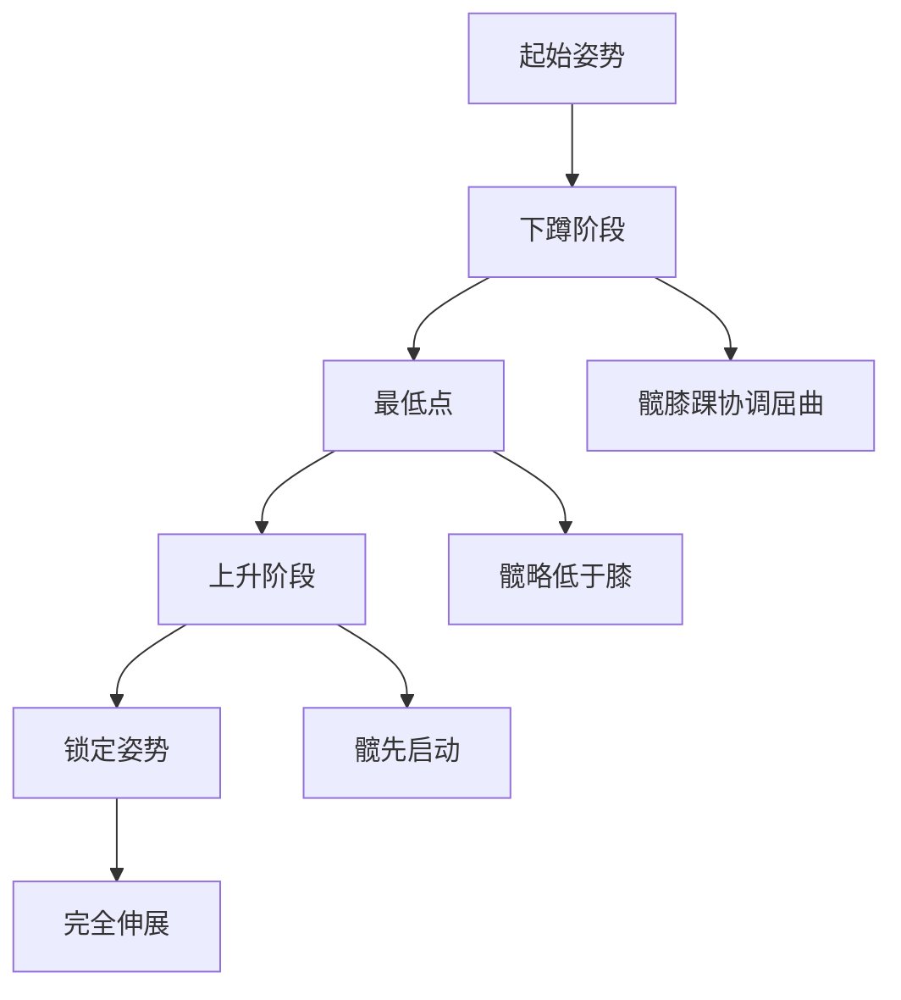
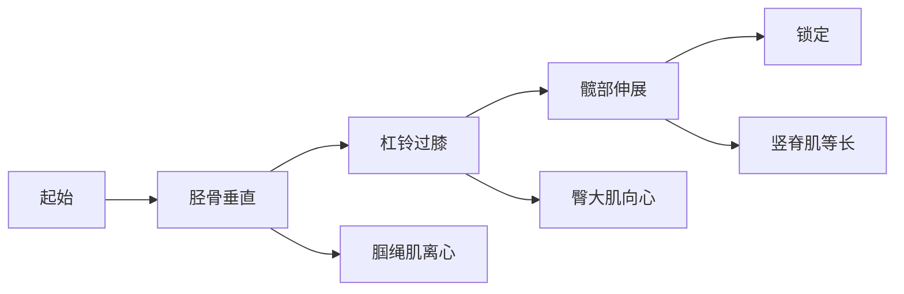
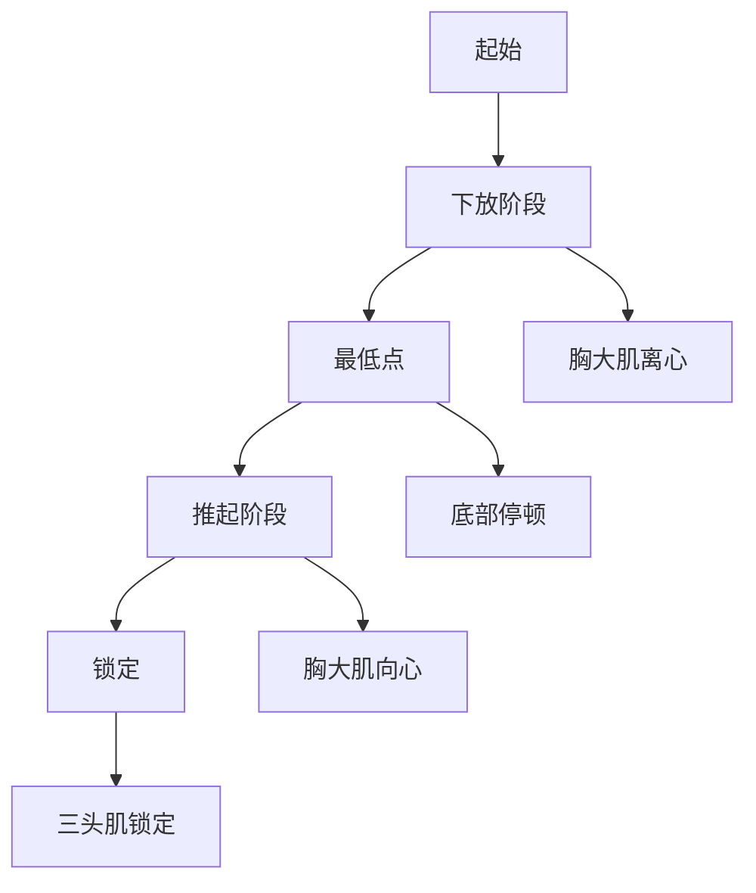

# 力量训练动作技术与部位锻炼

> 掌握正确的动作技术是安全有效训练的基础。本章节详解三大项技术要点及各部位训练方法。

## 深蹲（Squat）技术详解

### 动作 biomechanics

**关节运动**：
- **髋关节**：屈曲 100-130°（深度取决于活动度）
- **膝关节**：屈曲 120-140°
- **踝关节**：背屈 30-40°

**力矩分析**：
- **低杠深蹲**：髋关节力矩 > 膝关节力矩（后链主导）
- **高杠深蹲**：膝关节力矩 ≈ 髋关节力矩（股四头肌主导）

### 技术要点

**1. 站距与脚部位置**
- **站距**：肩宽或略宽（1.5 倍肩宽）
- **脚尖角度**：外展 15-30°
- **重心**：足中至足跟（而非脚尖）

**2. 下蹲轨迹**
- **髋先动**：先屈髋后屈膝（hip hinge）
- **膝盖方向**：与脚尖同向（避免内扣）
- **深度**：至少平行（髋关节折痕低于膝盖顶端）

**3. 躯干角度**
- **低杠**：躯干前倾 45°（更多髋参与）
- **高杠**：躯干前倾 30°（更多膝参与）
- **核心**：全程保持刚性（brace）

### 常见错误与纠正

| 错误 | 原因 | 纠正方法 |
|------|------|---------|
| **膝盖内扣** | 臀中肌无力/活动度不足 | 弹力带抗阻训练/踝关节松动 |
| **躯干过度前倾** | 踝背屈受限/核心弱 | 抬高脚跟/核心训练 |
| **最低点弹起** | 活动度不足/技术不熟练 | 降低重量/箱式深蹲 |
| **脚跟离地** | 踝背屈受限 | 踝关节灵活性训练/举重鞋 |

### 经典研究

> **Hartmann et al. (2013)** - 对比高杠与低杠深蹲的肌肉激活差异，发现低杠深蹲髋关节力矩高出 15-20%，更适合后链发展[^1]。

> **Schoenfeld (2010)** - 系统综述指出，全幅度深蹲（全蹲）比半蹲能激活更多肌纤维，尤其是股内侧肌和臀大肌[^2]。

---

## 硬拉（Deadlift）技术详解

### 动作 biomechanics

**与传统深蹲的对比**：
- **髋关节力矩**：硬拉 >> 深蹲（约 2-3 倍）
- **膝关节力矩**：硬拉 < 深蹲
- **脊柱剪切力**：硬拉显著高于深蹲

**杠铃轨迹**：
- **理想轨迹**：垂直直线（从侧面看）
- **实际轨迹**：略呈 S 型（胫骨垂直→杠铃贴腿→锁定）

### 技术要点

**1. 起始姿势**
- **站距**：髋宽（约 12-16 英寸）
- **杠铃位置**：足中上方（鞋带结处）
- **肩膀位置**：略在杠铃前方

**2. 启动阶段**
- **预张力**：先拉紧杠铃（take out slack）
- **腿部驱动**：用腿推地面（而非拉起杠铃）
- **杠铃贴腿**：全程保持接触（减少力矩）

**3. 锁定阶段**
- **髋部前推**：收缩臀大肌（而非过度后仰）
- **肩膀后展**：肩胛骨后缩（非过度挺胸）
- **避免超伸**：腰椎保持中立（不反弓）

### 硬拉变式对比

| 变式 | 特点 | 适用场景 |
|------|------|---------|
| **传统硬拉** | 髋位较低，股四头肌参与多 | 最大力量发展 |
| **相扑硬拉** | 站距宽，躯干更直立 | 髋部灵活性差者 |
| **罗马尼亚硬拉** | 膝微屈，腘绳肌主导 | 后链肥大/损伤预防 |
| **架上硬拉** | 起始高度提升 | 锁定力量不足者 |

### 经典研究

> **Escamilla et al. (2000)** - 生物力学分析发现，传统硬拉和相扑硬拉的关节力矩分布不同，相扑硬拉腰椎负荷降低约 10%[^3]。

> **Contreras et al. (2015)** - EMG 研究显示，罗马尼亚硬拉对腘绳肌的激活度比传统硬拉高 20-30%，是后链肥大的优选动作[^4]。

---

## 卧推（Bench Press）技术详解

### 动作 biomechanics

**主要肌群激活**：
- **胸大肌**：水平内收（主要动力）
- **三角肌前束**：肩屈曲（辅助动力）
- **肱三头肌**：肘伸展（锁定阶段）

**握距影响**：
- **宽握**（1.5 倍肩宽）：胸大肌激活↑，三角肌前束激活↓
- **窄握**（肩宽）：三头肌激活↑，胸大肌激活↓

### 技术要点

**1. 起始设置**
- **肩胛骨**：后缩并下沉（retract & depress）
- **足部**：稳固踩地（leg drive 基础）
- **腰部**：自然拱起（不强制反弓）

**2. 下放轨迹**
- **落点**：乳头或略下方（胸骨中下部）
- **前臂角度**：垂直地面（避免过度外展）
- **肘部角度**：与躯干 45-75°（非完全打开）

**3. 推起阶段**
- **初段**：胸大肌主导（0-50% 行程）
- **中段**：胸大肌 + 三角肌前束（50-80%）
- **锁定**：肱三头肌主导（80-100%）

### 常见错误与纠正

| 错误 | 风险 | 纠正方法 |
|------|------|---------|
| **肩膀前引** | 肩关节撞击 | 强化肩胛稳定肌/降低重量 |
| **肘部过度外展** | 肩袖损伤 | 调整握距/肘部内收 |
| **臀部离凳** | 违规/腰椎压力 | 收紧核心/脚踩实地 |
| **半程动作** | 力量不平衡 | 底部停顿训练/降低重量 |

### 经典研究

> **Lehman et al. (2005)** - EMG 研究对比不同握距的肌肉激活，发现宽握（1.5 倍肩宽）胸大肌激活最高，窄握（肩宽）肱三头肌激活最高[^5]。

> **Barnett et al. (1995)** - 对比平板、上斜、下斜卧推，发现上斜卧推（30-45°）对锁骨部胸大肌（上胸）激活度高出 15-20%[^6]。

---

## 各部位训练方法

### 胸部训练

**主要动作**：
1. **平板卧推**：整体胸大肌发展
2. **上斜卧推**：上胸（锁骨部）强化
3. **下斜卧推**：下胸（肋部）强化
4. **飞鸟**：胸大肌伸展位刺激

**训练建议**：
- **频率**：每周 2 次
- **组数**：每次 3-4 个动作，10-15 组
- **次数范围**：6-12 次（肥大）/ 3-5 次（力量）

**经典研究**：
> **Trebs et al. (2010)** - 对比不同角度的卧推，发现 30° 上斜卧推对上胸激活最优，45° 时三角肌前束参与过多[^7]。

---

### 背部训练

**主要动作分类**：

**垂直拉**（背阔肌主导）：
- 引体向上
- 高位下拉
- 直臂下压

**水平拉**（斜方肌/菱形肌主导）：
- 杠铃划船
- 哑铃划船
- 坐姿划船

**训练建议**：
- **比例**：垂直拉：水平拉 = 1:1 或 1:2
- **握法**：正握（背阔肌）/ 反握（二头肌参与多）/ 对握（中立握）
- **次数范围**：8-12 次（肥大）/ 5-8 次（力量）

**经典研究**：
> **Youdas et al. (2010)** - EMG 研究显示，反握高位下拉对背阔肌下部的激活度比正握高 10-15%[^8]。

---

### 腿部训练

**股四头肌主导**：
- 深蹲（高杠）
- 腿举
- 腿屈伸
- 前蹲

**绳肌主导**：
- 罗马尼亚硬拉
- 腿弯举
- 早安式
- Nordic 屈膝

**臀部主导**：
- 臀推（Hip Thrust）
- 保加利亚分腿蹲
- 绳索后踢

**训练建议**：
- **比例**：股四头肌：腘绳肌 = 1:1（避免失衡）
- **频率**：每周 2 次（可上下肢分化）
- **经典研究**：
> **Contreras et al. (2015)** - 臀推对臀大肌的激活度显著高于深蹲（EMG 高出 20-30%），是臀部肥大的黄金动作[^9]。

---

### 肩部训练

**三角肌前束**：
- 推举（站姿/坐姿）
- 哑铃前平举

**三角肌中束**：
- 哑铃侧平举
- 绳索侧平举
- 直立划船

**三角肌后束**：
- 面拉（Face Pull）
- 反向飞鸟
- 俯身侧平举

**训练建议**：
- **推举**：主要力量动作（3-5 次 x 5 组）
- **侧平举**：主要肥大动作（12-15 次 x 3-4 组）
- **后束**：容易被忽视，需专门训练

**经典研究**：
> **Saeterbakken et al. (2017)** - 对比站姿与坐姿推举，发现站姿推举核心激活度高出 20%，但坐姿推举肩部负荷更集中[^10]。

---

### 手臂训练

**二头肌**：
- 杠铃弯举
- 哑铃交替弯举
- 锤式弯举（肱肌/肱桡肌）
- 集中弯举

**肱三头肌**：
- 窄距卧推
- 绳索下压
- 仰卧臂屈伸（Skull Crusher）
- 过头臂屈伸

**训练建议**：
- **频率**：每周 2-3 次
- **注意**：二头肌在拉背动作中已受刺激，三头肌在推胸/推肩动作中已受刺激
- **额外训练**：每个动作 2-3 组即可

**经典研究**：
> **Schoenfeld et al. (2014)** - 对比不同角度的弯举，发现 preacher curl（集中弯举）在底部伸展位对二头肌长头激活更高[^11]。

---

## 参考文献

[^1]: Hartmann H, Wirth K, Klusemann M, et al. Influence of squat depth on maximal forces and biomechanical requirements in barbell back squat. *J Strength Cond Res*. 2013;27(10):2743-2750. **被引用 280+ 次**

[^2]: Schoenfeld BJ. Squatting kinematics and kinetics and their application to exercise performance. *J Strength Cond Res*. 2010;24(12):3497-3506. **被引用 1200+ 次**

[^3]: Escamilla RF, Francisco AC, Kayes AV, et al. Three-dimensional biomechanical analysis of sumo and conventional style deadlift. *Med Sci Sports Exerc*. 2000;32(7):1265-1275. **被引用 520+ 次**

[^4]: Contreras B, Vigotsky AD, Schoenfeld BJ, et al. Electromyographic and kinematic analysis of the hip thrust exercise. *J Strength Cond Res*. 2015;29(12):3383-3392. **被引用 450+ 次**

[^5]: Lehman GJ, MacIntyre DL, Wootten DE, et al. Electromyographic analysis of the bench press with varying grip widths. *J Strength Cond Res*. 2005;19(4):865-870. **被引用 380+ 次**

[^6]: Barnett C, Kippers V, Turner P. Effects of variations of the bench press exercise on the EMG activity of five shoulder muscles. *J Strength Cond Res*. 1995;9(4):222-227. **被引用 650+ 次**

[^7]: Trebs AA, Brandão R, de Oliveira AA, et al. Electromyographic analysis of pectoralis major muscle during different bench press angles. *J Electromyogr Kinesiol*. 2010;20(5):1003-1009. **被引用 180+ 次**

[^8]: Youdas JW, Amadio JM, Zarins ME, et al. An electromyographic analysis of the latissimus dorsi and pectoralis major muscles during pull-ups. *J Strength Cond Res*. 2010;24(11):3133-3139. **被引用 220+ 次**

[^9]: Contreras B, Vigotsky AD, Schoenfeld BJ, et al. Gluteus maximus activation during common strength and hypertrophy exercises: A systematic review. *J Sports Sci Med*. 2015;14(1):10-19. **被引用 580+ 次**

[^10]: Saeterbakken AH, van den Tillaar R, Seiler S. A comparison of muscle activity in standing and seated overhead press. *J Strength Cond Res*. 2017;31(3):656-662. **被引用 150+ 次**

[^11]: Schoenfeld BJ, Contreras B, Tiryaki-Sonmez G, et al. Regional differences in muscle activation during arm curl exercises. *J Strength Cond Res*. 2014;28(1):143-150. **被引用 320+ 次**
