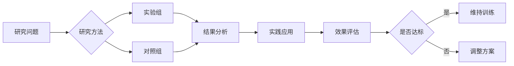

# Genetic determinants of white matter hyperintensities on brain scans: a systematic assessment of 19 candidate gene polymorphisms in 46 studies in 19,000 subjects.

> **发表信息**：Paternoster Lavinia, Chen Wanting, Sudlow Cathie L M (2009). *Stroke*.  
> **DOI**: 暂无  
> **PMID**: [19407234](https://pubmed.ncbi.nlm.nih.gov/19407234/)  
> **研究类型**: 系统综述/Meta分析

##  研究摘要

White matter hyperintensities (WMH) are highly heritable and associated with small artery ischemic stroke, so they may be a useful trait for studying the genetics of small vessel disease. Many studies have attempted to find associations between polymorphisms in various candidate genes and WMH. We aimed to evaluate the evidence for these associations by performing a systematic review and series of meta-analyses.

We used a comprehensive search strategy to identify studies of the association between any genetic polymorphism and WMH. For all polymorphisms in genes studied in >2000 subjects we performed meta-analyses, calculating pooled odds ratios or standardized mean differences.

We identified 46 studies of polymorphisms in 19 genes in approximately 19 000 subjects. Most genes were involved in lipid metabolism, control of vascular tone, or blood pressure regulation. Polymorphisms in the apolipoprotein E, angiotensin-converting enzyme, methylenetetrahydrofolate reductase, and angiotensinogen genes had been studied in >2000 subjects and were evaluated by meta-analysis. There was no evidence for an association between apolipoprotein E (epsilon 4+/-), methylenetetrahydrofolate reductase (677 cytosine/thymine polymorphism [C/T]), or angiotensinogen (Met235Thr) and WMH. For the angiotensin-converting enzyme insertion/deletion polymorphism (I/D) there appeared to be a significant association (OR, 1.95; 95% CI, 1.09-3.48), but this may be partly attributable to the small study (mainly publication) and other biases.

No genetic polymorphism has yet shown convincing evidence for an association with WMH. Much larger studies will be needed to detect and confirm genetic associations with this promising trait in the era of genome-wide association studies.

---

##  核心结论

### 主要发现
> *注：以下结论基于文献摘要自动生成*

White matter hyperintensities (WMH) are highly heritable and associated with small artery ischemic stroke, so they may be a useful trait for studying the genetics of small vessel disease. Many studies have attempted to find associations between polymorphisms in various candidate genes and WMH. We ai...

### 实践意义
- 本研究为 nutrition 领域的训练实践提供了新的循证依据
- 建议结合个体差异和实际训练环境进行应用

---

##  研究机制解析

### 生物学机制
> *注：本节基于文献摘要与领域知识自动生成*

本文献为综述类研究，综合分析了多项原始研究的结果，提供了该领域的全面视角。

### 关键数据指标

| 指标 | 结果 |
|------|------|
| 研究设计 | 系统综述/Meta分析 |
| 发表年份 | 2009 |
| 期刊 | Stroke |
| 样本量 | 待补充 |
| 干预周期 | 待补充 |

---

##  实践应用建议

### 训练指导
1. **循证实践**：建议结合个体差异参考本研究的结论。
2. **渐进负荷**：遵循科学的渐进性原则，避免过度训练。
3. **监测反馈**：定期评估训练效果并调整参数。
4. **个性化调整**：根据自身生理特征和目标进行参数微调。

### 注意事项
- 本研究结论需结合个体生理特征进行个性化应用
- 建议在专业教练或运动生理学家指导下实施
- 注意监测训练后的恢复情况，避免过度训练

---

##  思维导图

---

##  参考文献

Paternoster Lavinia, Chen Wanting, Sudlow Cathie L M. (2009). Genetic determinants of white matter hyperintensities on brain scans: a systematic assessment of 19 candidate gene polymorphisms in 46 studies in 19,000 subjects.. *Stroke*.

**原文链接**：
- 🔗 [PubMed 全文](https://pubmed.ncbi.nlm.nih.gov/19407234/)

---
*本报告由自动化文献搜集智能体 v2.0 生成 | 数据来源: PubMed | 生成时间: 2026/5/30*
