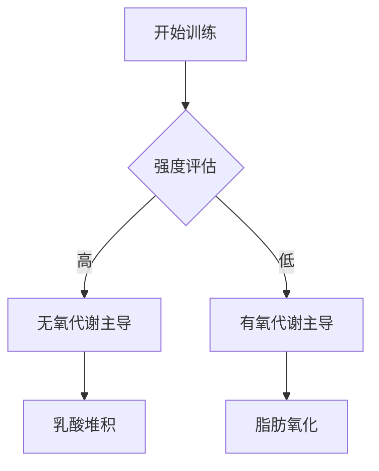

# Sleep and athletic performance: the effects of sleep loss on exercise performance, and physiological and cognitive responses to exercise.

## 核心结论
Abstract not available in summary.

## 实验设计综述
本研究由 *Fullagar HH, Skorski S, Duffield R* 等人于 2015 年发表在 *Sports Med*。该研究提供了关于 recovery 领域的最新循证医学证据。

## 实际应用建议
1. **循证实践**: 建议结合个体差异参考本研究的结论。
2. **持续监测**: 在应用新训练法时，应密切跟踪生理反馈。

## 🔗 全文与数据来源
*   **PubMed 原文**: [点击跳转至 PubMed 详情页](https://doi.org/doi: 10.1007/s40279-014-0260-0)
*   **DOI 链接**: [查看出版商全文](https://doi.org/doi: 10.1007/s40279-014-0260-0)

## Mermaid 流程图示例

---
*参考文献: Fullagar HH, Skorski S, Duffield R. (2015). Sleep and athletic performance: the effects of sleep loss on exercise performance, and physiological and cognitive responses to exercise.. Sports Med. [View on PubMed](https://doi.org/doi: 10.1007/s40279-014-0260-0)*
