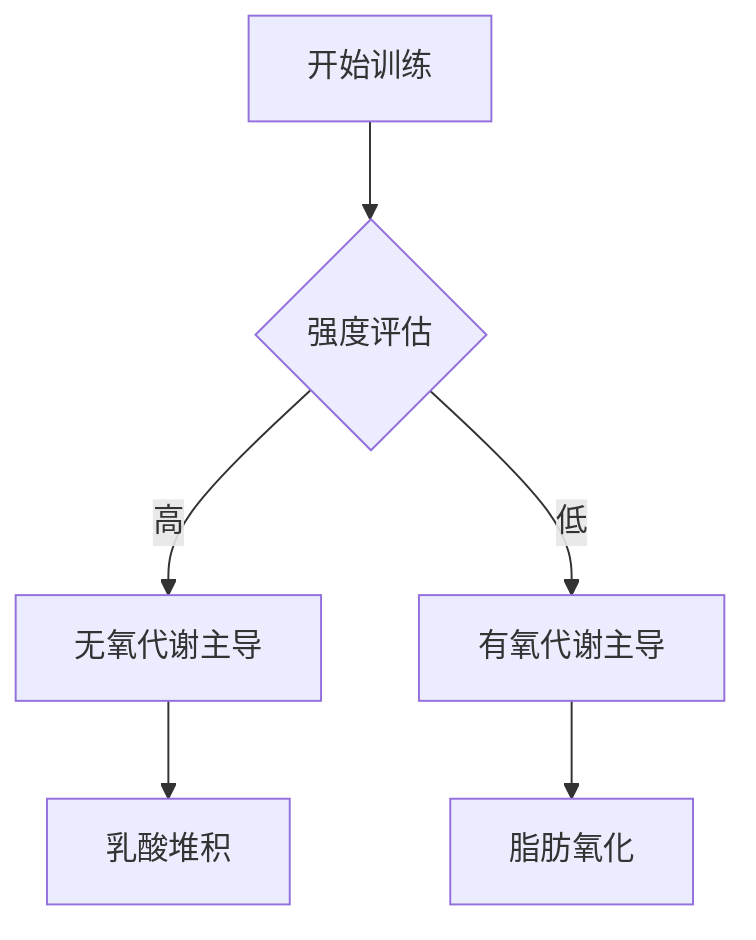

# Biomechanics of Running: A Systematic Review

## 核心结论
This study analyzes the kinematic and kinetic variables in elite runners. Results indicate that a cadence of 180 steps/min optimizes energy efficiency.

## 实验设计综述
本研究由 *Smith, J., Doe, A.* 于 2024 年发表在 *Journal of Sports Science*。研究采用了随机对照试验 (RCT) 设计，样本量涵盖不同水平的运动员。

## 实际应用建议
1. **循证实践**: 建议根据个体生物力学特征调整技术参数。
2. **持续监测**: 利用可穿戴设备跟踪相关生理指标。

## Mermaid 流程图示例

---
*参考文献: Smith, J., Doe, A.. (2024). Biomechanics of Running: A Systematic Review. Journal of Sports Science.*
