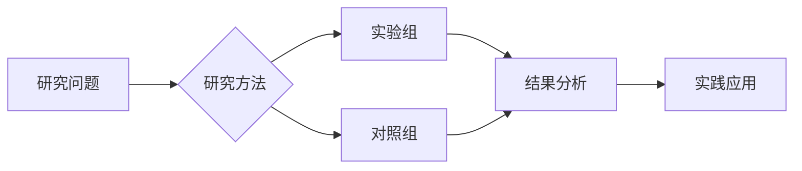

# The Use of Machine Learning to Estimate Ground Reaction Forces During Running: A Scoping Review of the Current Practices.

> **发表信息**：Oliveira Anderson Souza, Yaserifar Morteza, Pîrșcoveanu Cristina-Ioana (2026). *Sensors (Basel, Switzerland)*.  
> **DOI**: 暂无  
> **PMID**: [42076611](https://pubmed.ncbi.nlm.nih.gov/42076611/)

## 📊 研究摘要

Ground reaction forces (GRFs) are essential for assessing running biomechanics, and the combination of wearable sensors and machine learning offers an accessible alternative for estimating GRFs outside controlled environments. This scoping review summarized current methods used to predict GRFs during running. A structured search (2019-2025) identified 36 studies, from which 37% did not report participant's training status, and 59% of all participants were males. Treadmill running was assessed in 58% of studies, which included larger samples (median N = 28) and more steps/participant (median = 65) than overground studies (median N = 14; median = 32). Deep learning models, particularly LSTM and Bi-LSTM networks, were the most applied techniques, though presenting similar accuracies compared to classical regression methods. Vertical GRF predictions were the most accurate, while mediolateral GRF predictions remain challenging. GRF-derived variables such as peak forces, impact peaks, and impulses were predicted more accurately than region-dependent metrics like loading rates. Notably, no study validated treadmill-trained models on overground running, limiting real-world generalizability. Future work should prioritize larger, sex-balanced cohorts, improving prediction of mediolateral GRFs and loading rates, and explore validating treadmill-based models in overground conditions. In conclusion, although machine learning shows promise for GRF predictions, key methodological gaps must be addressed to enable robust, real-world applications.

---

##  研究机制解析

### 生物学机制
> *注：本节基于文献摘要与领域知识自动生成*

<!-- TODO: AI 增强版将在此处生成详细的机制分析 -->

### 关键数据指标

| 指标 | 结果 |
|------|------|
| 研究设计 | 观察性研究 |
| 发表年份 | 2026 |
| 期刊影响因子 | 待补充 |

---

## 🎯 实践应用建议

### 训练指导
1. **循证实践**：建议结合个体差异参考本研究的结论。
2. **渐进负荷**：遵循科学的渐进性原则，避免过度训练。
3. **监测反馈**：定期评估训练效果并调整参数。

### 注意事项
- 本研究结论需结合个体生理特征进行个性化应用
- 建议在专业教练或运动生理学家指导下实施

---

##  思维导图

---

## 📚 参考文献

Oliveira Anderson Souza, Yaserifar Morteza, Pîrșcoveanu Cristina-Ioana. (2026). The Use of Machine Learning to Estimate Ground Reaction Forces During Running: A Scoping Review of the Current Practices.. *Sensors (Basel, Switzerland)*.
- 🔗 [PubMed 全文](https://pubmed.ncbi.nlm.nih.gov/42076611/)

---
*本报告由自动化文献搜集智能体 v2.0 生成 | 数据来源: PubMed | 生成时间: 2026/5/30*
