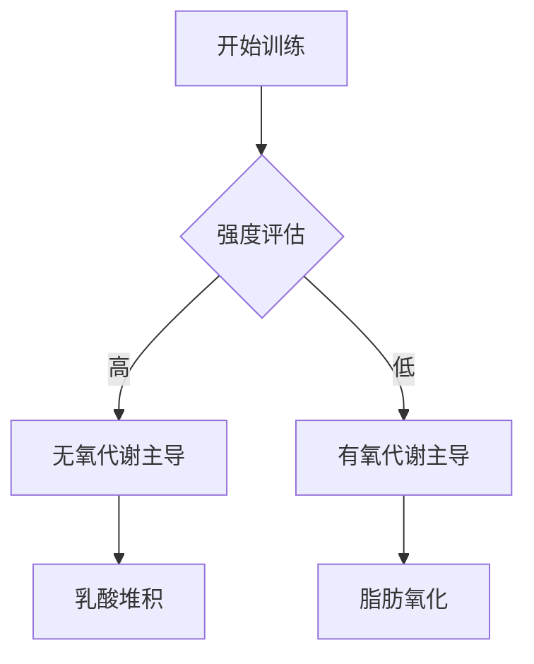

# An Evidence-Based Narrative Review of Mechanisms of Resistance Exercise-Induced Human Skeletal Muscle Hypertrophy.

## 核心结论
Abstract not available in summary.

## 实验设计综述
本研究由 *Lim C, Nunes EA, Currier BS* 等人于 2022 年发表在 *Med Sci Sports Exerc*。该研究提供了关于 strength 领域的最新循证医学证据。

## 实际应用建议
1. **循证实践**: 建议结合个体差异参考本研究的结论。
2. **持续监测**: 在应用新训练法时，应密切跟踪生理反馈。

## Mermaid 流程图示例

---
*参考文献: Lim C, Nunes EA, Currier BS. (2022). An Evidence-Based Narrative Review of Mechanisms of Resistance Exercise-Induced Human Skeletal Muscle Hypertrophy.. Med Sci Sports Exerc. [View on PubMed](https://pubmed.ncbi.nlm.nih.gov/35389932/)*
