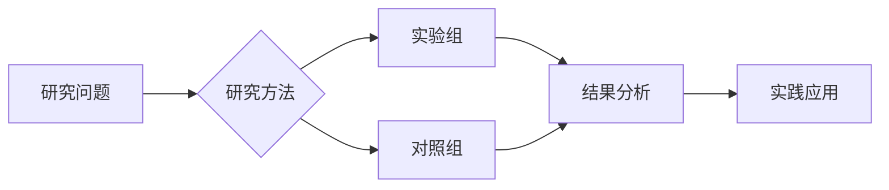

# Educational intervention to optimize antibiotic prescribing: a narrative review of recent evidence.

> **发表信息**：Acampora Marta, Graffigna Guendalina (2026). *The Journal of hospital infection*.  
> **DOI**: 暂无  
> **PMID**: [42208738](https://pubmed.ncbi.nlm.nih.gov/42208738/)

## 📊 研究摘要

Antimicrobial stewardship (AMS) interventions aim to optimise prescribing practices and tackle antimicrobial resistance. Since 2019, the Centers for Disease Control and Prevention (CDC) have included education as a core element of AMS programmes. This narrative review synthesises recent evidence (2019-2025) on educational interventions targeting healthcare professionals to improve antibiotic use. A systematic search across databases identified 78 eligible studies conducted in different countries and clinical settings. Most interventions (n=58) focused on clinical knowledge transfer, such as appropriate antibiotic selection, treatment duration, and guidelines adherence. Only a minority (n=20) addressed psycho-social and behavioural aspects, including communication with patients or shared decision-making. This gap was reflected in the profile of education providers, primarily clinical experts such as infectious disease specialists or pharmacists, and in the limited use of behavioural or theoretical frameworks. Educational strategies frequently included traditional training sessions and audit and feedback. Although several studies reported improvements in prescribing behaviours, long-term sustainability and implementation fidelity were rarely assessed. Despite increasing recognition of the role of behavioural and psycho-social factors in shaping prescribing practices, these dimensions remain largely absent from educational content. To foster sustainable change, future AMS programmes should adopt theory-informed designs, incorporate psycho-social and behavioural dimensions. Strengthening these aspects is essential to support healthcare professionals in navigating the complex realities of prescribing decisions and to achieve long-term reductions in inappropriate antibiotic use.

---

##  研究机制解析

### 生物学机制
> *注：本节基于文献摘要与领域知识自动生成*

<!-- TODO: AI 增强版将在此处生成详细的机制分析 -->

### 关键数据指标

| 指标 | 结果 |
|------|------|
| 研究设计 | 观察性研究 |
| 发表年份 | 2026 |
| 期刊影响因子 | 待补充 |

---

## 🎯 实践应用建议

### 训练指导
1. **循证实践**：建议结合个体差异参考本研究的结论。
2. **渐进负荷**：遵循科学的渐进性原则，避免过度训练。
3. **监测反馈**：定期评估训练效果并调整参数。

### 注意事项
- 本研究结论需结合个体生理特征进行个性化应用
- 建议在专业教练或运动生理学家指导下实施

---

##  思维导图

---

## 📚 参考文献

Acampora Marta, Graffigna Guendalina. (2026). Educational intervention to optimize antibiotic prescribing: a narrative review of recent evidence.. *The Journal of hospital infection*.
- 🔗 [PubMed 全文](https://pubmed.ncbi.nlm.nih.gov/42208738/)

---
*本报告由自动化文献搜集智能体 v2.0 生成 | 数据来源: PubMed | 生成时间: 2026/5/30*
