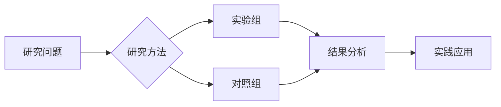

# Host- and pathogen-related determinants of pulmonary  extrapulmonary tuberculosis.

> **发表信息**：Tulu Begna, Brehm Thomas Theo, van Crevel Reinout, Dallenga Tobias, DiNardo Andrew R, Dheda Keertan, Eggeling Johanna, Enbiale Wendemagegn, Gröschel Matthias I, Hao Jialun, Kumar Vinod, van Laarhoven Arjan, Londt Rolanda, Prosser Gareth, Randall Philippa, Reiling Norbert, Rybniker Jan, Schaible Ulrich E, Schurr Erwin, Suarez Isabelle, Theobald Sebastian J, Wilkinson Robert J, Lange Christoph (2026). *European respiratory review : an official journal of the European Respiratory Society*.  
> **DOI**: 暂无  
> **PMID**: [41605541](https://pubmed.ncbi.nlm.nih.gov/41605541/)

## 📊 研究摘要

Tuberculosis (TB) primarily manifests as pulmonary TB (PTB), but extrapulmonary TB (EPTB) remains a major clinical challenge. Distinct diagnostic and therapeutic difficulties arise from differences in immune responses, pathogen behaviour and host susceptibility. However, the factors driving disease localisation are still incompletely understood. We conducted a comprehensive narrative review of studies examining differences between PTB and EPTB in terms of epidemiology, mycobacterial factors, genetic and epigenetic determinants, host immune responses, transcriptomic profiles, cytokine and chemokine patterns, and immunophenotypes. EPTB is more common among females, children, older adults and immunocompromised individuals with deficient granuloma formation. This review is intended to provide deeper insight for clinicians and researchers and provides an accessible synthesis of current basic science findings together with their relevance for clinical practice. Certain , lineages, notably lineage 1, and specific virulence factors are associated with extrapulmonary dissemination. While genetic polymorphisms influence TB localisation, no studies specifically addressing epigenetic predisposition to EPTB were identified. PTB typically is characterised by T-helper 1-driven immunity, high bacillary loads and robust macrophage activation, whereas EPTB involves compartmentalised immune responses, reduced cytotoxicity and broader cytokine variability. Transcriptomic analyses reveal site-specific gene expression differences and emerging diagnostic blood-based biomarkers show promise but require further validation. Cytokine profiles and immunophenotyping suggest greater immune exhaustion and regulatory T-cell activity in EPTB. We outline practical implications for diagnosis and management and highlight constraints in resource-limited settings and emphasise access and implementation considerations. Integrating these clinical and mechanistic insights can guide more timely recognition and tailored care.

---

##  研究机制解析

### 生物学机制
> *注：本节基于文献摘要与领域知识自动生成*

<!-- TODO: AI 增强版将在此处生成详细的机制分析 -->

### 关键数据指标

| 指标 | 结果 |
|------|------|
| 研究设计 | 观察性研究 |
| 发表年份 | 2026 |
| 期刊影响因子 | 待补充 |

---

## 🎯 实践应用建议

### 训练指导
1. **循证实践**：建议结合个体差异参考本研究的结论。
2. **渐进负荷**：遵循科学的渐进性原则，避免过度训练。
3. **监测反馈**：定期评估训练效果并调整参数。

### 注意事项
- 本研究结论需结合个体生理特征进行个性化应用
- 建议在专业教练或运动生理学家指导下实施

---

##  思维导图

---

## 📚 参考文献

Tulu Begna, Brehm Thomas Theo, van Crevel Reinout, Dallenga Tobias, DiNardo Andrew R, Dheda Keertan, Eggeling Johanna, Enbiale Wendemagegn, Gröschel Matthias I, Hao Jialun, Kumar Vinod, van Laarhoven Arjan, Londt Rolanda, Prosser Gareth, Randall Philippa, Reiling Norbert, Rybniker Jan, Schaible Ulrich E, Schurr Erwin, Suarez Isabelle, Theobald Sebastian J, Wilkinson Robert J, Lange Christoph. (2026). Host- and pathogen-related determinants of pulmonary  extrapulmonary tuberculosis.. *European respiratory review : an official journal of the European Respiratory Society*.
- 🔗 [PubMed 全文](https://pubmed.ncbi.nlm.nih.gov/41605541/)

---
*本报告由自动化文献搜集智能体 v2.0 生成 | 数据来源: PubMed | 生成时间: 2026/5/30*
