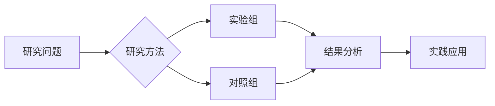

# Synergistic Effects of Protein Intake and Exercise on Biomarkers of Sarcopenia: A Systematic Review.

> **发表信息**：Cruz-Pierard Stephanie, Iñiguez-Jiménez Samuel (2026). *Biomolecules*.  
> **DOI**: 暂无  
> **PMID**: [41750266](https://pubmed.ncbi.nlm.nih.gov/41750266/)

## 📊 研究摘要

Sarcopenia, defined as the progressive decline of muscle mass, strength, and function, severely compromises autonomy and quality of life in older adults. This systematic review evaluated synergistic effects of protein supplementation combined with resistance exercise on biochemical and functional biomarkers of sarcopenia. The search for scientific evidence was conducted in PubMed, Scopus, ScienceDirect, and Cochrane databases (2019-2025), applying explicit inclusion and exclusion criteria, like only randomized controlled trials in humans, published in English, Spanish, or French, were included to ensure high-quality evidence. After selection, the risk of bias of the articles was assessed according to the Cochrane Handbook for Systematic Reviews of Interventions. Seven randomized controlled trials, with a total of 260 participants, met the eligibility criteria. Interventions combining resistance exercise three times per week at 60-80% of one-repetition maximum with daily protein supplementation of at least 15 g, mainly from dairy sources, showed synergistic effects. Improvements were observed in inflammatory and anabolic biomarkers, with reductions in myostatin, activin, and IL-6, and increases in IGF-1, follistatin, and IL-10. Functional outcomes included gains in muscle strength, fat-free mass, and muscle fiber cross-sectional area. Despite heterogeneity in duration and sample size, findings support this combined approach as a promising and clinically applicable strategy to prevent and treat sarcopenia. No external funding was received, and the review is registered in PROSPERO (CRD42025640989).

---

##  研究机制解析

### 生物学机制
> *注：本节基于文献摘要与领域知识自动生成*

<!-- TODO: AI 增强版将在此处生成详细的机制分析 -->

### 关键数据指标

| 指标 | 结果 |
|------|------|
| 研究设计 | 随机对照试验 (RCT) |
| 发表年份 | 2026 |
| 期刊影响因子 | 待补充 |

---

## 🎯 实践应用建议

### 训练指导
1. **循证实践**：建议结合个体差异参考本研究的结论。
2. **渐进负荷**：遵循科学的渐进性原则，避免过度训练。
3. **监测反馈**：定期评估训练效果并调整参数。

### 注意事项
- 本研究结论需结合个体生理特征进行个性化应用
- 建议在专业教练或运动生理学家指导下实施

---

##  思维导图

---

## 📚 参考文献

Cruz-Pierard Stephanie, Iñiguez-Jiménez Samuel. (2026). Synergistic Effects of Protein Intake and Exercise on Biomarkers of Sarcopenia: A Systematic Review.. *Biomolecules*.
- 🔗 [PubMed 全文](https://pubmed.ncbi.nlm.nih.gov/41750266/)

---
*本报告由自动化文献搜集智能体 v2.0 生成 | 数据来源: PubMed | 生成时间: 2026/5/30*
