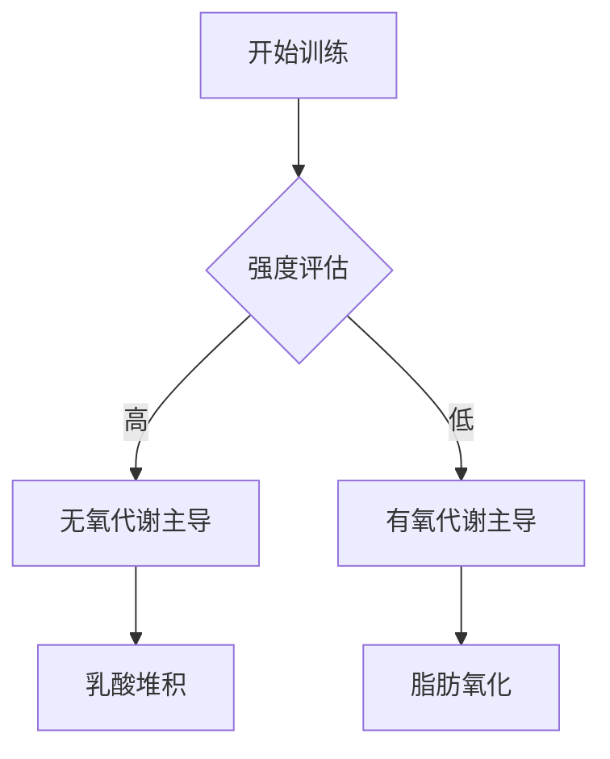

# The mechanisms of muscle hypertrophy and their application to resistance training.

## 核心结论
Abstract not available in summary.

## 实验设计综述
本研究由 *Schoenfeld BJ* 等人于 2010 年发表在 *J Strength Cond Res*。该研究提供了关于 strength 领域的最新循证医学证据。

## 实际应用建议
1. **循证实践**: 建议结合个体差异参考本研究的结论。
2. **持续监测**: 在应用新训练法时，应密切跟踪生理反馈。

## 🔗 全文与数据来源
*   **PubMed 原文**: [点击跳转至 PubMed 详情页](https://doi.org/doi: 10.1519/JSC.0b013e3181e840f3)
*   **DOI 链接**: [查看出版商全文](https://doi.org/doi: 10.1519/JSC.0b013e3181e840f3)

## Mermaid 流程图示例

---
*参考文献: Schoenfeld BJ. (2010). The mechanisms of muscle hypertrophy and their application to resistance training.. J Strength Cond Res. [View on PubMed](https://doi.org/doi: 10.1519/JSC.0b013e3181e840f3)*
