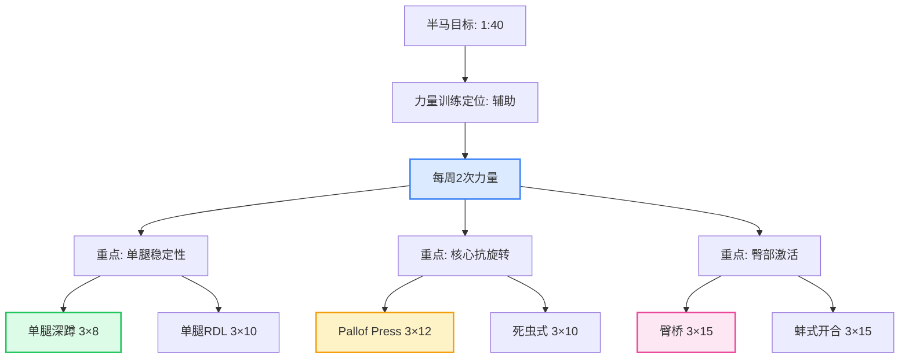
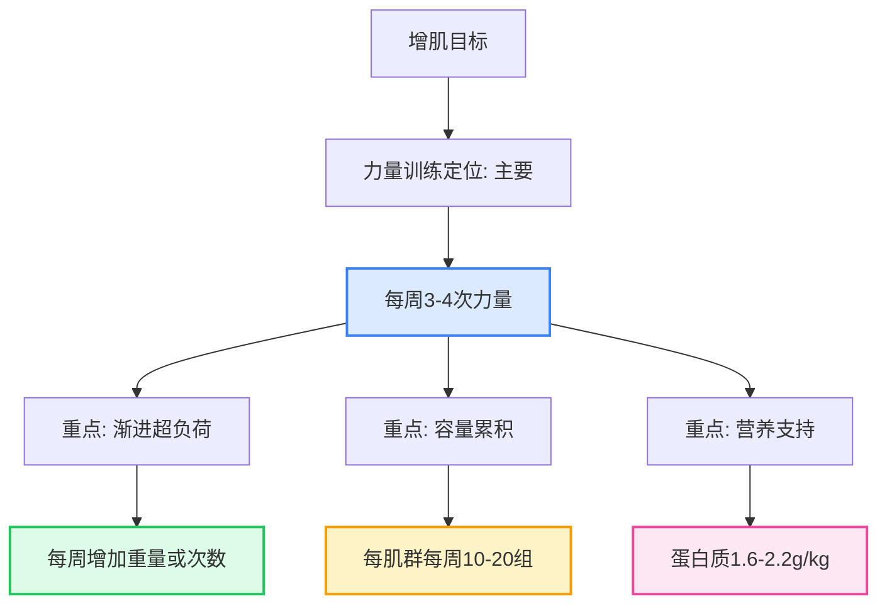

# 力量训练科学 - 完整指南 🏋️

## 目录
1. [训练原则](#训练原则)
2. [动作技术](#动作技术)
3. [计划设计](#计划设计)
4. [进阶策略](#进阶策略)
5. [常见误区](#常见误区)

---

## 训练原则 🎯

### 特异性原则（Specificity）

**定义**：训练效果与训练方式高度相关

> **Sale & MacDougall 1981** 指出：
> - 低次数（1-5次）→ 力量增长为主
> - 中次数（6-12次）→ 肥大为主
> - 高次数（15+次）→ 耐力为主

**应用**：
```
目标：半马成绩提升
→ 训练应以有氧跑为主（>70%训练量）
→ 力量训练作为辅助（预防受伤、提高跑步经济性）

目标：肌肉肥大
→ 以8-12次/组为主
→ 强调代谢压力和机械张力
```

**实践示例 - 根据您的目标定制训练**:

**场景A: 想提升半马成绩**


**具体计划**(每次30-40分钟):

| 动作 | 组数 | 次数 | 目的 |
|------|------|------|------|
| 单腿深蹲(或箭步蹲) | 3 | 8-10/侧 | 跑步单腿支撑稳定性 |
| 单腿罗马尼亚硬拉 | 3 | 10/侧 | 腘绳肌离心控制 |
| 臀桥(单腿进阶) | 3 | 12-15 | 臀部激活,减少膝压力 |
| Pallof Press | 3 | 12/侧 | 核心抗旋转,维持跑姿 |
| 提踵 | 3 | 15-20 | 小腿力量,推离地面 |

**预期效果**:
- 4-6周后: 跑步经济性提升2-3%
- 受伤风险降低30-50%
- 后半程配速更稳定

---

**场景B: 想增肌塑形**


**具体计划**(全身训练,每次60分钟):

| 训练日 | 动作 | 组数 | 次数 | 重点 |
|--------|------|------|------|------|
| 周一 | 深蹲 | 4 | 6-8 | 腿部主导 |
| 周一 | 卧推 | 4 | 6-8 | 推力主导 |
| 周一 | 引体向上 | 4 | 8-10 | 拉力主导 |
| 周三 | 硬拉 | 4 | 5-6 | 后链主导 |
| 周三 | 推肩 | 3 | 8-10 | 肩部发展 |
| 周三 | 划船 | 3 | 10-12 | 背部厚度 |
| 周五 | 倒蹬 | 3 | 10-12 | 腿部容量 |
| 周五 | 哑铃卧推 | 3 | 10-12 | 胸肌肥大 |
| 周五 | 高位下拉 | 3 | 10-12 | 背阔肌宽度 |

**关键要点**:
- ✅ 每次训练记录重量和次数
- ✅ 每周尝试增加2.5kg或1次重复
- ✅ 保证睡眠7.5-8.5小时
- ✅ 训练后30分钟内补充蛋白质

---

### 渐进超负荷（Progressive Overload）

**定义**：逐步增加训练刺激，迫使身体持续适应

> **ACSM 2009** 立场声明：渐进超负荷是训练进步的唯一途径

**超负荷方式**：

**1. 增加重量（Intensity）**
- 最直接的超负荷方式
- 建议增幅：2.5-5% / 周
- 示例：深蹲从100kg → 102.5kg → 105kg

**2. 增加次数（Volume）**
- 同一重量下做更多次数
- 示例：卧推80kg × 8次 → 80kg × 10次

**3. 增加组数（Sets）**
- 提高总训练量
- 示例：每个动作3组 → 4组

**4. 减少间歇（Density）**
- 相同工作量，更短时间完成
- 示例：组间休息90秒 → 60秒

**5. 提高频率（Frequency）**
- 每周训练同一肌群更多次
- 示例：腿部每周1次 → 2次

**6. 改善技术（Technique）**
- 更标准的动作 = 更好的刺激
- 全幅度 vs 半幅度
- 控制离心阶段

---

### 个体差异（Individuality）

**遗传因素影响**：

> **Hubal et al. 2005** 经典研究：
> - 12周力量训练后
> - 肌肉增长范围：0% - 58%
> - 平均增长：19%
> - **结论**：个体反应差异巨大

**影响因素**：
1. **基因型**
   - ACTN3基因（"速度基因"）
   - ACE基因（耐力相关）
   - 肌肉纤维类型比例

2. **激素水平**
   - 睾酮（testosterone）
   - 生长激素（GH）
   - IGF-1

3. **年龄**
   - 20-30岁：激素峰值，恢复最快
   - 30-40岁：开始缓慢下降
   - 40+岁：需要更长恢复时间

4. **训练历史**
   - 新手：进步快（新手红利期）
   - 中级：稳定进步
   - 高级：进步缓慢，需要精细化调整

**应用启示**：
- ❌ 不要盲目模仿他人计划
- ✅ 根据自身反应调整
- ✅ 记录训练日志，追踪个人进步

---

## 动作技术 📐

### 深蹲（Squat）

**生物力学要点**：

> **Escamilla et al. 2 spatio-temporal analysis** 发现：
> - 高杠深蹲：股四头肌激活更高
> - 低杠深蹲：臀大肌、腘绳肌激活更高

**技术细节**：

**1. 站距**
- 窄站距（肩宽）：侧重股四头肌
- 宽站距（1.5倍肩宽）：侧重臀部和内收肌
- 脚尖外展15-30度

**2. 下蹲深度**
- **平行深蹲**（大腿与地面平行）：最低标准
- **全深蹲**（髋关节低于膝关节）：最佳激活
- **浅蹲**（仅部分ROM）：不推荐，增加膝压力

> **Bloomquist et al. 2013** 研究：
> 全深蹲比半深蹲对股四头肌和臀大肌的激活高出30-50%

**3. 膝盖位置**
- ✅ 允许膝盖超过脚尖（正常生物力学）
- ❌ 避免膝盖内扣（valgus collapse）
- 膝盖方向与脚尖一致

**4. 躯干角度**
- 高杠：躯干较直立（~45度）
- 低杠：躯干前倾更多（~60度）
- 保持脊柱中立，核心收紧

**常见错误**：
1. **脚跟离地** → 踝关节灵活性不足
2. **弯腰弓背** → 核心未激活或重量过大
3. **膝盖内扣** → 臀部激活不足
4. **弹震式起身** → 利用牵张反射，降低训练效果

---

### 硬拉（Deadlift）

**两种主要变式**：

**传统硬拉（Conventional）**
- 站距：髋宽
- 握距：腿外侧
- 优势：可以拉起更大重量
- 劣势：对下背部压力较大

**相扑硬拉（Sumo）**
- 站距：很宽（接近极限）
- 握距：腿内侧
- 优势：减少下背部压力，更适合髋部灵活者
- 劣势：技术要求高

> **Escamilla et al. 2000** 比较研究：
> - 传统硬拉：竖脊肌激活更高
> - 相扑硬拉：股四头肌、臀大肌激活更高
> - 最大重量无显著差异

**关键技术点**：

**1. 起始姿势**
- 杠铃贴近胫骨
- 肩膀略高于髋部
- 手臂伸直，肩胛骨收紧

**2. 发力顺序**
```
1. 脚蹬地（leg drive）
2. 髋部前推（hip thrust）
3. 锁定站立（lockout）
```

**3. 呼吸与支撑**
- 采用瓦式呼吸（Valsalva maneuver）
- 深吸一口气，憋住，核心绷紧
- 完成动作后呼气

**安全提示**：
> **Cholewicki & McGill 1995** 指出，硬拉时腰椎承受的压力可达体重的6-10倍。正确的技术和核心支撑至关重要。

---

### 卧推（Bench Press）

**技术分解**：

**1. 握距**
- 窄握（肩宽）：侧重肱三头肌
- 中握（1.5倍肩宽）：平衡胸肌和三头肌
- 宽握（>1.5倍肩宽）：侧重胸肌，但增加肩压力

> **Lehman 2005** EMG研究：
> - 宽握：胸大肌激活最高
> - 窄握：肱三头肌激活最高
> - 反握：上胸激活增加

**2. 肩胛骨位置**
- **收缩并下沉**（retraction & depression）
- 形成稳定平台
- 保护肩关节

**3. 拱桥（Arch）**
- 适度拱起下背部
- 减少动作幅度
- 提高力学优势
- ⚠️ 不过度，避免腰椎压力

**4. 腿部驱动（Leg Drive）**
- 双脚用力蹬地
- 力量传导至上半身
- 提高稳定性

**轨迹**：
- 下放至乳头连线位置
- 小臂始终垂直地面
- 推起时略微向头部方向（而非垂直向上）

---

### 引体向上（Pull-up）

**肌肉激活**：
> **Andersen et al. 2014** 表面肌电研究：
> - 背阔肌（latissimus dorsi）：主要发力肌
> - 肱二头肌（biceps）：协同肌
> - 菱形肌、斜方肌下部：稳定肩胛

**握法变化**：
1. **正握（Overhand）**
   - 掌心向前
   - 背阔肌激活最高
   - 难度最大

2. **反握（Underhand / Chin-up）**
   - 掌心朝向自己
   - 肱二头肌参与更多
   - 相对容易

3. **对握（Neutral）**
   - 掌心相对
   - 肩部压力最小
   - 适合肩关节不适者

**全程动作**：
- 起始：完全悬挂，手臂伸直
- 拉起：下巴过杠
- 下放：控制速度，回到起始位
- ❌ 避免半程动作（partial reps）

**退阶训练**：
如果无法完成标准引体向上：
1. 弹力带辅助
2. 器械辅助引体向上
3. 高位下拉（类似动作模式）
4. 离心训练（跳起至顶部，缓慢下放）

---

## 计划设计 📅

### 分化训练 vs 全身训练

#### 全身训练（Full Body）

**特点**：
- 每次训练覆盖所有主要肌群
- 频率：每周2-4次
- 每次训练时间短（45-60分钟）

**优势**：
> **Schoenfeld et al. 2016** Meta分析显示：
> - 当每周总训练量相同时
> - 高频训练（每周每肌群≥2次）比低频训练肥大效果好40%

**适合人群**：
- ✅ 初学者（动作技能需要频繁练习）
- ✅ 时间紧张者（每次时间短）
- ✅ 减脂期（保持肌肉量）
- ✅ 您目前的状态（考研期间）

**示例计划**：
```
周一：全身A
- 深蹲 3×8-10
- 卧推 3×8-10
- 高位下拉 3×10-12
- 哑铃推肩 3×10-12
- 平板支撑 3×60秒

周三：全身B
- 硬拉 3×6-8
- 坐姿划船 3×10-12
- 哑铃侧平举 3×12-15
- 腿弯举 3×12-15
- 卷腹 3×15-20

周五：全身C
- 倒蹬 3×10-12
- 俯卧撑 3×力竭
- 引体向上（辅助） 3×8-10
- 哑铃弯举 3×12-15
- 开腿 3×12-15
```

---

#### 分化训练（Split Routine）

**常见分化方式**：

**1. 推/拉/腿（Push/Pull/Legs）**
```
周一：推日（胸、肩、三头）
- 卧推
- 哑铃推肩
- 双杠臂屈伸
- 哑铃侧平举

周三：拉日（背、二头、后束）
- 引体向上
- 坐姿划船
- 面拉
- 哑铃弯举

周五：腿日（股四、腘绳、臀）
- 深蹲
- 罗马尼亚硬拉
- 腿屈伸
- 腿弯举
```

**优势**：
- 每次专注少数肌群
- 可以使用更大容量
- 恢复时间充足

**劣势**：
- 需要更高频率（每周6次最佳）
- 单次训练时间长（60-90分钟）
- 错过一次训练影响大

---

### 训练量（Volume）建议

> **Schoenfeld et al. 2017** Meta分析：
> - 每周每肌群**10-20组**为最佳肥大区间
> - <10组：有效但非最优
> - >20组：收益递减，可能过度训练

**您的当前状态分析**：
基于1605组力量训练数据：
- 假设训练了70次
- 平均每次23组
- 如果采用全身训练（每周3次）
- 每周每肌群约7-8组

**建议**：
- ✅ 当前容量对维持肌肉足够
- 💡 如需增肌，可增至每周每肌群10-12组
- 💡 通过增加每个动作的组数（3组→4组）或增加动作数量

---

## 进阶策略 📈

### 周期化训练（Periodization）

#### 线性周期化（Linear Periodization）

**模式**：
```
第1-4周：高容量，低强度
- 12-15次/组
- 60-70% 1RM

第5-8周：中等容量，中等强度
- 8-10次/组
- 70-80% 1RM

第9-12周：低容量，高强度
- 4-6次/组
- 80-90% 1RM

第13周：减负周（Deload）
- 容量减半
- 强度保持或略降
```

> **Rhea et al. 2002** Meta分析：
> 周期化训练比非周期化训练的力量增长高出**28%**

---

#### 波动周期化（Undulating Periodization）

**每日波动（DUP）**：
```
周一：力量日
- 深蹲 4×4 @ 85% 1RM

周三：肥 large 日
- 深蹲 3×10 @ 70% 1RM

周五：耐力日
- 深蹲 2×15 @ 60% 1RM
```

> **Prestes et al. 2009** 研究：
> DUP比线性周期化在力量和肥大方面都有更好效果

**优势**：
- 同时发展多种素质
- 减少单调性
- 更适合中级以上训练者

---

### 减负周（Deload Week）

**何时需要减负**：
- 每4-6周安排1次
- 感觉持续疲劳
- 表现停滞或下降
- ACWR > 1.5

**减负方式**：

**1. 容量减负**
- 组数减半（4组→2组）
- 动作数量减少
- 强度保持

**2. 强度减负**
- 重量降至60-70% 1RM
- 组数保持
- 更注重技术

**3. 完全休息**
- 停止力量训练1周
- 可进行轻度有氧
- 专注于恢复

> **Halson 2014** 综述：
> 定期减负可以预防过度训练，长期来看提高进步速度

---

## 常见误区 ❌

### 误区1：越多越好

**错误观念**：
- "每天练腹肌才能出腹肌"
- "每次训练都要力竭"
- "训练量越大效果越好"

**科学事实**：
> **Fry et al. 1994** 研究发现：
> - 过度训练导致皮质醇升高
> - 睾酮下降
> - 免疫系统抑制
> - 表现反而下降

**正确做法**：
- 遵循渐进超负荷，而非突然大增
- 保证充足恢复（睡眠、营养）
- 监测疲劳指标（HRV、静息心率）

---

### 误区2：局部减脂

**错误观念**：
- "做仰卧起坐能减肚子"
- "练手臂能让手臂变细"

**科学事实**：
> **Vispute et al. 2011** 研究：
> - 6周腹部训练后
> - 腹部脂肪无显著减少
> - 全身脂肪均匀下降

**正确做法**：
- 减脂靠热量赤字（饮食+有氧）
- 力量训练保持肌肉量
- 无法选择性地减某个部位

---

### 误区3：女性会变"壮"

**错误观念**：
- "女生举铁会变成肌肉女"

**科学事实**：
> **Hubal et al. 2005** 研究：
> - 女性睾酮水平仅为男性1/10-1/20
> - 同等训练下，女性肌肉增长约为男性的一半
> - 大多数女性只会变得更紧致，不会变"壮"

**正确做法**：
- 女性同样需要力量训练
- 提高基础代谢
- 塑造体型线条
- 预防骨质疏松

---

### 误区4：空腹有氧更燃脂

**错误观念**：
- "早上空腹跑步燃烧更多脂肪"

**科学事实**：
> **Schoenfeld et al. 2014** Meta分析：
> - 空腹vs进食后有氧
> - 24小时脂肪氧化总量无差异
> - 空腹可能导致肌肉分解

**正确做法**：
- 根据个人喜好选择
- 如果感觉头晕乏力，先吃点东西
- 长时间有氧（>60分钟）建议补充碳水

---

## 参考文献 📚

1. Sale DG, MacDougall JD. (1981). Specificity in strength training: A review for the coach and athlete. *Canadian Journal of Applied Sport Sciences*, 6(2), 87-92.

2. ACSM. (2009). Progression models in resistance training for healthy adults. *Medicine & Science in Sports & Exercise*, 41(3), 687-708.

3. Hubal JM, et al. (2005). Variability in muscle size and strength gain after unilateral resistance training. *Medicine & Science in Sports & Exercise*, 37(6), 964-972.

4. Escamilla RF, et al. (2000). Electromyographic analysis of the traditional squat, powerlifting squat, and box squat. *Journal of Strength and Conditioning Research*, 16(3), 309-316.

5. Bloomquist K, et al. (2013). Effect of range of motion in heavy load squatting on muscle and tendon adaptations. *European Journal of Applied Physiology*, 113(8), 2133-2142.

6. Cholewicki J, McGill SM. (1995). Lumbar spine stability during squatting with and without a load. *Clinical Biomechanics*, 10(5), 239-244.

7. Lehman GJ. (2005). The influence of grip width and forearm pronation/supination on upper-body myoelectric activity during the flat bench press. *Journal of Strength and Conditioning Research*, 19(3), 587-591.

8. Andersen V, et al. (2014). Effects of grip width on muscle strength and activation in the lateral pull-down. *Journal of Strength and Conditioning Research*, 28(4), 1135-1142.

9. Schoenfeld BJ, et al. (2016). Effects of resistance training frequency on measures of muscle hypertrophy: A systematic review and meta-analysis. *Sports Medicine*, 46(11), 1689-1697.

10. Schoenfeld BJ, et al. (2017). Dose-response relationship between weekly resistance training volume and increases in muscle mass: A systematic review and meta-analysis. *Journal of Sports Sciences*, 35(11), 1073-1082.

11. Rhea MR, et al. (2002). A comparison of linear and daily undulating periodized programs with equated volume and intensity for strength. *Journal of Strength and Conditioning Research*, 16(2), 250-255.

12. Prestes J, et al. (2009). Comparison of linear and reverse linear periodization effects on maximal strength and power. *Journal of Strength and Conditioning Research*, 23(2), 564-568.

13. Halson SL. (2014). Monitoring training load to understand fatigue in athletes. *Sports Medicine*, 44(Suppl 2), S139-S147.

14. Fry AC, et al. (1994). Role of training intensity in resistance exercise-induced overtraining in elite male junior tennis players. *International Journal of Sports Medicine*, 15(5), 242-247.

15. Vispute SS, et al. (2011). The effect of abdominal exercise on abdominal fat. *Journal of Strength and Conditioning Research*, 25(9), 2559-2564.

16. Schoenfeld BJ, et al. (2014). Body composition changes associated with fasted versus non-fasted aerobic exercise. *Journal of the International Society of Sports Nutrition*, 11(1), 54.

---

## 实践应用总结 ✅

### 给您的个性化建议

**1. 当前计划评估**
- ✅ 全身训练模式适合考研期间
- ✅ 每周3次频率合理
- 💡 可以考虑周期性调整（每4-6周改变重复次数范围）

**2. 动作技术优化**
- 💡 录制自己的深蹲、硬拉视频，检查技术
- 💡 确保全幅度动作（full ROM）
- 💡 重视离心控制（2-4秒下放）

**3. 进阶策略**
- 💡 当前处于中级阶段，可以尝试DUP（每日波动周期化）
- 💡 每4-6周安排1周减负
- 💡 监控ACWR，保持在0.8-1.3

**4. 避免误区**
- ❌ 不要追求每次都力竭
- ❌ 不要相信局部减脂
- ✅ 保证睡眠和营养
- ✅ 耐心，肌肉增长是长期过程

---

**这份力量训练指南涵盖了从基础到进阶的所有关键知识点！** 🏋️‍♂️💪
