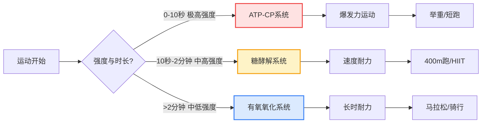
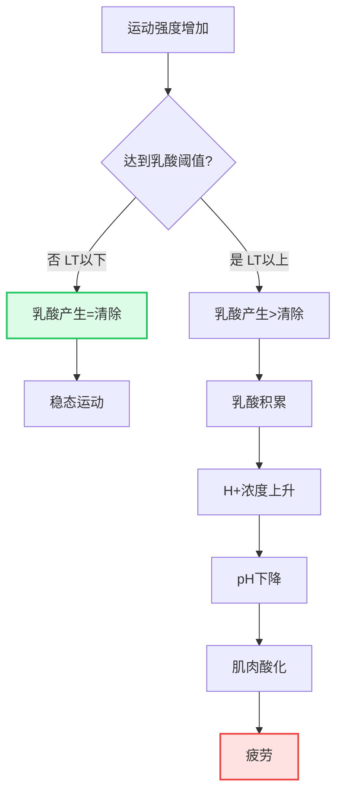
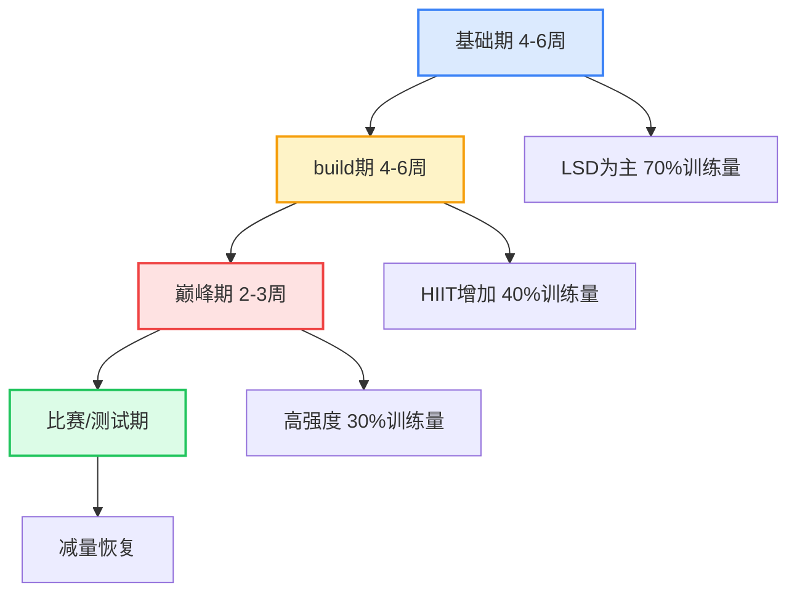
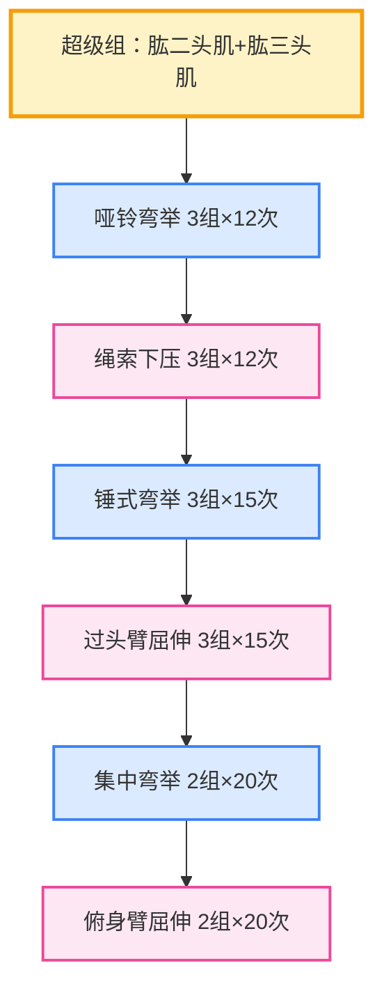
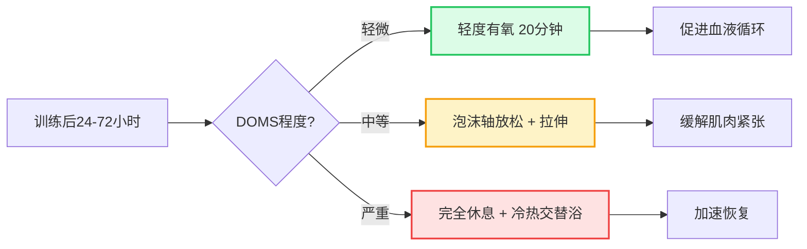
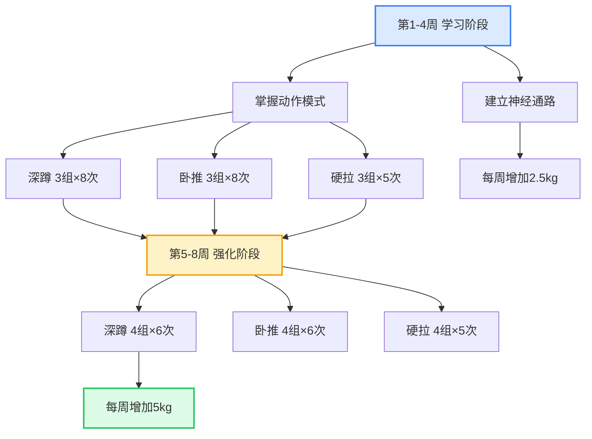
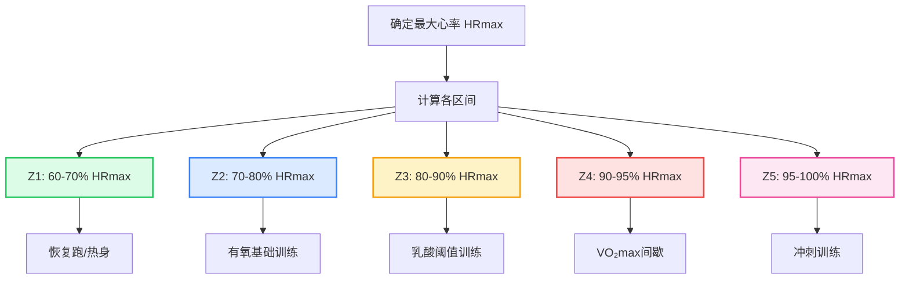
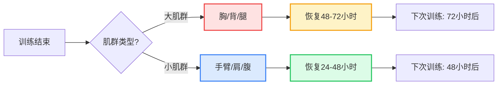

# 运动生理学基础 - 权威指南 🧬

## 目录
1. [能量系统](#能量系统)
2. [肌肉适应机制](#肌肉适应机制)
3. [心血管适应](#心血管适应)
4. [神经适应](#神经适应)
5. [超量恢复原理](#超量恢复原理)

---

## 能量系统 ⚡

### 三大供能系统概述

人体的能量代谢是一个高度复杂的生理过程，三大供能系统并非独立运作，而是根据运动强度和持续时间**动态协同工作**。理解这一原理对于制定科学训练计划至关重要。



### 能量系统的交互与转换

**关键概念**：所有三个系统在运动中同时激活，但贡献比例随时间变化。

- **前10秒**：ATP-CP系统贡献约70%
- **10-30秒**：糖酵解系统逐渐成为主导
- **30秒-2分钟**：糖酵解系统贡献达峰值
- **>2分钟**：有氧系统开始主导
- **>10分钟**：有氧系统贡献超过90%

---

#### 1. ATP-CP系统（磷酸原系统）

**生化机制详解**：

ATP（三磷酸腺苷）是肌肉收缩的直接能量来源。肌肉中ATP储量极少（约80-100g），仅能维持2-3秒的最大强度运动。因此需要CP（磷酸肌酸）快速补充ATP：

```
CP + ADP → C + ATP
（磷酸肌酸激酶催化）
```

**持续时间**：0-10秒  
**功率输出**：最高（约50-60 kcal/min）  
**应用场景**：
- 1RM最大力量测试
- 短跑起跑（100m前30米）
- 跳跃、投掷爆发力动作
- 举重抓举/挺举
- 橄榄球冲撞

**生理特点**：
- 无需氧气（无氧）
- 不产生乳酸
- CP（磷酸肌酸）储量有限，约8-10秒耗尽
- 完全恢复需要3-5分钟
- 肌酸补充可提升CP储量约10-20%

**训练建议**：
> 根据 **Harris et al. 1976** 研究，ATP-CP系统的训练应采用：
> - 高强度（>90% 1RM或最大速度）
> - 短时长（<10秒）
> - 长间歇（3-5分钟，确保CP完全恢复）
> - 每组3-5次，3-5组

**常见误区**：
- ❌ 间歇时间不足：导致CP未完全恢复，训练效果下降
- ❌ 负荷过低：无法充分刺激磷酸原系统
- ✅ 正确做法：保证高质量、充分恢复

**实践案例**：
> **短跑运动员训练计划**：
> - 30m冲刺 × 6组
> - 组间休息：4分钟（完全恢复）
> - 总训练时间：约25分钟
> - 效果：提升起跑爆发力和前30米加速能力

---

#### 2. 糖酵解系统（乳酸系统）

**生化机制详解**：

糖酵解是将葡萄糖分解为丙酮酸的过程，产生少量ATP。在缺氧状态下，丙酮酸转化为乳酸：

```
葡萄糖 → 2丙酮酸 + 2ATP（净产量）
丙酮酸 + NADH → 乳酸 + NAD+
（乳酸脱氢酶催化）
```

**持续时间**：10秒-2分钟  
**功率输出**：中高（约30-40 kcal/min）  
**应用场景**：
- 400m-800m跑
- 健美训练（8-12次/组）
- HIIT高强度间歇
- 拳击回合（3分钟）
- 游泳200m

**生理特点**：
- 无氧代谢
- 分解葡萄糖/糖原产生ATP
- 副产物：乳酸（lactate）
- 乳酸积累导致肌肉酸化（pH下降），引起疲劳
- 1分子葡萄糖产生2分子ATP（效率低但速度快）

**乳酸的真相**：
> **重要认知更新**：乳酸并非“疲劳元凶”，而是重要的能量底物！
>
> 根据 **Brooks 2020** 的“乳酸穿梭理论”（Lactate Shuttle Theory）：
> - 乳酸可以在肌肉纤维间转运
> - 乳酸可以被心脏、大脑和慢肌纤维氧化利用
> - 乳酸是葡萄糖异生的前体
> - 真正的疲劳原因是H+离子积累导致的pH下降

**乳酸阈值（LT）**：
> **Coyle et al. 1988** 发现，乳酸阈值是耐力表现的关键预测因子。当血乳酸浓度达到4 mmol/L时，即为个体乳酸阈（OBLA - Onset of Blood Lactate Accumulation）。
>
> **实际意义**：
> - LT以下的强度可以长时间维持
> - LT以上的强度会快速积累乳酸
> - 训练可以提高LT，延缓疲劳



**训练应用**：

**1. 乳酸耐受训练**：提高缓冲能力
  - 强度：85-95% HRmax
  - 时长：1-2分钟
  - 间歇：1:1或1:2
  - 示例：400m重复跑 × 8组，休息2分钟
  - 生理适应：提升碳酸氢盐缓冲系统能力

**2. 乳酸清除训练**：提高转运效率
  - 强度：70-80% HRmax（低于LT）
  - 时长：20-40分钟
  - 促进乳酸氧化利用
  - 生理适应：增加MCT1转运蛋白表达

**3. 乳酸阈值训练**：推高LT
  - 强度：刚好在LT附近（约85% HRmax）
  - 时长：20-30分钟持续或间歇
  - 示例：5km配速跑 × 3组，每组10分钟
  - 效果：提高可持续的高强度运动能力

**实践建议**：
> **针对考研期间的训练**：
> - 每周1-2次乳酸阈值训练
> - 每次20-30分钟，强度适中
> - 避免过度疲劳影响学习
> - 训练后充分恢复（睡眠+营养）

---

#### 3. 有氧氧化系统

**生化机制详解**：

有氧氧化是人体最高效的能量产生方式，通过三个阶段完全氧化底物：

1. **糖酵解**：葡萄糖 → 2丙酮酸 + 2ATP
2. **三羧酸循环（TCA）**：丙酮酸 → CO₂ + NADH + FADH₂
3. **电子传递链（ETC）**：NADH/FADH₂ + O₂ → 大量ATP

```
1分子葡萄糖 → 36-38 ATP（完全氧化）
1分子脂肪酸 → 100+ ATP（因链长而异）
```

**持续时间**：>2分钟至数小时  
**功率输出**：低至中等（约10-20 kcal/min）  
**应用场景**：
- 长跑（5km以上）
- 骑行、游泳
- 日常活动
- 长时间低强度运动

**生理特点**：
- 需要氧气
- 底物：碳水化合物、脂肪、少量蛋白质
- ATP产量最高（1分子葡萄糖→36-38 ATP）
- 不产生乳酸（完全氧化）
- 脂肪氧化需要更长时间（约20分钟后开始主导）

**最大摄氧量（VO₂max）**：

> **Bassett & Howley 2000** 综述指出，VO₂max是耐力表现的黄金标准，由以下因素决定：
>
> ```mermaid
> graph LR
>     A[VO₂max] --> B[心输出量]
>     A --> C[动静脉氧差]
>     B --> D[心率 × 每搏输出量]
>     C --> E[血红蛋白浓度]
>     C --> F[毛细血管密度]
>     C --> G[线粒体密度]
>     D --> H[心脏泵血能力]
>     E --> I[氧气运输]
>     F --> J[氧气扩散]
>     G --> K[氧气利用]
>     
>     style A fill:#dbeafe,stroke:#3b82f6,stroke-width:3px
>     style H fill:#fef3c7,stroke:#f59e0b,stroke-width:2px
>     style K fill:#dcfce7,stroke:#22c55e,stroke-width:2px
> ```

**VO₂max的正常值**：
- 久坐男性：35-40 ml/kg/min
- 久坐女性：30-35 ml/kg/min
- 优秀耐力运动员：70-85 ml/kg/min
- 世界纪录保持者：90+ ml/kg/min

**VO₂max训练方法**：

**1. 高强度间歇训练（HIIT）**
  
  > 根据 **Helgerud et al. 2007** 研究，4×4分钟间歇训练（90-95% HRmax）比持续训练更有效提升VO₂max。
  
  **方案**：
  - 工作期：4分钟 @ 90-95% HRmax
  - 休息期：3分钟 @ 70% HRmax
  - 重复：4组
  - 频率：2-3次/周
  - 预期提升：8-10% / 8周

**2. 长距离慢速训练（LSD）**
  
  - 强度：60-70% HRmax（轻松对话水平）
  - 时长：60-120分钟
  - 频率：1-2次/周
  - 目的：提高脂肪氧化能力、增加线粒体密度

**3. 节奏跑（Tempo Run）**
  
  - 强度：80-90% HRmax（乳酸阈值附近）
  - 时长：20-40分钟
  - 频率：1次/周
  - 目的：提高乳酸阈值、增强耐力

**训练周期化建议**：



**实践应用 - 针对您的训练数据**：

根据您最近的跑步记录：
- 平均配速：约5:30-6:00 min/km
- 训练频率：每周3-4次
- 训练类型：以中等强度持续跑为主

**建议优化**：
1. **增加HIIT训练**：每周1次 4×4分钟间歇
2. **保持LSD训练**：每周1次 60-90分钟慢跑
3. **加入节奏跑**：每周1次 20分钟 Tempo
4. **充分恢复**：每周至少1-2天完全休息

**预期效果**：
- 8周后 VO₂max 提升 5-8%
- 5km 成绩提升 1-2分钟
- 半马成绩提升 3-5分钟

---

## 肌肉适应机制 💪

### 肌肉肥大（Hypertrophy）

#### 三种主要机制
> **Schoenfeld 2010** 提出肌肉肥大的三大驱动因素：

**1. 机械张力（Mechanical Tension）**
- **定义**：肌肉收缩时产生的力量
- **关键因素**：
  - 负荷强度（重量）
  - 肌肉长度（全程ROM效果最佳）
  - 离心阶段（eccentric phase）张力最高
- **信号通路**：mTOR通路激活 → 蛋白质合成增加

**训练应用**：
- 使用70-85% 1RM的重量
- 强调离心控制（2-4秒下放）
- 全幅度动作（full ROM）

**实践示例 - 胸肌训练计划**：


**具体执行方案**：

| 动作 | 组数 | 次数 | 重量 | 组间休息 | 要点 |
|------|------|------|------|----------|------|
| 杠铃卧推 | 4 | 6-8 | 75-80% 1RM | 2-3分钟 | 离心3秒，全程ROM |
| 上斜哑铃卧推 | 3 | 8-10 | 中等重量 | 90秒 | 上胸刺激，30°斜板 |
| 双杠臂屈伸 | 3 | 10-12 | 自重/负重 | 60秒 | 下胸发展，身体前倾 |
| 绳索夹胸 | 3 | 12-15 | 轻重量 | 60秒 | 顶峰收缩2秒 |

**关键提示**：
- ✅ 每次训练增加2.5kg或1次重复（渐进超负荷）
- ✅ 离心阶段要慢（3-4秒），向心爆发
- ✅ 动作幅度要完整，不要半程
- ❌ 不要弹杠（利用反弹借力）
- ❌ 不要耸肩（保持肩胛骨后缩下沉）

---

**2. 代谢压力（Metabolic Stress）**
- **定义**：代谢产物积累引起的细胞肿胀和激素反应
- **表现**：
  - "泵感"（pump）
  - 乳酸、氢离子、无机磷酸盐积累
  - 细胞肿胀（cell swelling）
- **机制**：
  - 激活卫星细胞（satellite cells）
  - 增加生长激素（GH）分泌
  - 提高蛋白质合成速率

**训练应用**：
- 高次数（12-20+次/组）
- 短间歇（30-60秒）
- 血流限制训练（BFR）
- 递减组（drop sets）、超级组

**实践示例 - 手臂超级组训练**：



**执行方案**：

| 超级组 | 动作1 | 动作2 | 组数 | 次数 | 间歇 |
|--------|-------|-------|------|------|------|
| 超级组1 | 哑铃弯举 | 绳索下压 | 3 | 12+12 | 60秒 |
| 超级组2 | 锤式弯举 | 过头臂屈伸 | 3 | 15+15 | 45秒 |
| 超级组3 | 集中弯举 | 俯身臂屈伸 | 2 | 20+20 | 30秒 |

**技巧要点**：
- 🔥 使用递减组：最后一组力竭后立即减重20%继续
- 🔥 控制离心：3秒下放，感受肌肉拉伸
- 🔥 顶峰收缩：在收缩位置停留2秒
- ⚡ 组间休息不要超过60秒
- 💪 训练后30分钟内补充蛋白质

**饮食建议 - 肌肉合成窗口期**：
> **训练后30-60分钟**是蛋白质合成的黄金窗口！
>
> **推荐餐单**：
> - 乳清蛋白粉 30g + 香蕉 1根
> - 或：鸡胸肉 150g + 白米饭 200g
> - 或：希腊酸奶 200g + 蜂蜜 1勺 + 坚果 30g
>
> **关键营养素**：
> - 蛋白质：20-40g（含2-3g亮氨酸）
> - 碳水化合物：0.5-0.7g/kg体重
> - 水分：500ml

---

**3. 肌肉损伤（Muscle Damage）**
- **定义**：微细肌纤维撕裂引发的炎症反应
- **表现**：
  - 延迟性肌肉酸痛（DOMS）
  - 血清肌酸激酶（CK）升高
  - 力量暂时下降
- **修复过程**：
  - 炎症细胞清除受损组织
  - 卫星细胞增殖分化
  - 肌纤维修复并增粗（超量补偿）

**注意**：
> **Paulsen et al. 2012** 指出，过度的肌肉损伤会干扰训练频率，反而不利于长期进步。适度的DOMS是正常的，但不应每次训练都追求极度酸痛。

**实践示例 - DOMS管理方案**：



**DOMS恢复时间表**：

| 时间 | 措施 | 具体做法 | 效果 |
|------|------|----------|------|
| 训练后即刻 | 冷敷 | 冰袋敷10-15分钟 | 减少炎症反应 |
| 训练后24小时 | 轻度活动 | 散步、慢骑行20分钟 | 促进血液循环 |
| 训练后48小时 | 泡沫轴 | 每块肌肉滚动2-3分钟 | 缓解肌肉紧张 |
| 训练后72小时 | 拉伸 | 静态拉伸每动作30秒×3组 | 恢复灵活性 |

**恢复饮食建议**：
> **抗炎食物推荐**：
> - 欧米伽-3脂肪酸：三文鱼、亚麻籽、核桃
> - 抗氧化剂：蓝莓、樱桃、绿茶
> - 姜黄素：咖喱、姜黄粉（抗炎效果显著）
>
> **每日抗炎餐单示例**：
> - 早餐：燕麦粥 + 蓝莓 + 核桃 + 蜂蜜
> - 午餐：三文鱼 150g + 糙米 + 西兰花
> - 晚餐：鸡胸肉 + 红薯 + 菠菜沙拉
> - 加餐：希腊酸奶 + 樱桃

**睡眠建议**：
> - **睡眠时长**：7-9小时（肌肉修复主要在深度睡眠期）
> - **睡前习惯**：
>   - 避免咖啡因（睡前6小时）
>   - 降低屏幕亮度（睡前1小时）
>   - 室温保持18-20°C
> - **睡眠姿势**：侧卧或仰卧，避免压迫训练过的肌肉群

---

### 力量增长（Strength Gains）

#### 早期阶段（0-8周）：神经适应为主
> **Moritani & deVries 1979** 经典研究发现：
> - 前8周力量增长主要来自**神经适应**
> - 肌肉横截面积尚未显著增加
> - 力量提升 20-30% 而无明显肌肉肥大

**神经适应表现**：
- 运动单位募集增加
- 发力速率提高
- 肌间协调性改善
- 抗肌抑制增强

**实践示例 - 新手力量训练计划（前8周）**：



**具体训练计划**：

**第1-4周（学习阶段）**：

| 训练日 | 动作 | 组数 | 次数 | 重量 | 目标 |
|--------|------|------|------|------|------|
| 周一 | 杠铃深蹲 | 3 | 8 | 轻重量 | 学习动作 |
| 周一 | 杠铃卧推 | 3 | 8 | 轻重量 | 建立模式 |
| 周三 | 硬拉 | 3 | 5 | 轻重量 | 髋关节铰链 |
| 周三 | 引体向上 | 3 | 6-8 | 自重/辅助 | 背部激活 |
| 周五 | 深蹲 | 3 | 8 | +2.5kg | 渐进超负荷 |
| 周五 | 卧推 | 3 | 8 | +2.5kg | 力量提升 |

**第5-8周（强化阶段）**：

| 训练日 | 动作 | 组数 | 次数 | 重量 | 进阶 |
|--------|------|------|------|------|------|
| 周一 | 杠铃深蹲 | 4 | 6 | +5kg/周 | 增加负荷 |
| 周一 | 杠铃卧推 | 4 | 6 | +5kg/周 | 提高强度 |
| 周三 | 硬拉 | 4 | 5 | +5kg/周 | 强化后链 |
| 周三 | 杠铃划船 | 4 | 8 | 中等重量 | 平衡发展 |
| 周五 | 深蹲 | 4 | 6 | +5kg/周 | 测试极限 |
| 周五 | 卧推 | 4 | 6 | +5kg/周 | 冲刺重量 |

**关键要点**：
- ✅ 动作质量优先于重量
- ✅ 每次训练增加2.5-5kg（新手福利期）
- ✅ 组间休息2-3分钟（充分恢复）
- ✅ 记录训练日志（追踪进步）
- ❌ 不要盲目追求大重量
- ❌ 不要跳过热身（5-10分钟动态拉伸）

---

#### 中后期阶段（8周+）：肌肉肥大主导
> - 肌肉横截面积变化不明显
> - 力量增长可达20-30%，而肌肉仅增长2-5%

**神经适应包括**：
1. **运动单位募集增加**
   - 激活更多肌纤维
   - 特别是高阈值的II型纤维

2. **发放频率提高**
   - 神经冲动频率加快
   - 产生更强收缩力

3. **同步化改善**
   - 多个运动单位同时激活
   - 合力更大

4. **拮抗肌抑制**
   - 减少对抗肌的阻力
   - 提高净输出力

---

#### 后期阶段（8周+）：肌肉肥大主导
- 神经适应趋于平台
- 肌肉横截面积持续增长
- 力量与肌肉量呈线性相关（r=0.7-0.8）

---

## 心血管适应 ❤️

### 心脏适应

#### 运动员心脏(Athlete's Heart)
> **Pluim et al. 2000** 综述指出,长期耐力训练导致:

**1. 左心室肥大(Eccentric Hypertrophy)**
- 心室腔扩大
- 室壁适度增厚
- 每搏输出量(SV)增加

**2. 静息心率降低**
- 迷走神经张力增强
- 优秀耐力运动员可达40-50 bpm
- 称为"运动员心动过缓"

**3. 最大心输出量提升**
- CO = HR × SV
- VO₂max提升的主要贡献者(占70-80%)

**实践示例 - 心率区间训练方案**:



**具体执行方案**:

| 区间 | 心率范围 | 配速参考 | 训练目的 | 每周占比 |
|------|---------|---------|---------|----------|
| Z1 | 60-70% HRmax | 轻松对话 | 恢复、脂肪氧化 | 20-30% |
| Z2 | 70-80% HRmax | 可短句交流 | 有氧基础 | 50-60% |
| Z3 | 80-90% HRmax | 勉强说话 | 乳酸阈值 | 10-15% |
| Z4 | 90-95% HRmax | 无法说话 | VO₂max | 5-10% |
| Z5 | 95-100% HRmax | 全力冲刺 | 神经肌肉功率 | <5% |

**HRmax计算方法**:
- **传统公式**: 220 - 年龄
- **更准确**: 208 - (0.7 × 年龄)
- **实测法**: 跑步机递增负荷测试至力竭

**您的个性化心率区间**(假设年龄22岁):
- HRmax = 208 - (0.7 × 22) = 193 bpm
- Z1: 116-135 bpm (恢复跑)
- Z2: 135-154 bpm (轻松跑,主要训练区)
- Z3: 154-174 bpm (节奏跑)
- Z4: 174-183 bpm (间歇跑)
- Z5: 183-193 bpm (冲刺)

**训练建议**:
> ✅ **Zone 2训练**(最容易被忽视但最重要!)
> - 强度: 可以轻松交谈
> - 时长: 60-90分钟
> - 频率: 每周2-3次
> - 效果: 提高线粒体密度、毛细血管数量、脂肪氧化能力
> - **关键**: 严格控制心率,不要跑太快!

---

### 血管适应

**1. 毛细血管密度增加**
> **Andersen & Henriksson 1977** 发现,耐力训练后肌肉毛细血管数量增加40-50%。
- 缩短氧气扩散距离
- 提高营养物质输送效率

**2. 动脉弹性改善**
- 降低血压
- 减少心血管疾病风险

**3. 血流重新分配**
- 运动时优先流向工作肌肉
- 内脏器官血流减少

**实践建议 - 促进血管适应的训练**:

**1. 长距离慢跑(LSD)**
- 强度: Z2 (70-80% HRmax)
- 时长: 90-120分钟
- 频率: 每周1次
- 生理适应: 毛细血管增生、线粒体生物合成

**2. 法特莱克(Fartlek)**
- 模式: 快慢交替,无固定结构
- 示例: 2分钟快 + 2分钟慢 × 10组
- 好处: 模拟比赛中的变速,提高血管弹性

**3. 高温环境训练**(谨慎使用)
- 桑拿浴: 训练后15-20分钟 @ 80-90°C
- 研究: **Scoon et al. 2007** 发现,桑拿浴可增加血浆体积7%
- 注意: 充分补水,避免脱水

---

## 神经适应 🧠

### 运动学习三阶段
> **Fitts & Posner 1967** 提出的经典模型:

**1. 认知阶段(Cognitive Stage)**
- 初学者理解动作要领
- 注意力高度集中
- 表现不稳定,错误多
- 需要外部反馈(教练指导)

**2. 关联阶段(Associative Stage)**
- 动作逐渐流畅
- 错误减少
- 开始形成内部反馈
- 可以自我纠正

**3. 自主阶段(Autonomous Stage)**
- 动作自动化
- 无需有意识控制
- 可以同时执行其他任务
- 表现稳定且高效

**训练启示**:
> 新动作需要100-300次重复才能进入自主阶段。初期应:
> - 轻重量练习技术
> - 录像分析动作
> - 寻求专业反馈
> - 避免过早加重

**实践示例 - 深蹲技术学习计划(4周)**:


**每周训练安排**:

| 周次 | 重量 | 组数×次数 | 重点 | 辅助练习 |
|------|------|----------|------|----------|
| 第1周 | 空杆/轻重量 | 5×8 | 动作模式 | 箱式深蹲、高脚杯深蹲 |
| 第2周 | 50% 1RM | 4×6 | 深度控制 | 暂停深蹲(底部停2秒) |
| 第3周 | 70% 1RM | 4×5 | 速度爆发 | 跳跃深蹲(轻重量) |
| 第4周 | 80%+ 1RM | 3×3 | 力量测试 | 前蹲(强化股四头肌) |

**关键技术检查点**:
- ✅ 膝盖方向与脚尖一致
- ✅ 脊柱保持中立位
- ✅ 下蹲至大腿平行或更低
- ✅ 脚跟始终贴地
- ❌ 避免膝盖内扣
- ❌ 避免弯腰弓背

**视频分析要点**:
> 📹 从侧面和正面录制自己的深蹲视频
> - 侧面: 检查躯干角度、下蹲深度
> - 正面: 检查膝盖是否内扣
> - 对比职业运动员视频,找出差距

---

### 本体感觉(Proprioception)

**定义**: 身体感知自身位置和运动的能力

**感受器**:
1. **肌梭(Muscle Spindles)**
   - 检测肌肉长度变化
   - 触发牵张反射(stretch reflex)

2. **高尔基腱器官(GTO)**
   - 检测肌肉张力
   - 防止过度拉伸(逆牵张反射)

3. **关节感受器**
   - 检测关节角度和压力

**训练应用**:
- 不稳定表面训练(平衡垫、波速球)
- 单侧训练(单腿深蹲、单臂推举)
- 闭眼练习(增强本体感觉依赖)

**实践示例 - 本体感觉训练计划**:

**适合人群**: 
- 新手: 预防受伤,建立正确的动作感知
- 康复期: 恢复关节稳定性
- 高级训练者: 突破平台期

**训练方案**(每周2次,放在力量训练后):

| 练习 | 组数 | 时间/次数 | 难度进阶 |
|------|------|----------|----------|
| 单腿站立 | 3 | 30秒/侧 | 闭眼 → 不稳定表面 |
| 波速球深蹲 | 3 | 10次 | 双脚 → 单脚 |
| 单腿罗马尼亚硬拉 | 3 | 8次/侧 | 徒手 → 哑铃 |
| 平板支撑抬腿 | 3 | 10次/侧 | 标准 → 加弹力带 |
| 瑜伽球俯卧撑 | 3 | 8次 | 半程 → 全程 |

**预期效果**:
- 4周后: 平衡能力提升30-50%
- 8周后: 核心稳定性显著改善
- 长期: 降低受伤风险,提高运动表现

**注意事项**:
> ⚠️ 本体感觉训练应在疲劳度较低时进行
> - 放在主训练之后
> - 确保场地安全(旁边有支撑物)
> - 循序渐进,不要急于求成

---

## 超量恢复原理 📈

### General Adaptation Syndrome (GAS)
> **Hans Selye 1956** 提出的应激适应理论：

**三个阶段**：

**1. 警戒期（Alarm Phase）**
- 训练刺激引发疲劳
- 表现暂时下降
- 持续时间：数小时至2天

**2. 抵抗期（Resistance Phase）**
- 身体启动修复机制
- 蛋白质合成增加
- 能量储备补充
- 持续时间：24-72小时

**3. 超量恢复期（Supercompensation Phase）**
- 身体适应超过原有水平
- 表现提升
- **最佳训练窗口**
- 持续时间：短暂（12-24小时）

**4. 消退期（Involution Phase）**
- 如无新刺激，适应逐渐消失
- 回到基线水平
- "用进废退"

---

### 训练时机把握

> **Banister et al. 1975** 的** Fitness-Fatigue 模型**指出：

```
表现 =  fitness（体能） - fatigue（疲劳）

训练后：
- 疲劳迅速上升，然后快速下降
- 体能缓慢上升，持续时间长

最佳训练时机：
当疲劳降至低点，体能处于高点时
```

**实际应用**：
- **高频训练**（每周4-6次）：每次训练量适中，依靠累积效应
- **低频训练**（每周2-3次）：每次训练量大，需要更长恢复
- **周期化安排**：硬训练周后接减负周

**实践示例 - 不同肌群的恢复时间表**:



**具体恢复时间建议**:

| 肌群 | 训练强度 | 恢复时间 | 下次训练时机 |
|------|---------|---------|-------------|
| 腿部(深蹲/硬拉) | 高强度(>80% 1RM) | 72-96小时 | 4天后 |
| 腿部(中等强度) | 中等(60-80% 1RM) | 48-72小时 | 3天后 |
| 胸部(卧推) | 高强度 | 72小时 | 3天后 |
| 背部(引体/划船) | 高强度 | 48-72小时 | 3天后 |
| 肩部(推举) | 中等 | 48小时 | 2天后 |
| 手臂(弯举/臂屈伸) | 任何强度 | 24-48小时 | 2天后 |
| 腹肌 | 任何强度 | 24小时 | 每天可练 |

**实践工具 - 如何判断是否该训练**:

**1. 主观指标**:
- ✅ 精力充沛,期待训练
- ✅ 睡眠质量好
- ✅ 无明显肌肉酸痛
- ❌ 持续疲劳,不想训练
- ❌ 静息心率比平时高5-10 bpm
- ❌ 情绪烦躁,易怒

**2. 客观指标**:
- **静息心率(RHR)**: 早晨醒来测量,如连续3天升高>5bpm,需减量
- **心率变异性(HRV)**: 使用智能手表监测,下降表示恢复不足
- **握力测试**: 如握力下降>10%,表明中枢神经系统疲劳

**3. ACWR(急性:慢性 workload 比率)**:
```
ACWR = 本周训练量 ÷ 过去4周平均训练量

理想范围: 0.8-1.3
- <0.8: 训练量不足,可能退步
- 0.8-1.3: 最佳区间,稳步进步
- 1.3-1.5: 高风险区,谨慎增加
- >1.5: 过度训练风险极高,必须减量
```

**您的ACWR计算示例**:
```
假设过去4周平均每周训练量: 500吨
本周训练量: 574吨

ACWR = 574 ÷ 500 = 1.15 ✅ 处于理想区间!

如果下周突然增加到750吨:
ACWR = 750 ÷ 500 = 1.5 ⚠️ 进入高风险区!
建议: 控制在650吨以内(ACWR=1.3)
```

**减负周(Deload Week)安排**:

> **何时需要减负**:
> - 每4-6周规律安排1次
> - 连续2周表现停滞或下降
> - ACWR > 1.5
> - 静息心率持续升高
> - 睡眠质量下降

**减负方式**:

**1. 容量减负(推荐)**
- 组数减半: 4组 → 2组
- 动作数量减少: 6个动作 → 3-4个
- 强度保持: 重量不变
- 目的: 维持神经适应,让身体恢复

**2. 强度减负**
- 重量降至60-70% 1RM
- 组数保持
- 更注重技术和速度
- 目的: 主动恢复,促进血液循环

**3. 完全休息**
- 停止力量训练3-7天
- 可进行轻度有氧(散步、瑜伽)
- 专注于睡眠和营养
- 目的: 彻底恢复,适用于极度疲劳

**减负周示例计划**:
```
正常周:
- 深蹲 4×6 @ 100kg
- 卧推 4×6 @ 80kg
- 硬拉 3×5 @ 120kg
- 总组数: 11组

减负周(容量减半):
- 深蹲 2×6 @ 100kg
- 卧推 2×6 @ 80kg
- 硬拉 2×5 @ 120kg
- 总组数: 6组

✅ 强度保持不变,但总工作量减少45%
✅ 下周恢复正常训练量,通常会感觉更强!
```

**预期效果**:
- 减负周后1-2周: 力量提升5-10%
- 心理状态: 重新获得训练热情
- 长期: 避免平台期和过度训练

---

## 参考文献 📚

1. Harris RC, et al. (1976). Elevation of creatine in resting and exercised muscle of normal subjects by creatine supplementation. *Clinical Science and Molecular Medicine*, 51(3), 301-304.

2. Coyle EF, et al. (1988). Integration of the physiological factors determining endurance performance ability. *Exercise and Sport Sciences Reviews*, 16, 25-63.

3. Bassett DR Jr, Howley ET. (2000). Limiting factors for maximum oxygen uptake and determinants of endurance performance. *Medicine & Science in Sports & Exercise*, 32(1), 70-84.

4. Helgerud J, et al. (2007). Aerobic high-intensity intervals improve VO₂max more than moderate training. *Medicine & Science in Sports & Exercise*, 39(4), 665-671.

5. Schoenfeld BJ. (2010). The mechanisms of muscle hypertrophy and their application to resistance training. *Journal of Strength and Conditioning Research*, 24(10), 2857-2872.

6. Paulsen G, et al. (2012). Satellite cells and myonuclei are not affected by exercise-induced damage or inflammation in humans. *Journal of Applied Physiology*, 112(1), 101-109.

7. Moritani T, deVries HA. (1979). Potential for gross muscle hypertrophy in older men. *Journal of Gerontology*, 34(5), 672-676.

8. Pluim BM, et al. (2000). The athlete's heart: A meta-analysis of cardiac structure and function. *Circulation*, 101(3), 336-344.

9. Andersen P, Henriksson J. (1977). Capillary supply of the quadriceps femoris muscle of man: adaptive response to exercise. *Journal of Physiology*, 270(3), 677-690.

10. Fitts PM, Posner MI. (1967). Human Performance. Brooks/Cole.

11. Selye H. (1956). The Stress of Life. McGraw-Hill.

12. Banister EW, et al. (1975). Modeling human performance in running. *Journal of Applied Physiology*, 39(6), 1049-1055.

---

## 实践应用总结 ✅

### 给您的个性化建议

基于您的训练数据（279次跑步 + 1605组力量）：

**1. 能量系统平衡**
- ✅ 您的轻松跑（5-6km）主要训练有氧系统
- ✅ 力量训练（8-12次/组）兼顾机械张力和代谢压力
- 💡 建议：偶尔加入HIIT（如4×4分钟间歇），进一步提升VO₂max

**2. 肌肉肥大优化**
- ✅ 当前容量（~574吨/月）处于有效范围
- 💡 建议：尝试周期性调整
  - 肥大期：12-15次/组，短间歇
  - 力量期：4-6次/组，长间歇
  - 每期4-6周

**3. 神经适应利用**
- ✅ 全身训练模式有利于动作技能巩固
- 💡 建议：新动作先用轻重量练习2-3周，再逐步加重

**4. 超量恢复把握**
- ✅ 当前频率（每周3次力量）合理
- 💡 建议：观察ACWR指标，保持在0.8-1.3区间
- 💡 每4-6周安排1周减负（容量减半）

---

**这份指南涵盖了运动生理学的核心知识点，为您的训练提供坚实的科学基础！** 🎓💪
