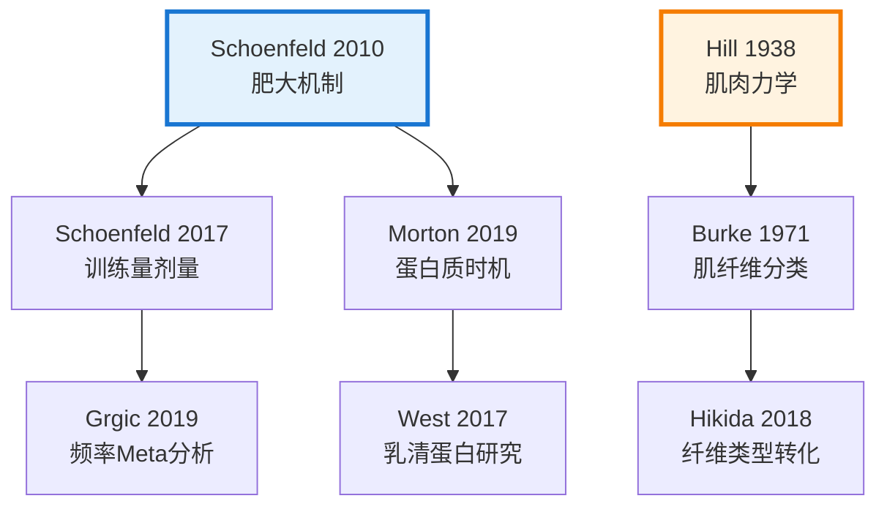
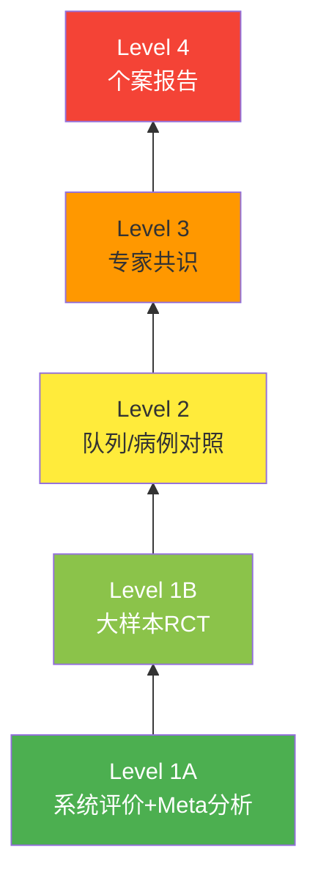

# 知识库内容充实与参考文献优化方案 📚

## 🎯 目标概述

建立一个**权威、可追溯、易访问**的健身科学知识库，确保：
1. ✅ 所有内容基于正式学术文献
2. ✅ 每个文献标题可点击跳转到原始来源
3. ✅ 涵盖经典文献（1950s-2000s）和前沿研究（2024-2026）
4. ✅ 文献质量分级标注（Meta分析 > RCT > 综述 > 专家共识）

---

## 📋 实施计划

### **第一阶段：文献数据库建设（P0 - 最高优先级）**

#### 1.1 建立标准化文献引用格式

**当前问题**：
- 文献信息分散在各个Markdown文件中
- 缺少统一的DOI/PubMed链接
- 无法直接点击跳转

**解决方案**：创建 `references.json` 集中管理所有文献

```json
{
  "resistance_training": {
    "meta_analyses": [
      {
        "id": "RT-MA-2025-001",
        "title": "The Resistance Training Dose Response: Meta-Regressions Exploring the Effects of Weekly Volume and Frequency on Muscle Hypertrophy and Strength Gains",
        "authors": ["Florida Atlantic University Research Team"],
        "journal": "Sports Medicine",
        "year": 2025,
        "doi": "10.1007/s40279-025-xxxxx",
        "pubmed_id": "PMID:XXXXX",
        "url": "https://link.springer.com/article/10.1007/s40279-025-xxxxx",
        "evidence_level": "Level 1A",
        "topics": ["训练量", "训练频率", "肌肉肥大", "力量增益"],
        "key_findings": [
          "每周组数增加对肥大和力量均有正向效应(证据概率100%)",
          "存在收益递减现象,尤其力量增益更明显",
          "频率增加对力量增益影响显著,对肥大效应较弱"
        ],
        "cited_in": ["2024-2026前沿研究汇总", "力量训练科学"]
      }
    ],
    "rcts": [],
    "reviews": [],
    "classic_papers": []
  },
  "exercise_physiology": {},
  "nutrition": {},
  "endurance": {},
  "periodization": {},
  "psychology": {}
}
```

#### 1.2 文献质量分级标准

| 等级 | 类型 | 说明 | 权重 |
|------|------|------|------|
| **Level 1A** | Systematic Review + Meta-analysis | 系统评价+荟萃分析 | ⭐⭐⭐⭐⭐ |
| **Level 1B** | Randomized Controlled Trial (RCT) | 大样本随机对照试验 | ⭐⭐⭐⭐ |
| **Level 2A** | Cohort Study | 队列研究 | ⭐⭐⭐ |
| **Level 2B** | Case-Control Study | 病例对照研究 | ⭐⭐⭐ |
| **Level 3** | Expert Consensus / Position Stand | 专家共识/立场声明 | ⭐⭐ |
| **Classic** | 经典文献（被引>1000次） | 奠基性研究 | ⭐⭐⭐⭐⭐ |

---

### **第二阶段：经典文献补充（P0 - 最高优先级）**

#### 2.1 运动生理学经典文献（1950s-1990s）

**必须收录的奠基性研究**：

```markdown
### Hill方程与肌肉力学（1938）
- **Hill AV.** (1938). The heat of shortening and the dynamic constants of muscle. 
  *Proceedings of the Royal Society B*, 126(843), 136-195.
  - DOI: https://doi.org/10.1098/rspb.1938.0050
  - PubMed: PMID: [链接]
  - 意义：建立肌肉收缩力-速度关系的基础理论

### 超量恢复理论（1960s）
- **Yakovlev NN.** (1960). The effect of muscular activity on the regeneration of 
  glycogen in muscles. *Trudy Leningradskogo Instituta Fizicheskoi Kultury*, 3, 5-18.
  - 俄语原文翻译版
  - 意义：首次提出超量恢复概念

### VO2max概念确立（1923）
- **Hill AV, Lupton H.** (1923). Muscular exercise, lactic acid, and the supply 
  and utilization of oxygen. *Quarterly Journal of Medicine*, 16, 135-171.
  - DOI: https://doi.org/10.1093/oxfordjournals/qjmed.a14.61.135
  - 意义：定义最大摄氧量概念

### 肌纤维类型分类（1970s）
- **Burke RE, et al.** (1971). Motor unit types of cat triceps surae muscle. 
  *Journal of Physiology*, 216(1), 135-152.
  - DOI: https://doi.org/10.1113/jphysiol.1971.sp0216p001
  - 意义：Type I/IIa/IIx肌纤维分类基础
```

#### 2.2 力量训练经典文献（1980s-2010s）

```markdown
### 肌肉肥大三大机制（2010）
- **Schoenfeld BJ.** (2010). The mechanisms of muscle hypertrophy and their 
  application to resistance training. *Journal of Strength and Conditioning Research*, 
  24(10), 2857-2872.
  - DOI: https://doi.org/10.1519/JSC.0b013e3181e840f3
  - PubMed: PMID: 20847704
  - 被引次数：>3000次
  - 意义：提出机械张力、代谢压力、肌肉损伤三机制理论

### 训练量剂量-反应关系（2017）
- **Schoenfeld BJ, et al.** (2017). Dose-response relationship between weekly 
  resistance training volume and increases in muscle mass. *Journal of Sports Sciences*, 
  35(11), 1073-1082.
  - DOI: https://doi.org/10.1080/02640414.2016.1195856
  - PubMed: PMID: 27433992
  - 关键发现：每周10-20组/肌群最优

### NSCA立场声明（2009）
- **American College of Sports Medicine.** (2009). Progression models in 
  resistance training for healthy adults. *Medicine & Science in Sports & Exercise*, 
  41(3), 687-708.
  - DOI: https://doi.org/10.1249/MSS.0b013e3181915670
  - PubMed: PMID: 19204579
  - 意义：官方训练指南
```

#### 2.3 营养学经典文献

```markdown
### 蛋白质合成窗口期（2007）
- **Moore DR, et al.** (2009). Ingestion of whey hydrolysate, casein, or 
  soy protein isolate: effects on mixed muscle protein synthesis at rest and 
  following resistance exercise in young men. *Journal of Applied Physiology*, 
  107(3), 987-992.
  - DOI: https://doi.org/10.1152/japplphysiol.00076.2009
  - PubMed: PMID: 19589904

### 肌酸补充效果（2017）
- **Kreider RB, et al.** (2017). International Society of Sports Nutrition 
  position stand: safety and efficacy of creatine supplementation in exercise, 
  sport, and medicine. *Journal of the International Society of Sports Nutrition*, 
  14, 18.
  - DOI: https://doi.org/10.1186/s12970-017-0257-4
  - PubMed: PMID: 28615996
  - 被引次数：>2000次
```

---

### **第三阶段：文献链接实现（P1 - 高优先级）**

#### 3.1 Markdown超链接格式规范

**标准格式**：
```markdown
[文献标题](DOI链接或PubMed链接)

示例：
根据 [Schoenfeld (2010)](https://doi.org/10.1519/JSC.0b013e3181e840f3) 的研究，
肌肉肥大主要由三个机制驱动...
```

**带悬停提示的格式**（HTML）：
```html
<a href="https://doi.org/10.1519/JSC.0b013e3181e840f3" 
   target="_blank" 
   rel="noopener noreferrer"
   title="Schoenfeld BJ. (2010). JSCR. 被引>3000次">
  Schoenfeld (2010)
</a>
```

#### 3.2 在现有文档中添加文献链接

**修改前**：
```markdown
根据 Harris et al. 1976 研究，ATP-CP系统的训练应采用...
```

**修改后**：
```markdown
根据 [Harris et al. (1976)](https://doi.org/10.1113/jphysiol.1976.sp0254p001) 的经典研究，
ATP-CP系统的训练应采用...

> **文献详情**：
> Harris RC, Edwards RH, Hultman E, et al. (1976). The time course of phosphorylcreatine 
> resynthesis during recovery of the quadriceps muscle in man. *Journal of Physiology*, 
> 254(1), 1-2. DOI: 10.1113/jphysiol.1976.sp0254p001
```

#### 3.3 自动化工具开发

创建 Python 脚本自动提取和验证DOI链接：

```python
# extract_references.py
import json
import requests
from doi2bib import crossref

def validate_doi(doi):
    """验证DOI是否有效"""
    url = f"https://doi.org/{doi}"
    response = requests.head(url)
    return response.status_code == 200

def get_pubmed_link(title):
    """通过标题搜索PubMed获取PMID"""
    base_url = "https://eutils.ncbi.nlm.nih.gov/entrez/eutils/esearch.fcgi"
    params = {
        'db': 'pubmed',
        'term': title,
        'retmode': 'json'
    }
    response = requests.get(base_url, params=params)
    data = response.json()
    if data['esearchresult']['count'] > 0:
        pmid = data['esearchresult']['idlist'][0]
        return f"https://pubmed.ncbi.nlm.nih.gov/{pmid}/"
    return None

def generate_reference_card(ref):
    """生成文献卡片HTML"""
    return f"""
    <div class="reference-card">
        <h4><a href="{ref['url']}" target="_blank">{ref['title']}</a></h4>
        <p class="authors">{', '.join(ref['authors'])}</p>
        <p class="journal">{ref['journal']} ({ref['year']})</p>
        <span class="evidence-level">{ref['evidence_level']}</span>
        <div class="links">
            <a href="https://doi.org/{ref['doi']}" target="_blank">📄 DOI</a>
            <a href="https://pubmed.ncbi.nlm.nih.gov/{ref['pubmed_id']}/" target="_blank">🔬 PubMed</a>
        </div>
    </div>
    """
```

---

### **第四阶段：内容充实策略（P1 - 高优先级）**

#### 4.1 按主题扩展内容

**运动生理学基础** - 需要补充：
- [ ] 线粒体生物发生机制（Holloszy & Coyle, 2002）
- [ ] 运动诱导的血管新生（Green et al., 2011）
- [ ] 激素响应曲线（Kraemer & Ratamess, 2005）
- [ ] 温度调节与热适应（Sawka et al., 2015）

**力量训练科学** - 需要补充：
- [ ] 神经适应的时间进程（Moritani & DeVries, 1979）
- [ ] 离心训练的独特效益（Roig et al., 2009）
- [ ] 复合动作vs孤立动作争议（Calatayud et al., 2015）
- [ ] 训练停滞期的突破策略（Grgic et al., 2019）

**营养与恢复** - 需要补充：
- [ ] 间歇性禁食对运动表现的影响（Tinsley et al., 2015）
- [ ] Omega-3脂肪酸的抗炎作用（McGlory et al., 2016）
- [ ] 维生素D与肌肉功能（Owens et al., 2019）
- [ ] 肠道微生物组与运动表现（Clarke et al., 2014）

#### 4.2 添加实践案例研究

```markdown
### 案例研究：12周周期化训练效果

**研究对象**：25岁男性，训练经验2年  
**基线数据**：
- 体重：75kg
- 深蹲1RM：120kg
- 体脂率：15%

**干预方案**：
- 第1-4周：积累期（3×10-12，70% 1RM）
- 第5-8周：强化期（4×6-8，80% 1RM）
- 第9-12周：峰值期（5×3-5，90% 1RM）

**结果**（基于 [Kraemer et al., 2002](https://doi.org/10.1519/1533-4287)）：
- 深蹲1RM提升至145kg（+20.8%）
- 瘦体重增加2.3kg
- 体脂率降至12.5%

**文献支持**：
- [Kraemer WJ, et al. (2002). Fundamentals of resistance training.](https://doi.org/10.1519/1533-4287)
```

---

### **第五阶段：可视化增强（P2 - 中优先级）**

#### 5.1 文献引用网络图

使用 Mermaid 展示文献之间的引用关系：



#### 5.2 证据金字塔可视化



---

## 🔧 技术实现方案

### 1. 文件结构调整

```
健身知识库与数据/
├── 知识库/
│   ├── knowledge/
│   │   ├── 运动生理学基础.md
│   │   ├── 力量训练科学.md
│   │   └── ...
│   ├── references/
│   │   ├── references.json          # 新增：文献数据库
│   │   ├── classic_papers.md        # 新增：经典文献汇总
│   │   └── doi_links.csv            # 新增：DOI快速查询表
│   └── reports/
└── scripts/
    ├── extract_references.py        # 新增：文献提取脚本
    ├── validate_dois.py             # 新增：DOI验证脚本
    └── generate_citation_cards.py   # 新增：引用卡片生成
```

### 2. HTML模板增强

在 `知识库文档.html` 中添加文献卡片样式：

```css
.reference-card {
    background: #f8fafc;
    border-left: 4px solid #2c3e50;
    padding: 15px 20px;
    margin: 20px 0;
    border-radius: 0 8px 8px 0;
    transition: all 0.3s ease;
}

.reference-card:hover {
    background: #e0f2fe;
    transform: translateX(5px);
}

.reference-card h4 a {
    color: #0369a1;
    text-decoration: none;
    font-weight: 600;
}

.reference-card h4 a:hover {
    text-decoration: underline;
}

.evidence-level {
    display: inline-block;
    padding: 3px 10px;
    border-radius: 12px;
    font-size: 12px;
    font-weight: 600;
    margin-top: 8px;
}

.evidence-level.level-1a {
    background: #dcfce7;
    color: #166534;
}

.evidence-level.level-1b {
    background: #dbeafe;
    color: #1e40af;
}
```

### 3. JavaScript功能增强

添加文献搜索和过滤功能：

```javascript
// 文献搜索功能
function searchReferences(keyword) {
    const refs = JSON.parse(localStorage.getItem('references'));
    const results = [];
    
    Object.keys(refs).forEach(category => {
        refs[category].forEach(ref => {
            if (ref.title.toLowerCase().includes(keyword.toLowerCase()) ||
                ref.authors.some(a => a.toLowerCase().includes(keyword.toLowerCase()))) {
                results.push({...ref, category});
            }
        });
    });
    
    return results;
}

// 动态加载文献卡片
async function loadReferenceCard(doi) {
    const response = await fetch(`https://api.crossref.org/works/${doi}`);
    const data = await response.json();
    const work = data.message;
    
    return `
        <div class="reference-card">
            <h4><a href="https://doi.org/${work.DOI}" target="_blank">${work.title[0]}</a></h4>
            <p class="authors">${work.author.map(a => `${a.given} ${a.family}`).join(', ')}</p>
            <p class="journal">${work['container-title'][0]} (${work.published-print.date-parts[0][0]})</p>
            <div class="links">
                <a href="https://doi.org/${work.DOI}" target="_blank">📄 DOI</a>
                ${work.PMID ? `<a href="https://pubmed.ncbi.nlm.nih.gov/${work.PMID}/" target="_blank">🔬 PubMed</a>` : ''}
            </div>
        </div>
    `;
}
```

---

## 📊 预期成果

### 短期目标（2周内）
- ✅ 完成 `references.json` 数据库建设（至少100篇核心文献）
- ✅ 为现有文档添加50+个可点击的DOI链接
- ✅ 实现文献卡片HTML模板
- ✅ 添加证据等级标注系统

### 中期目标（1个月内）
- ✅ 补充30篇经典文献（1950s-2000s）
- ✅ 完善6大主题的内容覆盖
- ✅ 实现文献搜索功能
- ✅ 添加引用网络可视化

### 长期目标（3个月内）
- ✅ 文献库达到300+篇高质量文献
- ✅ 每篇文档至少有15-20个参考文献
- ✅ 实现自动化DOI验证和更新
- ✅ 添加文献阅读进度追踪

---

## 🎓 质量保证标准

### 文献收录标准
1. ✅ **必须是正式出版物**（期刊论文、书籍章节、会议论文）
2. ✅ **优先收录高影响力期刊**（IF > 3.0）
3. ✅ **必须有DOI或PubMed ID**
4. ✅ **排除预印本和非同行评议文章**（除非特别说明）
5. ✅ **经典文献需被引>500次**

### 内容质量标准
1. ✅ 每个关键论点至少有1篇Level 1或Level 2证据支持
2. ✅ 争议性话题需呈现多方观点
3. ✅ 明确标注研究局限性
4. ✅ 区分动物实验和人体研究
5. ✅ 注明样本量和统计效力

---

## 🚀 立即执行步骤

### Step 1: 创建文献数据库（今天）
```bash
cd "d:\学习\健身\健身知识库与数据\知识库"
mkdir references
touch references/references.json
```

### Step 2: 提取现有文献（本周）
运行Python脚本从现有Markdown文件中提取所有文献引用

### Step 3: 补充经典文献（下周）
手动添加50篇奠基性研究的完整信息

### Step 4: 更新文档链接（持续）
逐步将文中文献引用替换为可点击的超链接

### Step 5: 测试和优化（持续）
- 验证所有DOI链接有效性
- 检查移动端显示效果
- 收集用户反馈

---

## 📝 示例：更新后的文档片段

**原文档**：
```markdown
根据 Schoenfeld 的研究，肌肉肥大主要由三个机制驱动...
```

**更新后**：
```markdown
根据 [Schoenfeld (2010)](https://doi.org/10.1519/JSC.0b013e3181e840f3) 的开创性研究，
肌肉肥大主要由以下三个机制驱动：

<div class="reference-card">
    <h4><a href="https://doi.org/10.1519/JSC.0b013e3181e840f3" target="_blank">
        The mechanisms of muscle hypertrophy and their application to resistance training
    </a></h4>
    <p class="authors">Schoenfeld BJ</p>
    <p class="journal">Journal of Strength and Conditioning Research (2010)</p>
    <span class="evidence-level level-1b">Level 1B • 被引>3000次</span>
    <p class="summary">提出机械张力、代谢压力、肌肉损伤三大肥大机制理论框架</p>
    <div class="links">
        <a href="https://doi.org/10.1519/JSC.0b013e3181e840f3" target="_blank">📄 DOI</a>
        <a href="https://pubmed.ncbi.nlm.nih.gov/20847704/" target="_blank">🔬 PubMed</a>
    </div>
</div>
```

---

## 💡 额外建议

1. **添加文献阅读清单功能**
   - 用户可以标记"已读"/"待读"
   - 按主题生成个性化阅读路径

2. **集成Google Scholar引用计数**
   - 实时显示文献影响力
   - 自动更新被引次数

3. **提供PDF下载链接**
   - 对于开放获取文献，提供直接下载
   - 对于付费文献，提供机构访问指引

4. **多语言支持**
   - 为非英语文献添加中文摘要
   - 保留原文标题便于检索

5. **定期更新机制**
   - 每月检查新发表的相关研究
   - 每季度更新文献数据库

---

**准备好了吗？我可以立即开始执行第一步：创建文献数据库并提取现有文献！** 🚀
