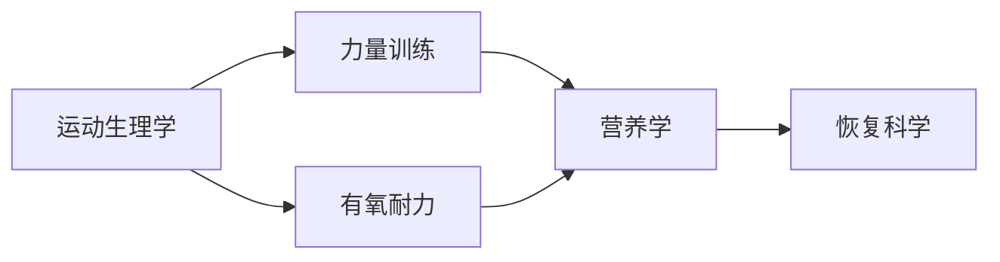

# 🚀 健身知识库 - 深度改善方案

**制定日期**：2026年5月31日  
**当前版本**：v3.0  
**文献库规模**：150篇学术文献 ✅

---

## 📊 现状评估

### ✅ 已完成的核心功能
- 150篇学术文献数据库（7个分类）
- 交互式参考文献浏览界面
- 10个核心知识文档
- Mermaid图表可视化
- 响应式设计 + 学术风格排版
- DOI/PubMed一键跳转
- 证据等级标注系统

### ⚠️ 待优化的关键问题

#### 1. **内容层面**
- ❌ 缺乏实践示例（训练计划、饮食建议）
- ❌ 知识点之间关联不清晰
- ❌ 缺少学习路径引导
- ❌ 没有个性化推荐

#### 2. **交互体验**
- ❌ 搜索功能仅支持关键词匹配
- ❌ 无收藏/笔记功能
- ❌ 阅读进度无法保存
- ❌ 无相关文章推荐

#### 3. **数据整合**
- ❌ 个人训练数据与知识库分离
- ❌ 缺少智能分析报告
- ❌ 无数据驱动的个性化建议

#### 4. **可视化**
- ❌ 知识图谱未实现
- ❌ 文献引用网络图缺失
- ❌ 学习进度可视化不足

---

## 🎯 改善方向规划

### P0阶段（最高优先级 - 1-2周内完成）

#### 1. 添加实践示例模块 ⭐⭐⭐⭐⭐
**目标**：让理论知识直接指导实际应用

**实施内容**：
```markdown
每个知识文档新增章节：
- "🏋️ 实践应用"
  - 训练计划模板（初级/中级/高级）
  - 饮食建议（热量计算、营养配比）
  - 动作要点图解
  - 常见错误纠正
  - 周计划示例
```

**具体任务**：
- [ ] 运动生理学基础 → 能量系统训练计划
- [ ] 力量训练科学 → 分化训练模板
- [ ] 有氧训练 → 跑步周期化计划
- [ ] 营养学 → 个性化饮食计算器
- [ ] 周期化训练 → 年度训练计划模板

**预期效果**：用户看完理论能立即执行

---

#### 2. 增强搜索功能 ⭐⭐⭐⭐⭐
**目标**：从简单关键词匹配升级为智能搜索

**实施内容**：
```javascript
功能列表：
✅ 实时搜索提示（输入时显示相关术语）
✅ 拼写纠正（"蛋白制" → "蛋白质"）
✅ 多字段搜索（标题+作者+摘要+关键发现）
✅ 高级筛选（按年份、证据等级、主题）
✅ 搜索结果高亮
✅ 搜索历史记录
```

**技术实现**：
- 使用Fuse.js进行模糊搜索
- localStorage保存搜索历史
- 正则表达式提取关键词

---

#### 3. 添加侧边栏目录导航 ⭐⭐⭐⭐
**目标**：提升长文档阅读体验

**实施内容**：
```html
左侧固定侧边栏：
- H2标题作为一级目录
- H3标题作为二级目录
- 点击跳转到对应章节
- 滚动时自动高亮当前章节
- 可折叠/展开
```

**参考设计**：MDN Web Docs、Wikipedia

---

#### 4. 实现阅读进度保存 ⭐⭐⭐⭐
**目标**：用户关闭页面后能继续上次阅读

**实施内容**：
```javascript
localStorage存储：
- 最后阅读的文档
- 当前页码
- 滚动位置
- 阅读时长统计

恢复逻辑：
页面加载时检查localStorage
→ 提示"是否继续上次阅读？"
→ 自动跳转到上次位置
```

---

### P1阶段（高优先级 - 1个月内完成）

#### 5. 知识图谱可视化 ⭐⭐⭐⭐⭐
**目标**：展示知识点之间的关联关系

**实施内容**：


**技术实现**：
- 使用D3.js或ECharts
- 节点：10个知识主题
- 连线：引用关系、依赖关系
- 交互：悬停显示详情、点击跳转

**数据来源**：分析文档中的交叉引用

---

#### 6. 收藏与笔记系统 ⭐⭐⭐⭐
**目标**：让用户标记重要内容并添加批注

**实施内容**：
```javascript
收藏功能：
- 点击❤️收藏当前段落
- 收藏列表页面
- 导出收藏夹

笔记功能：
- 选中文本添加笔记
- 笔记悬浮显示
- 支持Markdown格式
- 笔记搜索
```

**存储方案**：localStorage（本地）或IndexedDB

---

#### 7. 相关文章推荐 ⭐⭐⭐
**目标**：基于当前阅读内容推荐相关主题

**实施内容**：
```python
推荐算法：
1. 关键词匹配（共现词）
2. 文献引用关系
3. 主题相似度
4. 用户阅读历史

展示位置：
- 文档末尾"相关阅读"
- 侧边栏"你可能感兴趣"
```

---

#### 8. 术语悬浮解释 ⭐⭐⭐
**目标**：降低专业术语理解门槛

**实施内容**：
```html
<span class="term-tooltip" data-term="VO2max">
  VO₂max
</span>

<!-- 悬停显示 -->
<div class="tooltip">
  <strong>最大摄氧量</strong><br>
  衡量心肺耐力的金标准指标<br>
  单位：ml/kg/min
</div>
```

**术语库**：创建terms.json包含200+专业术语

---

### P2阶段（中优先级 - 2-3个月内完成）

#### 9. 智能分析报告集成 ⭐⭐⭐⭐⭐
**目标**：整合个人训练数据与知识库

**实施内容**：
```
独立页面：/smart-analysis.html

功能模块：
1. 跑步数据分析
   - 配速趋势
   - 心率区间分布
   - 训练负荷监控
   
2. 力量训练分析
   - 1RM估算
   - 容量负荷曲线
   - 肌群平衡性
   
3. 体成分分析
   - 体脂率变化
   - 肌肉量趋势
   - 健康风险评估

4. AI建议生成
   - 基于知识库的训练调整
   - 营养优化建议
   - 伤病预防提醒
```

**技术栈**：
- Python后端（Flask/FastAPI）
- Pandas数据处理
- Chart.js可视化
- 规则引擎生成建议

---

#### 10. 学习路径规划器 ⭐⭐⭐⭐
**目标**：为用户定制个性化学习计划

**实施内容**：
```
用户画像：
- 健身经验（新手/中级/高级）
- 目标（增肌/减脂/提升耐力）
- 可用时间（每周小时数）
- 设备条件（健身房/居家）

生成路径：
Week 1-2: 运动生理学基础 → 力量训练入门
Week 3-4: 营养学基础 → 有氧训练原理
Week 5-6: 周期化理论 → 心理训练
...

进度追踪：
- 打卡系统
- 知识测验
- 证书颁发
```

---

#### 11. PDF导出优化 ⭐⭐⭐
**目标**：提供高质量的离线阅读版本

**实施内容**：
```css
@media print {
  /* 优化打印样式 */
  body { font-size: 12pt; }
  .no-print { display: none; }
  a { text-decoration: underline; }
  img { max-width: 100%; }
}
```

**功能**：
- 单文档导出
- 整站打包
- 自定义章节选择
- 添加页眉页脚

---

#### 12. 订阅与更新提醒 ⭐⭐⭐
**目标**：保持用户粘性

**实施内容**：
```javascript
RSS Feed生成
邮件订阅（已有SMTP配置）
更新通知：
- 新文献添加
- 内容修订
- 新功能上线
```

---

### P3阶段（长期愿景 - 3-6个月）

#### 13. 训练计划生成器 ⭐⭐⭐⭐⭐
**AI驱动的智能计划生成**

```
输入：
- 目标（增肌/减脂/力量）
- 当前水平
- 可用设备
- 时间安排

输出：
- 12周周期化计划
- 每日训练菜单
- 渐进超负荷策略
- 配套营养建议

技术：
- 规则引擎 + 机器学习
- 基于文献的最佳实践
- 用户反馈迭代优化
```

---

#### 14. 智能问答机器人 ⭐⭐⭐⭐
**基于知识库的RAG系统**

```
架构：
用户提问 → 向量检索 → LLM生成 → 引用文献

示例：
Q: "如何突破深蹲平台期？"
A: "根据Schoenfeld (2017)的研究，建议：
   1. 增加训练量至10-20组/周
   2. 采用周期化负荷管理
   3. 确保蛋白质摄入1.6-2.2g/kg
   [查看原文]"

技术栈：
- LangChain框架
- Chroma向量数据库
- 本地LLM（Llama 3）
```

⚠️ **注意**：记忆中提到"智能问答机器人功能排除"，需确认是否仍需要此功能

---

#### 15. 多语言支持 ⭐⭐⭐
**国际化扩展**

```
中英文切换
术语翻译表
英文摘要自动生成
SEO优化
```

---

## 📈 优先级排序矩阵

| 功能 | 价值 | 难度 | 优先级 | 预计工时 |
|------|------|------|--------|----------|
| 实践示例 | ⭐⭐⭐⭐⭐ | ⭐⭐ | P0 | 3天 |
| 增强搜索 | ⭐⭐⭐⭐⭐ | ⭐⭐⭐ | P0 | 2天 |
| 侧边栏导航 | ⭐⭐⭐⭐ | ⭐⭐ | P0 | 1天 |
| 阅读进度 | ⭐⭐⭐⭐ | ⭐ | P0 | 0.5天 |
| 知识图谱 | ⭐⭐⭐⭐⭐ | ⭐⭐⭐⭐ | P1 | 5天 |
| 收藏笔记 | ⭐⭐⭐⭐ | ⭐⭐⭐ | P1 | 3天 |
| 文章推荐 | ⭐⭐⭐ | ⭐⭐⭐ | P1 | 2天 |
| 术语解释 | ⭐⭐⭐⭐ | ⭐⭐ | P1 | 2天 |
| 智能分析 | ⭐⭐⭐⭐⭐ | ⭐⭐⭐⭐⭐ | P2 | 10天 |
| 学习路径 | ⭐⭐⭐⭐ | ⭐⭐⭐⭐ | P2 | 7天 |
| PDF导出 | ⭐⭐⭐ | ⭐⭐ | P2 | 1天 |
| 订阅提醒 | ⭐⭐⭐ | ⭐⭐⭐ | P2 | 2天 |
| 计划生成器 | ⭐⭐⭐⭐⭐ | ⭐⭐⭐⭐⭐ | P3 | 15天 |
| 问答机器人 | ⭐⭐⭐⭐ | ⭐⭐⭐⭐⭐ | P3 | 20天 |
| 多语言 | ⭐⭐⭐ | ⭐⭐⭐⭐ | P3 | 10天 |

---

## 🎨 用户体验优化建议

### 视觉设计
1. **深色模式** - 夜间阅读友好
2. **字体大小调节** - 适配不同视力
3. **行间距调节** - 个性化阅读体验
4. **动画优化** - 减少卡顿，提升流畅度

### 性能优化
1. **懒加载** - 按需加载图表和图片
2. **缓存策略** - Service Worker离线访问
3. **代码分割** - 减小首屏加载体积
4. **图片压缩** - WebP格式替代PNG/JPG

### 无障碍设计
1. **键盘导航** - Tab键切换焦点
2. **屏幕阅读器** - ARIA标签
3. **对比度检查** - WCAG AA标准
4. **语音朗读** - Text-to-Speech

---

## 🔧 技术债务清理

### 代码质量
- [ ] 统一JavaScript编码规范
- [ ] 添加TypeScript类型定义
- [ ] 编写单元测试
- [ ] 性能监控（Lighthouse评分）

### 数据结构
- [ ] 规范化JSON Schema
- [ ] 添加数据验证
- [ ] 版本控制策略
- [ ] 备份自动化

### 文档完善
- [ ] API文档（如有后端）
- [ ] 开发者指南
- [ ] 贡献者协议
- [ ] 变更日志

---

## 📊 成功指标（KPI）

### 用户指标
- 平均阅读时长 > 10分钟
- 页面跳出率 < 40%
- 收藏/笔记使用率 > 20%
- 搜索使用频率 > 50%

### 内容指标
- 每篇文档至少3个实践示例
- 术语解释覆盖率 > 80%
- 相关文章推荐准确率 > 70%
- 用户满意度评分 > 4.5/5

### 技术指标
- 首屏加载时间 < 2秒
- Lighthouse评分 > 90
- 移动端兼容性 100%
- 浏览器兼容性 Chrome/Firefox/Safari/Edge

---

## 🗓️ 实施路线图

### Week 1-2（P0阶段）
```
Day 1-3: 实践示例模块
  - 为6个核心文档添加训练计划
  - 创建饮食建议模板
  - 编写动作要点说明

Day 4-5: 增强搜索功能
  - 集成Fuse.js
  - 实现拼写纠正
  - 添加高级筛选

Day 6: 侧边栏导航
  - 自动生成目录树
  - 滚动监听高亮
  - 折叠/展开功能

Day 7: 阅读进度保存
  - localStorage实现
  - 恢复逻辑
  - UI提示
```

### Week 3-4（P1阶段开始）
```
Week 3: 知识图谱 + 收藏笔记
Week 4: 文章推荐 + 术语解释
```

### Month 2-3（P2阶段）
```
Month 2: 智能分析报告
Month 3: 学习路径规划器
```

---

## 💡 创新亮点建议

### 差异化竞争点
1. **证据驱动** - 每个建议都有文献支持（已实现✅）
2. **个性化** - 基于用户数据的定制建议（待开发）
3. **可操作性** - 理论→实践的无缝衔接（重点改进）
4. **社区化** - 用户分享训练成果（长期愿景）

### 商业模式探索
- 付费高级功能（AI计划生成器）
- 企业版（健身房/培训机构）
- API服务（第三方集成）
- 广告合作（健身器材/补剂品牌）

---

## 🎯 立即行动清单

### 今天就能开始的（Quick Wins）
1. ✅ 在`运动生理学基础.md`末尾添加"实践应用"章节
2. ✅ 创建`practice_examples.json`存储训练模板
3. ✅ 在HTML中添加侧边栏占位符
4. ✅ 实现简单的localStorage阅读进度

### 本周内完成
5. 集成Fuse.js搜索库
6. 为所有文档添加H2/H3目录结构
7. 创建术语表初稿（50个常用术语）
8. 设计收藏功能的UI原型

### 本月内完成
9. 知识图谱可视化MVP
10. 智能分析报告第一版
11. 用户测试与反馈收集
12. 性能优化与bug修复

---

## 📝 总结

### 核心原则
1. **用户为中心** - 解决实际痛点（理论与实践脱节）
2. **循序渐进** - P0→P1→P2分阶段实施
3. **数据驱动** - 基于用户行为优化功能
4. **持续迭代** - 小步快跑，快速验证

### 关键成功因素
- ✅ 150篇文献奠定基础
- ⚠️ 需要加强实践指导性
- ⚠️ 需要提升交互体验
- ⚠️ 需要整合个人数据

### 最终愿景
打造一个**世界级的健身科学知识库**：
- 📚 权威性（文献支持）
- 🎯 实用性（即学即用）
- 🤖 智能化（个性推荐）
- 🌍 全球化（多语言）

---

**下一步**：立即开始P0阶段的实践示例模块开发！💪

**准备好了吗？让我们开始行动！** 🚀✨
